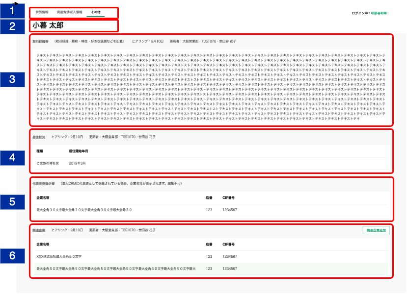
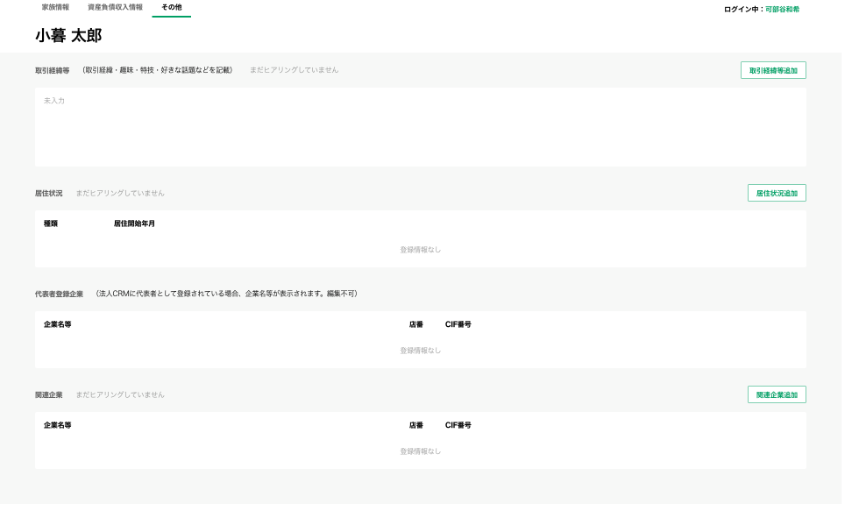

# その他明細一覧

## 概要

居住状況、代表者登録企業、関連企業、取引経緯等の明細一覧を確認する画面。

## 画面遷移

N/A

## 画面レイアウト図

- その他明細一覧（入力後）



- その他明細一覧（入力前）



## 画面項目

1. タブ
    - [X] "その他"タブが選択されている。
    - [X] "家族情報"タブを押下すると[家族情報タブをタップ](#家族情報タブをタップ)を実行する。
    - [X] "資産負債収入情報"タブを押下すると[資産負債収入情報タブをタップ](#資産負債収入情報タブをタップ)を実行する。

2. 顧客名
    - [X] 顧客名が表示される。

3. 取引経緯等エリア
    - ヘッダー
      - エリア名
          - [X] "取引経緯等（取引経緯・趣味・特技・好きな話題などを記載）"を表示する。
      - ヒアリング情報
          - [ ] 明細が存在しない、あるいはブランクで登録されている場合、"まだヒアリングしていません"を表示する。
          - [X] 明細が存在し、ブランクでない場合、ヒアリング、更新者を表示する。
          - ヒアリング
              - [X] 取引経緯等の明細の最終更新年月日を表示する。
              - [X] ヒアリングを年内に行った場合、 `MM月dd日` の形式で表示する。
              - [ ] ヒアリングを去年より過去に行った場合、 `yyyy年MM月dd日` の形式で表示する。
          - 更新者
              - [X] 取引経緯等の明細の更新者情報を`支店名・R2ID・更新者名`の形式で表示する。
              - [ ] 更新者が退職済みの場合、所属店名、R2ID、更新者氏名を表示する。
              - [ ] 所属店名が不明な場合、"不明な支店"を表示する。
      - 明細追加ボタン
          - [X] 明細が存在しない、あるいはブランクで登録されている場合、"取引経緯等追加"ボタンを表示する。
          - [ ] タップすると[取引経緯等追加ボタンをタップ](#取引経緯等追加ボタンをタップ)を実行する。
          - [X] 明細が存在し、ブランクでない場合、何も表示しない。
    - コンテンツ
      - [X] 明細が存在しない、あるいはブランクで登録されている場合、"未入力"を表示する。
      - [X] 明細が存在し、ブランクでない場合、取引経緯等で登録されたテキストを表示する。
      - [X] 明細をタップすると[取引経緯等明細をタップ](#取引経緯等明細をタップ)を実行する。

4. 居住状況エリア
    - ヘッダー
      - エリア名
          - [X] "居住状況"を表示する。
      - ヒアリング情報
          - [X] 明細が存在しない、あるいは種類と居住開始年月が登録されていない場合、"まだヒアリングしていません"を表示する。
          - [X] 明細が存在する場合、ヒアリング、更新者を表示する。
          - ヒアリング
              - [X] 居住状況の最終更新年月日を表示する。
              - [X] ヒアリングを年内に行った場合、 `MM月dd日` の形式で表示する。
              - [ ] ヒアリングを去年より過去に行った場合、 `yyyy年MM月dd日` の形式で表示する。
          - 更新者
              - [X] 居住状況の明細のうち、最終更新日時が最も新しい明細の更新者情報を`支店名・R2ID・更新者名`の形式で表示する。
              - [ ] 更新者が退職済みの場合、所属店名、R2ID、更新者氏名を表示する。
              - [ ] 所属店名が不明な場合、"不明な支店"を表示する。
      - 明細追加ボタン
          - [X] 明細が存在しない、あるいは種類と居住開始年月が登録されていない場合、"居住状況追加"ボタンを表示する。
          - [ ] タップすると[居住状況追加ボタンをタップ](#居住状況追加ボタンをタップ)を実行する。
          - [X] 明細が存在する場合、何も表示しない。
    - コンテンツ
      - [ ] 明細が存在しない、あるいは種類と居住開始年月が選択されていない場合、"登録情報なし"を表示する。
      - [X] 明細が存在する場合、種類、居住開始年月を表示する。
      - [X] 明細をタップすると[居住状況明細をタップ](#居住状況明細をタップ)を実行する。
      - 種類
          - [X] "未選択"の場合、ブランクで表示される。
          - [X] "持ち家/賃貸・社宅/ご家族の持ち家/老人ホーム/その他"が表示される。
      - 居住開始年月
          - [X] 存在しない場合、ブランクで表示される。
          - [X] 年月が明瞭な場合、"YYYY年M月"が表示される。
          - [X] 年が不明な場合、"----年M月"が表示される。
          - [X] 月が不明な場合、"YYYY年--月"が表示される。

5. 代表者登録企業エリア
    - ヘッダー
      - エリア名
        - [X] "代表者登録企業（法人CRMに代表者として登録されている場合、企業名等が表示されます。編集不可）"を表示する。
    - コンテンツ
      - [X] 法人CRMに代表登録されている企業がない場合、"登録情報なし"を表示する。
      - [ ] 法人CRMに代表登録されている企業がある場合、企業名等、店番、CIF番号を表示する。
      - [ ] 法人CRMに代表登録されている企業がある場合、明細は店番、CIF番号の昇順でソートされていること。<br>
      <span style="color: green;">ソート順についてはCRMの設計書参照。</span>
      - [ ] 明細が5件を超える場合は表の高さが固定となり表の中をスクロールすることができる。
      - 企業名等
          - [ ] 存在しない場合、ブランクで表示する。
          - [X] 存在する場合、登録されている企業名等を表示する。
          - [ ] 最大文字数は全角30文字で、当画面では全て表示する。（理由：詳細画面が無いため）
      - 店番
          - [ ] 存在しない場合、ブランクで表示する。
          - [X] 存在する場合、登録されている店番を表示する。
      - CIF番号
          - [ ] 存在しない場合、ブランクで表示する。
          - [X] 存在する場合、登録されているCIF番号を表示する。

6. 関連企業エリア
    - ヘッダー
      - エリア名
          - [X] "関連企業"を表示する。
      - ヒアリング情報
          - [ ] 明細が存在しない場合、"まだヒアリングしていません"を表示する。
          - [X] 明細が存在する場合、ヒアリング、更新者を表示する。
          - ヒアリング
              - [X] 関連企業の明細のうち、最終更新日時が最も新しい明細の最終更新年月日を表示する。
              - [X] ヒアリングを年内に行った場合、 `MM月dd日` の形式で表示する。
              - [ ] ヒアリングを去年より過去に行った場合、 `yyyy年MM月dd日` の形式で表示する。

                ```md
                存在するデータの中で最も大きい日付を表示するので、最も大きい日付が削除された場合、次に大きい日付が表示されることとなる。
                例: 1明細のみ登録されたデータを削除した場合、
                ①何も登録していない状態（更新日「まだヒアリングしていません」と表示される状態）
                ②1/31　1明細を登録
                ③2/1　  ②で登録した1明細を削除
                → ヒアリングには「まだヒアリングしていません」が表示される。
                ```

          - 更新者
              - [X] 関連企業の明細のうち、最終更新日時が最も新しい明細の更新者情報を`支店名・R2ID・更新者名`の形式で表示する。
              - [ ] 更新者が退職済みの場合、所属店名、R2ID、更新者氏名を表示する。
              - [ ] 所属店名が不明な場合、"不明な支店"を表示する。
      - 明細追加ボタン
          - [X] "関連企業追加"ボタンを表示する。（複数明細を作成可能であるため、明細が既に存在する場合も表示する。）
          - [X] タップすると[関連企業追加ボタンをタップ](#関連企業追加ボタンをタップ)を実行する。
    - コンテンツ
      - [X] 明細が存在しない場合、"登録情報なし"を表示する。
      - [X] 明細が存在する場合、企業名等、店番、CIF番号を表示する。
      - [X] 明細が存在する場合、明細が追加された順（明細ID)の昇順でソートされていること。
      - [X] 明細が5件を超える場合は表の高さが固定となり表の中をスクロールすることができる。
      - [X] 明細をタップすると[関連企業明細をタップ](#関連企業明細をタップ)を実行する。
      - 企業名等
          - [X] 存在しない場合、ブランクで表示する。
          - [X] 存在する場合、登録されている企業名等を表示する。
          - [X] 表示領域を超える文字数が登録されている場合、三点リードを表示する。
      - 店番
          - [X] 存在しない場合、ブランクで表示する。
          - [X] 存在する場合、登録されている店番を表示する。
      - CIF番号
          - [X] 存在しない場合、ブランクで表示する。
          - [X] 存在する場合、登録されているCIF番号を表示する。

## イベント

この項では、当画面にて実行されるイベント一覧を記述する。

### 家族情報タブをタップ

- [ ] [家族情報トップ画面](../家族情報/家族情報一覧.md)に遷移する。

### 資産負債収入情報タブをタップ

- [ ] [資産負債収入情報トップ画面](../資産情報/資産負債収入情報トップ.md)に遷移する。

### 居住状況追加ボタンをタップ

- [ ] [明細追加・編集ダイアログ（居住状況）](./明細追加・編集ダイアログ（居住状況）.md)に遷移する。

### 居住状況明細をタップ

- [X] [明細詳細ダイアログ（居住状況）](./明細詳細ダイアログ（居住状況）.md)に遷移する。

### 関連企業追加ボタンをタップ

- [ ] [明細追加・編集ダイアログ（関連企業）](./明細追加・編集ダイアログ（関連企業）.md)に遷移する。

### 関連企業明細をタップ

- [X] [明細詳細ダイアログ（関連企業）](./明細詳細ダイアログ（関連企業）.md)に遷移する。

### 取引経緯等追加ボタンをタップ

- [ ] [明細追加・編集ダイアログ（取引経緯等）](./明細追加・編集ダイアログ（取引経緯等）.md)に遷移する。

### 取引経緯等明細をタップ

- [ ] [明細詳細ダイアログ（取引経緯等）](./明細詳細ダイアログ（取引経緯等）.md)に遷移する。
