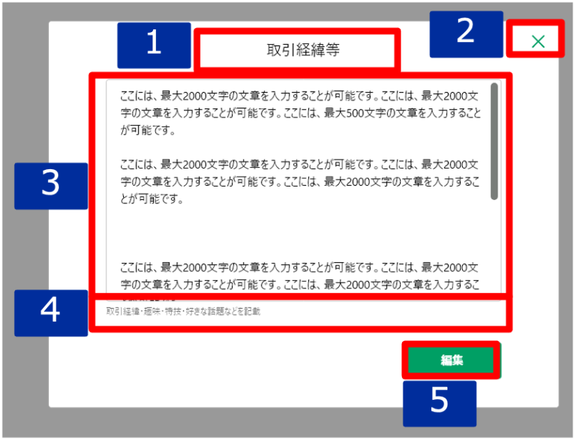

# 明細詳細ダイアログ（取引経緯等）

## 概要

取引経緯等の明細を確認するための画面。

## 画面遷移

N/A

## 画面レイアウト図

- 明細詳細ダイアログ（取引経緯等）

## 画面項目
明細詳細ダイアログ（取引経緯等）には、以下の情報を上から順に表示する。

1. 画面名
    - [X] "取引経緯等" を表示する。
2. 閉じるボタン
    - [X] タップすると、[閉じるボタンをタップ](#閉じるボタンをタップ)を実行する。
3. 詳細
    - テキスト
      - [X] 表示領域を超える文字数がある場合は、スクロールして全文を確認できる。
4. 注釈
    - [X] "取引経緯・趣味・特技・好きな話題などを記載"を表示する。
5. 編集ボタン
    - [X] タップすると、[編集ボタンをタップ](#編集ボタンをタップ)を実行する。

## イベント
この項では、当画面にて実行されるイベント一覧を記述する。

### 閉じるボタンをタップ
- [X] 当画面を閉じ、[その他明細一覧](./その他明細一覧.md)に戻る。

### 編集ボタンをタップ
- [X] [明細追加・編集ダイアログ（取引経緯等）](./明細追加・編集ダイアログ（取引経緯等）.md)を表示する。
