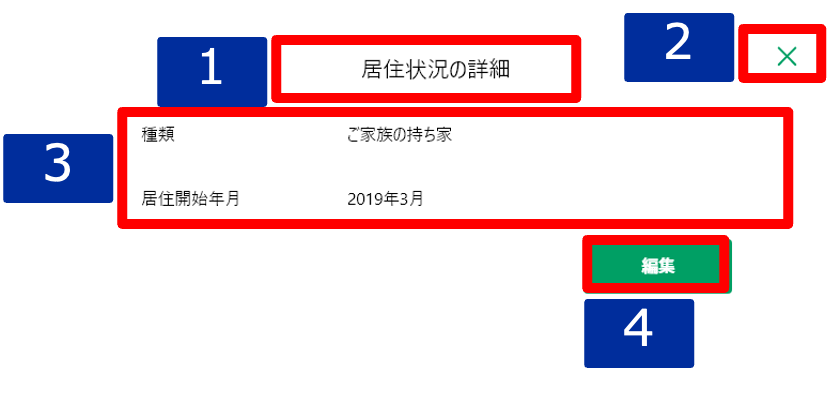

# 明細詳細ダイアログ（居住状況）

## 概要

居住状況の明細を確認するための画面。

## 画面遷移

N/A

## 画面レイアウト図

- 明細詳細ダイアログ（居住状況）

## 画面項目

明細詳細ダイアログ（居住状況）には、以下の情報を上から順に表示する。

1. 画面名
    - [X] "居住状況の詳細" を表示する。
2. 閉じるボタン
    - [X] タップすると、[閉じるボタンをタップ](#閉じるボタンをタップ)を実行する。
3. 詳細
    - 種類
      - [X] "未選択"の場合、ブランクで表示される。
      - [X] "持ち家/賃貸・社宅/ご家族の持ち家/老人ホーム/その他"のいずれかが表示される。
    - 居住開始年月
      - [X] 存在しない場合、ブランクで表示される。
      - [X] 年月が明瞭な場合、"YYYY年M月"が表示される。
      - [X] 年が不明な場合、"----年M月"が表示される。
      - [X] 月が不明な場合、"YYYY年--月"が表示される。
4. 編集ボタン
    - [X] タップすると、[編集ボタンをタップ](#編集ボタンをタップ)を実行する。

## イベント
この項では、当画面にて実行されるイベント一覧を記述する。

### 閉じるボタンをタップ
- [X] 当画面を閉じ、[その他明細一覧](./その他明細一覧.md)に戻る。

### 編集ボタンをタップ
- [ ] [明細追加・編集ダイアログ（居住状況）](./明細追加・編集ダイアログ（居住状況）.md)を表示する。
