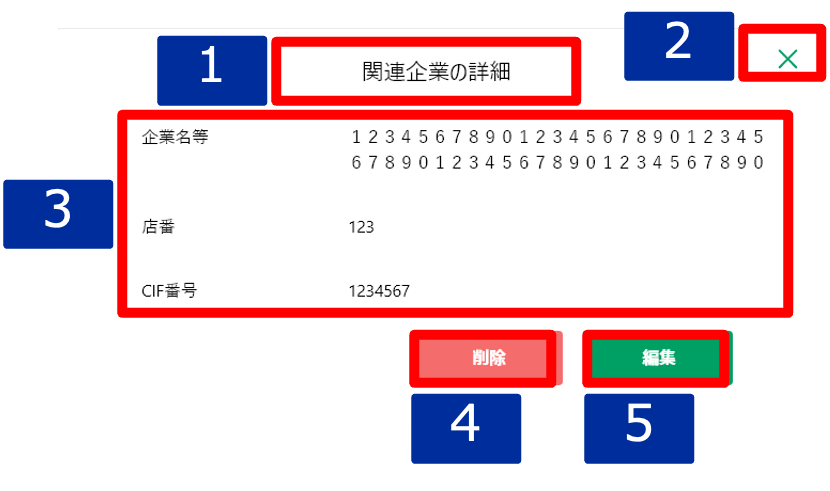

# 明細詳細ダイアログ（関連企業）

## 概要

関連企業の明細を確認するための画面。

## 画面遷移

N/A

## 画面レイアウト図

- 明細詳細ダイアログ（関連企業）

## 画面項目

明細詳細ダイアログ（関連企業）には、以下の情報を上から順に表示する。

1. 画面名
    - [X] "関連企業の詳細" を表示する。
2. 閉じるボタン
    - [X] タップすると、[閉じるボタンをタップ](#閉じるボタンをタップ)を実行する。
3. 詳細
    - 企業名等
      - [X] 存在しない場合、ブランクで表示する。
      - [X] 存在する場合、登録されている企業名等を表示する。
      - [X] 最大文字数は全角50文字で、当画面では全て表示する。26文字目からは改行して表示する。
    - 店番
      - [X] 存在しない場合、ブランクで表示する。
      - [X] 存在する場合、登録されている店番を表示する。
    - CIF番号
      - [X] 存在しない場合、ブランクで表示する。
      - [X] 存在する場合、登録されているCIF番号を表示する。
4. 削除ボタン
    - [X] タップすると、[削除ボタンをタップ](#削除ボタンをタップ)を実行する。
5. 編集ボタン
    - [X] タップすると、[編集ボタンをタップ](#編集ボタンをタップ)を実行する。

## イベント
この項では、当画面にて実行されるイベント一覧を記述する。

### 閉じるボタンをタップ
- [X] 当画面を閉じ、[その他明細一覧](./その他明細一覧.md)に戻る。

### 削除ボタンをタップ
- [X] 確認ダイアログを表示する。
  - 「キャンセル」を押下した場合
    - [X] ダイアログを閉じてそのまま当画面を表示する。
  - 「削除」を押下した場合
    - [X] 削除処理を実行し当画面を閉じて[その他明細一覧](./その他明細一覧.md)に戻る。
    - [X] その他明細一覧の関連企業エリアから該当明細の情報が削除されて表示されない。

### 編集ボタンをタップ
- [X] [明細追加・編集ダイアログ（関連企業）](./明細追加・編集ダイアログ（関連企業）.md)を表示する。
