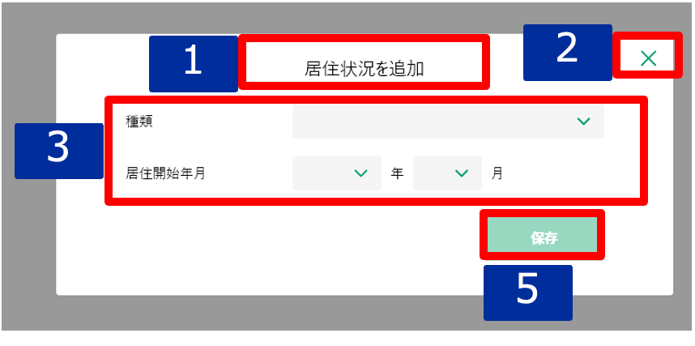
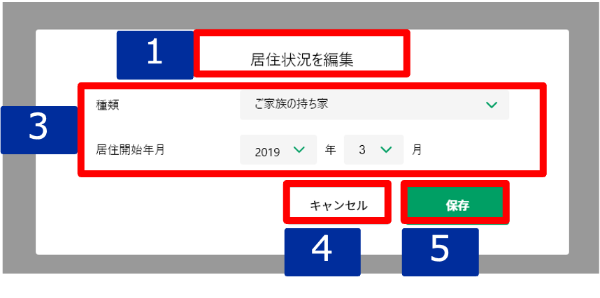

# 明細追加・編集ダイアログ（居住状況）

## 概要

居住状況の明細を追加・編集するための画面。

## 画面遷移

N/A

## 画面レイアウト図

- 明細追加ダイアログ（居住状況）

- 明細編集ダイアログ（居住状況）

## 画面項目
明細追加・編集ダイアログ（居住状況）には、以下の情報を上から順に表示する。

1. 画面名
    - [X] 追加の場合、"居住状況を追加" を表示する。
    - [X] 編集の場合、"居住状況を編集" を表示する。

2. 閉じるボタン
    - [X] 追加の場合、閉じるボタンを表示する。
    - [ ] タップすると、[閉じるボタンをタップ](#閉じるボタンをタップ)を実行する。
    - [X] 編集の場合、表示しない。

3. 詳細
    - 種類
      - [X] 追加の場合、初期状態ではブランクで表示される。
      - [X] 編集の場合、登録されている種類が初期選択される。
      - [X] "未選択/持ち家/賃貸・社宅/ご家族の持ち家/老人ホーム/その他"の選択肢を表示する。
    - 居住開始年月
      - [X] 追加の場合、初期状態ではブランクで表示される。
      - [X] 編集の場合、登録されている年月が表示される。
      - [X] 年は選択肢から値を選択できる。（現在の年−120年～現在の年＋50年）ソート順は降順。
      - [X] 月は選択肢から値を選択できる。（1月～12月）ソート順は昇順。
      - [X] 未来を選択しても特にチェックは行わない。
      - [X] 値が選択されていない状態でドロップダウンを開くと現在の年から選択肢が表示される。
      - [X] 値が選択されている状態でマウスオーバーした際に「×」ボタンが出現し、値をクリアできる。

4. キャンセルボタン
    - [X] 追加の場合、表示しない。
    - [X] 編集の場合、キャンセルボタンを表示する。
    - [X] タップすると、[キャンセルボタンをタップ](#キャンセルボタンをタップ)を実行する。

5. 保存ボタン
    - [X] 追加の場合、初期状態では非活性で、いずれかの値が入ると活性になる。
    - [X] 編集の場合、初期状態では非活性で、いずれかの値が更新されると活性になる。
    - [X] タップすると、[保存ボタンをタップ](#保存ボタンをタップ)を実行する。

## イベント
この項では、当画面にて実行されるイベント一覧を記述する。

### 閉じるボタンをタップ
- [ ] 変更がない場合は、そのまま当画面を閉じて[その他明細一覧](./その他明細一覧.md)に戻る。
- [ ] 変更がある場合は、確認ダイアログを表示する。
  - 「キャンセル」を押下した場合
    - [ ] ダイアログを閉じてそのまま当画面を表示する。
  - 「破棄」を押下した場合
    - [ ] 当画面を閉じて[その他明細一覧](./その他明細一覧.md)に戻る。

### キャンセルボタンをタップ
- [X] 変更がない場合は、そのまま当画面を閉じ[明細詳細ダイアログ（居住状況）](./明細詳細ダイアログ（居住状況）.md)に戻る。
- [X] 変更がある場合は、確認ダイアログを表示する。
  - 「キャンセル」を押下した場合
    - [X] ダイアログを閉じてそのまま当画面を表示する。
  - 「破棄」を押下した場合
    - [X] [明細詳細ダイアログ（居住状況）](./明細詳細ダイアログ（居住状況）.md)に戻る。

### 保存ボタンをタップ
- [X] 作成の場合、その他明細登録処理を実行し、当画面を閉じて[その他明細一覧](./その他明細一覧.md)に戻る。
- [X] 編集の場合はその他明細更新処理を実行し、当画面を閉じて[その他明細一覧](./その他明細一覧.md)に戻る。
- [X] その他明細一覧の居住状況エリアに保存した居住状況明細が反映される。
- [X] その他明細一覧の居住状況エリアのヒアリング情報（更新日・更新者）が更新される。
