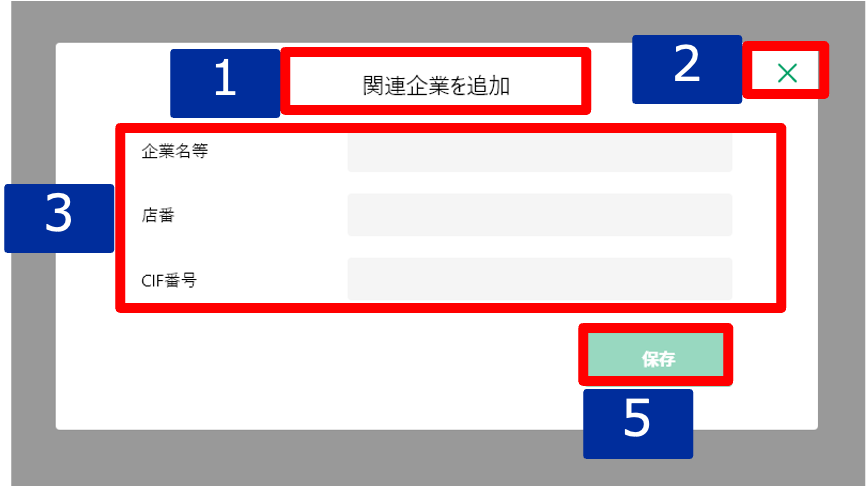
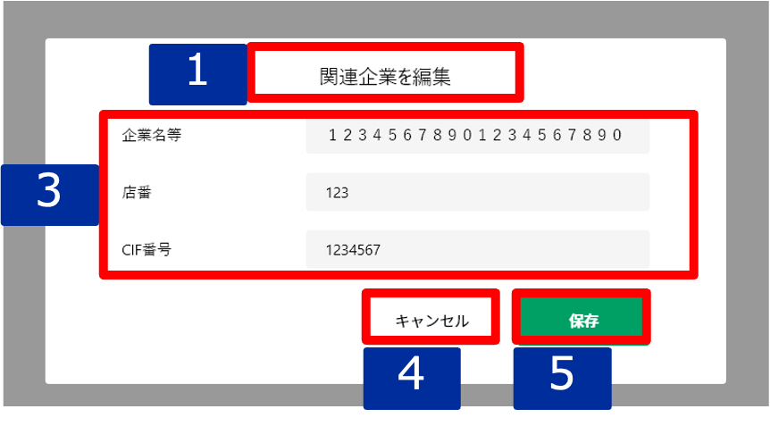

# 明細追加・編集ダイアログ（関連企業）

## 概要

関連企業の明細を追加・編集するための画面。

## 画面遷移

N/A

## 画面レイアウト図

- 明細追加ダイアログ（関連企業）

- 明細編集ダイアログ（関連企業）

## 画面項目
明細追加・編集ダイアログ（関連企業）には、以下の情報を上から順に表示する。

1. 画面名
    - [X] 追加の場合、"関連企業を追加" を表示する。
    - [X] 編集の場合、"関連企業を編集" を表示する。

2. 閉じるボタン
    - [X] 追加の場合、閉じるボタンを表示する。
    - [X] タップすると、[閉じるボタンをタップ](#閉じるボタンをタップ)を実行する。
    - [X] 編集の場合、表示しない。

3. 詳細
    - 企業名等
      - [X] 追加の場合、初期状態ではブランクで表示される。
      - [X] 編集の場合、登録されている企業名等が表示される。
      - [X] 入力可能な最大文字数は全角50文字である。
    - 店番
      - [X] 追加の場合、初期状態ではブランクで表示される。
      - [X] 編集の場合、登録されている店番が表示される。
      - [X] 数値のみ入力可能とし、数値以外を入力した場合エラーメッセージを表示する。
      - [X] 入力可能文字は3文字である。
      - [X] 3桁に満たない数値を入力した場合、フォーカスを外す際に頭0埋めする。
    - CIF番号
      - [X] 追加の場合、初期状態ではブランクで表示される。
      - [X] 編集の場合、登録されているCIF番号が表示される。
      - [X] 数値のみ入力可能とし、数値以外を入力した場合エラーメッセージを表示する。
      - [X] 入力可能文字は7文字である。
      - [X] 7桁に満たない数値を入力した場合、フォーカスを外す際に頭0埋めする。

4. キャンセルボタン
    - [X] 追加の場合、表示しない。
    - [X] 編集の場合、キャンセルボタンを表示する。
    - [X] タップすると、[キャンセルボタンをタップ](#キャンセルボタンをタップ)を実行する。

5. 保存ボタン
    - [X] 追加の場合、初期状態では非活性で、いずれかの値が入ると活性になる。
    - [X] 編集の場合、初期状態では非活性で、いずれかの値が更新されると活性になる。
    - [X] タップすると、[保存ボタンをタップ](#保存ボタンをタップ)を実行する。

## イベント
この項では、当画面にて実行されるイベント一覧を記述する。

### 閉じるボタンをタップ
- [ ] 変更がない場合は、そのまま当画面を閉じて[その他明細一覧](./その他明細一覧.md)に戻る。
- [ ] 変更がある場合は、確認ダイアログを表示する。
  - 「キャンセル」を押下した場合
    - [ ] ダイアログを閉じてそのまま当画面を表示する。
  - 「破棄」を押下した場合
    - [ ] 当画面を閉じて[その他明細一覧](./その他明細一覧.md)に戻る。

### キャンセルボタンをタップ
- [X] 変更がない場合は、そのまま当画面を閉じ[明細詳細ダイアログ（関連企業）](./明細詳細ダイアログ（関連企業）.md)に戻る。
- [X] 変更がある場合は、確認ダイアログを表示する。
  - 「キャンセル」を押下した場合
    - [X] ダイアログを閉じてそのまま当画面を表示する。
  - 「破棄」を押下した場合
    - [X] [明細詳細ダイアログ（関連企業）](./明細詳細ダイアログ（関連企業）.md)に戻る。

### 保存ボタンをタップ
- [X] 作成の場合、その他明細登録処理を実行し、当画面を閉じて[その他明細一覧](./その他明細一覧.md)に戻る。
- [X] 編集の場合はその他明細更新処理を実行し、当画面を閉じて[その他明細一覧](./その他明細一覧.md)に戻る。
- [X] その他明細一覧の関連企業エリアに保存した関連企業明細が反映される。
- [X] その他明細一覧の関連企業エリアのヒアリング情報（更新日・更新者）が更新される。
