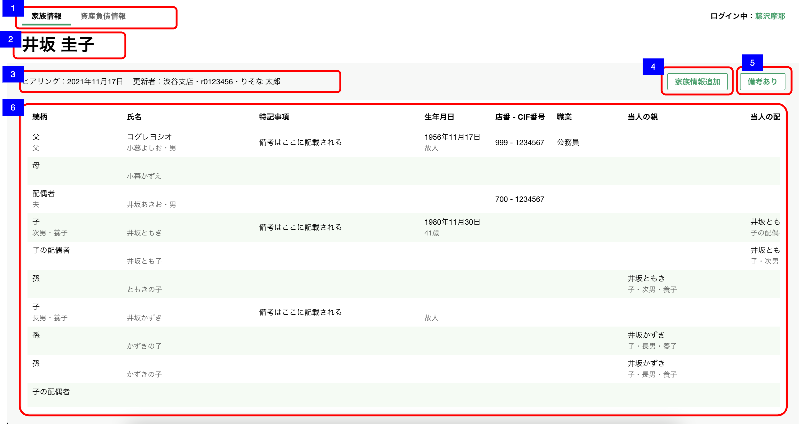

# 家族情報一覧

## 概要

家族情報の全体像を把握するための画面

## 画面遷移

N/A

## 画面レイアウト図

- 家族情報一覧  

## 画面項目

1. ブラウザのタブ
    - [x] 「個人概要詳細」が表示される
2. タブ
    - [x] 「家族情報」タブが選択されている。
    - [x] 「資産負債情報」タブを押下すると[資産負債情報タブを押下](#資産負債情報タブを押下)を実行する。
3. 顧客名
    - [x] 顧客名が表示される。
4. ヒアリング情報
    - [x] ヒアリングが行われていない場合、「まだヒアリングしていません」が表示される。
    - [x] ヒアリングを年内に行った場合、 `MM月dd日` の形式で更新日が表示される。（ ※ 更新日時補足 参照 ）
    - [x] ヒアリングを去年より過去に行った場合、 `yyyy年MM月dd日` の形式で更新日が表示される。
    - [x] 明細を削除した場合、更新日は削除した日付が表示される。
    - [x] 更新者の所属店名、R2ID、更新者氏名が中点（・）で連結して表示される。
    - [x] 更新者が退職済みの場合、所属店名、R2ID、更新者氏名が表示される。
    - [x] 所属店名が不明な場合、「不明な支店」を表示する  
  
5. 家族情報追加ボタン
    - [x] 押下すると、[家族情報追加ボタンを押下](#家族情報追加ボタンを押下)を実行する。
6. 備考リンクボタン
    - 家族情報備考がまだ作成されていない場合
      - [x] ボタンのラベルが「備考を作成」
      - [x] 押下すると[備考を作成ボタンを押下](#備考を作成ボタンを押下) を実行する。
    - 家族情報備考がある場合
      - [x] ボタンのラベルが「備考あり」
      - [x] 押下すると[備考ありボタンを押下](#備考ありボタンを押下) を実行する。
7. 家族情報一覧
    - EmptyState
      - [x] 何も値が入っていない初期状態では、続柄・氏名エリアに「ヒアリングして追加ボタンから更新しましょう」の文言が表示される
    - 並び順
      - [x] 渉外アプリiOSの[家族情報リストView](../../渉外アプリiOS/家族情報/家族情報リストView.md)と同様
    - マウスオーバー
      - [x] ポインターを家族情報一覧に上の合わせると該当の行の背景色が変化する。
    - スクロール
      - [x] 続柄と氏名は固定で、それ以外の領域は横スクロールできる。
      - [x] テーブル内で縦スクロールができる。
    - 家族情報の行を押下
      - [x] 押下すると[家族情報レコードを押下](#家族情報レコードを押下)を実行する。
    - （以下、テーブル内の各項目に関して記述する）
    - 続柄
      - [x] 上段に続柄が表示される。
      - [x] 下段に続柄詳細・続柄補足が中点（・）で連結して表示される。
      - [x] 登録されていない項目は表示されない。
    - 氏名
      - [x] 上段に氏名カナが表示される。
      - [x] 下段に氏名と性別が中点（・）で連結して表示される。
      - [x] 登録されていない項目は表示されない。
    - 特記事項
      - [x] 特記事項の内容が表示される。
      - [x] 表示領域に収まらない場合３点リーダー（…）が表示される。
      - [x] 登録されていない場合は何も表示されない。
    - 生年月日
      - [x] 上段に生年月日が表示される。「yyyy年MM月dd日」
      - [x] 年月日のいずれかが不明の場合は、`「yyyy年MM月--日」`/`「yyyy年--月dd日」`/`「----年MM月dd日」`の形式で表示される。
      - [x] 下段に年齢が表示される。
      - [x] 生年月日が登録されていない、もしくは年月日のいずれかが不明の場合は年齢は表示されない。
      - [x] 故人の場合は下段に「故人」と表示される。年齢は表示されない。
      - [x] 登録されていない項目は表示されない。
    - 店番 - CIF番号
      - [x] 店番とCIF番号がハイフンで連携して表示される。
      - [x] 店番、CIF番号いずれか一方しか入力されていない場合は、`「<店番> -」`/ `「- <CIF番号>」`の形式で表示される
      - [x] 登録されていない場合は何も表示されない。
    - 職業
      - [x] 職業が表示される。
      - [x] 登録されていない場合は何も表示されない。
    - 当人の親
      - [x] 上段に当人の親の名前が表示される。
      - [x] 下段に当人の親の続柄、続柄詳細、続柄補足が中点（・）で連結して表示される。
      - [x] 登録されていない項目は表示されない。
    - 当人の配偶者
      - [x] 上段に当人の配偶者の名前が表示される。
      - [x] 下段に当人の配偶者の続柄、続柄詳細、続柄補足が中点（・）で連結して表示される。
      - [x] 登録されていない項目は表示されない。
      - [x] 自身が当人の配偶者として登録されている「子」または「きょうだい」にもその配偶者の情報が表示される。
    - 居住の近さ
      - [x] 居住の近さが表示される。「同居」/「別居」/「別居（近隣）」/「別居（遠方）」
      - [x] 登録されていない場合は何も表示されない。
    - 実権者
      - [x] 実権者に該当する場合は、「○」が表示される。
      - [x] 登録されていない場合は何も表示されない。
    - 仲の良さ
      - [x] 仲の良さが表示される。「良い」/「悪い」
      - [x] 登録されていない場合は何も表示されない。
    - 保有資産
      - [x] 保有資産が百万円単位で表示される。
      - [x] 登録されていない場合は何も表示されない。
    - りそな保有資産
      - [x] りそな保有資産が百万円単位で表示される。
      - [x] 登録されていない場合は何も表示されない。
    - 法定相続人
      - [x] 法定相続人が表示される。「該当」/「該当（代襲）」
      - [x] 登録されていない場合は何も表示されない。
    - 年間贈与金額
      - [x] 年間贈与金額が万円単位で表示される。
      - [x] 登録されていない場合は何も表示されない。
    - 相続、贈与の思い
      - [x] 上段に相続、贈与の思いが表示される。
      - [x] 下段に相続、贈与の思い補足が表示される。
      - [x] 登録されていない項目は表示されない。

## イベント

この項では、当画面にて実行されるイベント一覧を記述する。

### 画面表示

- [x] ユーザーと顧客の銀行識別子が異なる場合、エラーメッセージを表示し、参照することができない。

### 資産負債情報タブを押下

- [x] [資産負債収入情報トップ画面](../資産情報/資産負債収入情報トップ.md)に遷移する。

### 家族情報レコードを押下

- [x] [家族情報詳細画面](家族情報詳細.md)を表示する。

### 家族情報追加ボタンを押下

- [x] [家族情報作成・画面](家族情報作成・編集.md)を表示する。

### 備考を作成ボタンを押下

- [x] [家族情報備考作成・編集画面](家族情報備考作成・編集.md)を表示する。

### 備考ありボタンを押下

- [x] [家族情報備考詳細画面](家族情報備考詳細.md)を表示する。
