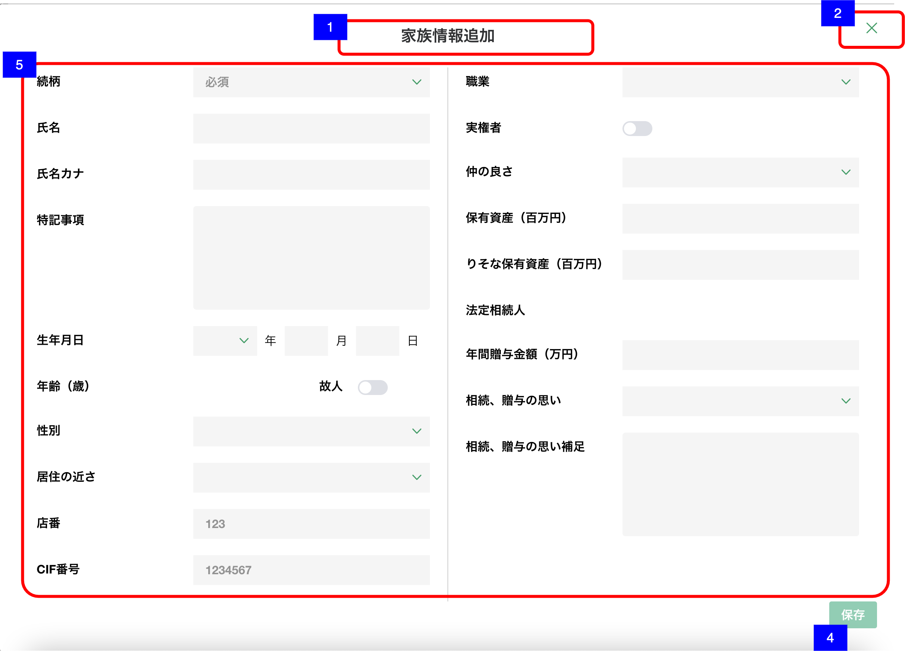
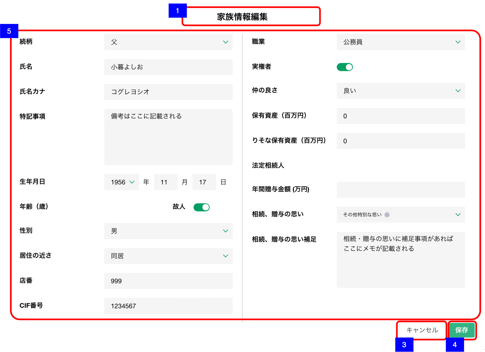

# 家族情報作成・編集

## 概要

家族情報を新規作成・編集するための画面

## 画面遷移

N/A

## 画面レイアウト図

- 家族情報追加

- 家族情報編集

## 画面項目

家族情報詳細には、以下の情報が上から順に表示する。

1. 画面名
    - [x] 新規作成の場合、「家族情報詳細」が表示される。
    - [x] 編集の場合「家族情報編集」が表示される。
2. 閉じるボタン
    - [x] 押下すると、[閉じるボタンを押下](#閉じるボタンを押下)を実行する。
    - [ ] 編集の場合、表示されない。
3. キャンセルボタン
    - [x] 新規作成の場合は表示されない。
    - [x] 押下すると、[キャンセルボタンを押下](#キャンセルボタンを押下)を実行する。
4. 保存ボタン
    - [x] 押下すると、[保存ボタンを押下](#保存ボタンを押下)を実行する。
    - [x] 作成時はいずれかの項目に入力があった場合、活性化する。
    - [x] 編集時はいずれかの項目の入力値に変更があった場合、活性化する。
5. 家族情報詳細
    - 続柄
        - [x] 新規作成の場合、プレースホルダーとして「必須」が表示される
        - [x] 編集の場合、続柄が初期選択される。
        - [x] 選択項目から値を選択できる。「父」/「母」/「配偶者」/「他パートナー」/「子」/「子の配偶者」/「孫」/「きょうだい」/「きょうだいの配偶者」/「甥姪」/「その他」
        - [x] 続柄が選択された場合、続柄詳細、続柄補足、当人の親、当人の配偶者をリセットする。
    - 続柄詳細
      - [x] 続柄にて「父」/「母」を選択している場合、項目を表示しない。
      - [x] 続柄にて「配偶者」/「「子」/「きょうだい」/「子の配偶者」/「きょうだいの配偶者」/「甥姪」/「他パートナー」/「その他」を選択している場合、項目を表示する。
      - [x] 編集の場合、続柄詳細が初期選択される。
      - [x] 選択項目から値を選択できる。続柄に応じてドロップダウンの選択肢が変化する。
        - [x] 続柄が「配偶者」の場合、「未選択」/「夫」/「妻」の選択項目
        - [x] 続柄が「子」の場合、「未選択」/「長男」/「長女」/「次男」/「次女」...「九男」/「九女」/「十男」/「十女」の選択項目を表示する。
        - [x]  続柄が「子の配偶者」の場合、「未選択」/「子の夫」/「子の妻」の選択項目を表示する。
        - [x]  続柄が「きょうだい」の場合、「未選択」/「兄」/「姉」/「弟」/「妹」の選択項目を表示する。
        - [x]  続柄が「きょうだいの配偶者」の場合、「未選択」/「きょうだいの夫」/「きょうだいの妻」の選択項目を表示する。
        - [x]  続柄が「甥姪」の場合、「未選択」/「甥」/「姪」の選択項目を表示する。
        - [x]  続柄が「他パートナー」の場合、「未選択」/「夫（内縁）」/「妻（内縁）」/「前夫」/「前妻」の選択項目を表示する。
        - [x]  続柄が「その他」の場合、「未選択」/「祖父」/「祖母」/「養父」/「養母」/「義父」/「義母」/「おじ」/「おば」/「甥姪の夫」/「甥姪の妻」/「孫の夫」/「孫の妻」/「ひ孫」の選択項目を表示する。
    - 続柄補足
      - [x] 続柄にて「父」/「母」/「配偶者」/「子の配偶者」/「孫」/「甥姪」/「その他」を選択している場合、項目を表示しない。
      - [x] 続柄にて「子」/「他パートナー」を選択している場合、項目を表示する。
      - [x] 編集の場合、続柄補足が初期選択される。
      - [x] 選択項目から値を選択できる。続柄に応じてドロップダウンの選択肢が変化する。
        - [x] 続柄が「子」の場合、「未選択」/「孫養子」/「養子」/「前夫の子」/「前妻の子」/「非嫡出子」/「連れ子」の選択項目を表示する。
        - [x] 続柄が「他パートナー」の場合、「未選択」/「離別」/「死別」の選択項目を表示する。
    - 氏名
      - [x] 編集の場合、登録されている氏名が表示される。
      - [x] 入力可能文字が30文字である。
    - 氏名カナ
      - [x] 編集の場合、登録されている氏名カナが表示される。
      - [x] 入力可能文字が30文字である。
    - 特記事項
      - [x] 編集の場合、登録されている特記事項が表示される。
      - [x] 表示領域を超える文字数がある場合は、スクロールして全文を確認できる。
      - [x] 入力可能文字が250文字である。
    - 生年月日
      - [x] 編集の場合、登録されている生年月日が表示される。
      - [x] 年は選択項目から値を選択できる。選択肢は`「西暦（和暦）」`の形式で表示される。
      - [x] 月と日は入力可能文字が2文字である。
    - 年齢（歳）
      - [x] 年齢が表示される。
      - [x] 生年月日が入力されていない、もしくは年月日のいずれかが不明の場合は年齢は表示されない。
      - [x] 故人の場合は表示されない。
    - 故人
      - [x] 編集かつ故人に該当する場合、スイッチ（トグル）がオンで表示される。
      - [x] スイッチ（トグル）でオン・オフを切り替えできる。
    - 性別
      - [x] 編集の場合、性別が初期選択される。
      - [x] 選択項目から値を選択できる。「男」/「女」/「その他」/「未選択」
    - 居住の近さ
      - [x] 編集の場合、居住の近さが初期選択される。
      - [x] 選択項目から値を選択できる。「同居」/「別居」/「別居（近隣）」/「別居（遠方）」/「未選択」
    - 店番
      - [x] 編集の場合、店番が表示される。
      - [x] 数値のみ入力可能とし、数値以外を入力した場合エラーメッセージを表示する。
      - [x] 入力可能文字が3文字である。
      - [x] 3桁に満たない数値を入力した場合フォーカスを外す際に頭0埋めする。
    - CIF番号
      - [x] 編集の場合、CIF番号が表示される。
      - [x] 数値のみ入力可能とし、数値以外を入力した場合エラーメッセージを表示する。
      - [x] 入力可能文字が7文字である。
      - [x] 7桁に満たない数値を入力した場合フォーカスを外す際に頭0埋めする。
    - 職業
      - [x] 編集の場合、職業が初期選択される。
      - [x] 選択項目から値を選択できる。「公務員」/「会社員・団体職員」/「その他給与所得者」/「団体役員」/「会社役員」/「個人事業者」/「主婦」/「任意団体」/「無職の方」/「その他」/「未選択 」
    - 当人の親
      - [x] 続柄が「孫」、「甥姪」でない場合、表示しない。
      - [x] 当人の親の名前が表示される。
      - [x] 登録されていない項目は表示されない。
    - 当人の配偶者
      - [x] 続柄が「子」、「きょうだい」「子の配偶者」、「きょうだいの配偶者」でない場合、表示しない。
      - [x] 当人の配偶者の続柄、続柄詳細、続柄補足、名前が中点（・）で連結して表示される。
      - [x] 登録されていない項目は表示されない。
    - 実権者
      - [x] 編集かつ実権者に該当する場合、スイッチ（トグル）がオンで表示される。
      - [x] スイッチ（トグル）でオン・オフを切り替えできる。
    - 仲の良さ
      - [x] 編集の場合、仲の良さが初期選択される。
      - [x] 選択項目から値を選択できる。「良い」/「悪い」/「未選択」
    - 保有資産（百万円）
      - [x] 編集の場合、保有資産が百万円単位で表示される。
      - [x] 数値のみ入力可能とし、数値以外を入力した場合エラーメッセージを表示する。
      - [x] 入力可能文字が5文字である。（1000億円未満）
    - りそな保有資産（百万円）
      - [x] 編集の場合、りそな保有資産が百万円単位で表示される。
      - [x] 数値のみ入力可能とし、数値以外を入力した場合エラーメッセージを表示する。
      - [x] 入力可能文字が5文字である。（1000億円未満）
    - 法定相続人
      - [x] 法定相続人が表示される。「該当」/「該当（代襲）」
    - 年間贈与金額（万円）
      - [x] 編集の場合、年間贈与金額が万円単位で表示される。
      - [x] 数値のみ入力可能とし、数値以外を入力した場合エラーメッセージを表示する。
      - [x] 入力可能文字が7文字である。（1000億円未満）
    - 相続、贈与の思い
      - [x] 編集の場合、相続、贈与の思いが初期選択（タグ表示）される。
      - [x] 選択項目から値を複数選択できる。「多めに遺したい」/「あまり遺したくない」/「不動産を渡したい」/「自社株を渡したい」/「投資商品を渡したい」/「毎年贈与をしたい」/「教育資金の援助をしたい」/「住宅資金の援助をしたい」/「結婚資金の援助をしたい」/「その他特別な思い」
    - 相続、贈与の思い補足
      - [x] 編集の場合、相続、贈与の思い補足が表示される。
      - [x] 表示領域を超える文字数がある場合は、スクロールして全文を確認できる。

## イベント

この項では、当画面にて実行されるイベント一覧を記述する。

### 閉じるボタンを押下

- [x] 確認ダイアログを表示する。
  - 「キャンセル」を押下した場合
    - [x] ダイアログを閉じてそのまま当画面を表示する。
  - 「閉じる」を押下した場合
    - [x] 入力内容を破棄し当画面を閉じて[家族情報一覧画面](家族情報一覧.md)に戻る。

### キャンセルボタンを押下

- [x] 確認ダイアログを表示する。
  - 「キャンセル」を押下した場合
    - [x] ダイアログを閉じてそのまま当画面を表示する。
  - 「閉じる」を押下した場合
    - [x] [家族情報詳細画面](家族情報詳細.md)に戻る。

### 保存ボタンを押下

- [x] 更新処理を実行し当画面を閉じて[家族情報一覧画面](家族情報一覧.md)に戻る。
- [x] 家族情報一覧に保存した家族情報が反映される。
- [x] ヒアリングの更新日と更新者が更新される。
- [x] 排他制御に関しては渉外アプリiOSの[家族情報詳細画面](../../渉外アプリiOS/家族情報/家族情報詳細.md)と同様
