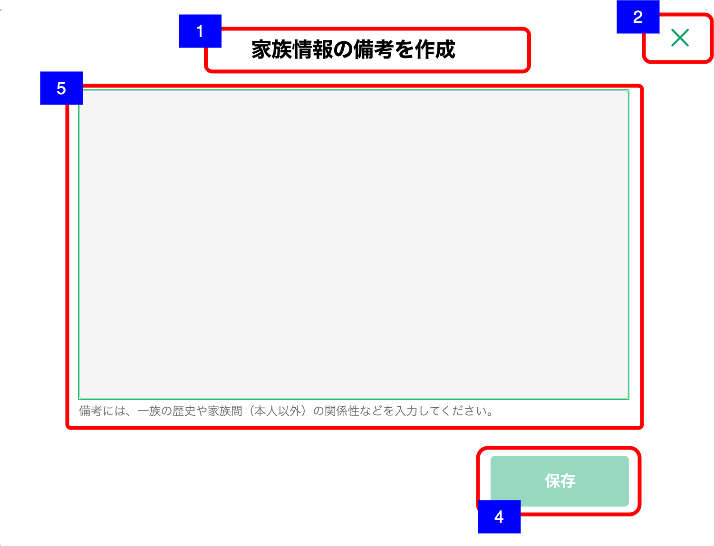
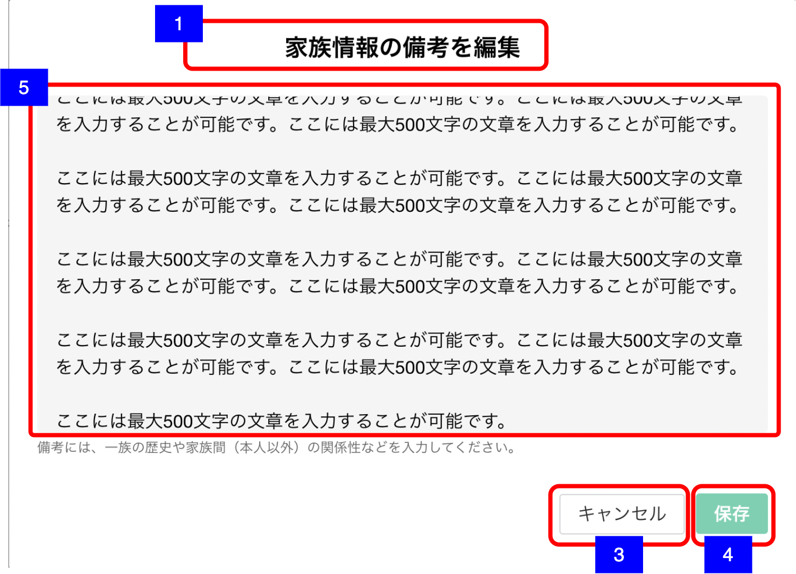

# 家族情報備考作成・編集

## 概要

家族情報の備考を新規作成・編集するための画面

## 画面遷移

N/A

## 画面レイアウト図

- 家族情報作成  

- 家族情報編集

## 画面項目

1. 画面名
    - [x] 新規作成の場合、「家族情報の備考を作成」が表示される。
    - [x] 編集の場合「家族情報の備考を編集」が表示される。
2. 閉じるボタン
    - [x] 押下すると、[閉じるボタンを押下](#閉じるボタンを押下)を実行する。
    - [ ] 編集の場合、表示されない。
3. キャンセルボタン
    - [x] 新規作成の場合は表示されない。
    - [x] 押下すると、[キャンセルボタンを押下](#キャンセルボタンを押下)を実行する。
4. 保存ボタン
    - [x] 押下すると、[保存ボタンを押下](#保存ボタンを押下)を実行する。
5. 備考
    - [x] 備考がすでにある場合は備考の内容が入力された状態で表示される。
    - [x] 表示領域を超える文字数がある場合は、スクロールして全文を確認できる。
    - [x] 表示エリアの下に注釈が表示される。
    - [x] 入力可能文字が500文字である。

## イベント

この項では、当画面にて実行されるイベント一覧を記述する。

### 閉じるボタンを押下

- [x] 当画面を閉じて[家族情報一覧画面](家族情報一覧.md)に戻る。

### キャンセルボタンを押下

- [x] 確認ダイアログを表示する。
  - 「キャンセル」を押下した場合
    - [x] ダイアログを閉じてそのまま当画面を表示する。
  - 「閉じる」を押下した場合
    - [x] [家族情報備考画面](家族情報備考.md)に戻る。

### 保存ボタンを押下

- [x] 更新処理を実行し当画面を閉じて[家族情報一覧画面](家族情報一覧.md)に戻る。
- [x] 新規作成操作で表示した場合、登録処理を行う。
  - [x] 当画面を閉じ、保存した旨のダイアログを表示する。
  - [x] 家族情報一覧画面上部の備考へのリンクボタンのラベルが「備考あり」になる。
  - [x] ヒアリング情報が更新される。
- [x] 編集操作で表示した場合、更新処理を行う。
  - [x] 当画面を閉じ、保存した旨のダイアログを表示する。
  - [x] ヒアリング情報が更新される。
  - [x] ブランクで更新した場合、「備考あり」ボタンが「備考を作成」ボタンとなる。ヒアリングの日付はブランクに更新した日付となる。
- [x] 排他制御に関しては渉外アプリiOSの[家族情報詳細画面](../../渉外アプリiOS/家族情報/家族情報詳細.md)と同様
