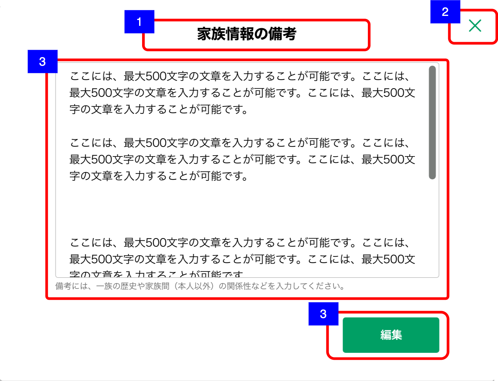

# 家族情報備考詳細

## 概要

家族情報の備考を確認するための画面

## 画面遷移

N/A

## 画面レイアウト図

- 家族情報一覧  

## 画面項目

1. 画面名
    - [x] 「家族情報の備考」が表示される。
2. 閉じるボタン
    - [x] 押下すると、[閉じるボタンを押下](#閉じるボタンを押下)を実行する。
3. 編集ボタン
    - [x] 押下すると、[編集ボタンを押下](#編集ボタンを押下)を実行する。
4. 備考
    - [x] 家族情報備考の内容が表示される。
    - [x] 表示領域を超える文字数がある場合は、スクロールして全文を確認できる。
    - [x] 登録されていない場合は何も表示されない。
    - [x] 備考の下に注釈が表示される。

## イベント

この項では、当画面にて実行されるイベント一覧を記述する。

### 閉じるボタンを押下

- [x] 当画面を閉じて[家族情報一覧画面](家族情報一覧.md)に戻る。

### 編集ボタンを押下

- [x] [家族情報備考作成・編集画面](家族情報備考作成・編集.md)を表示する。
