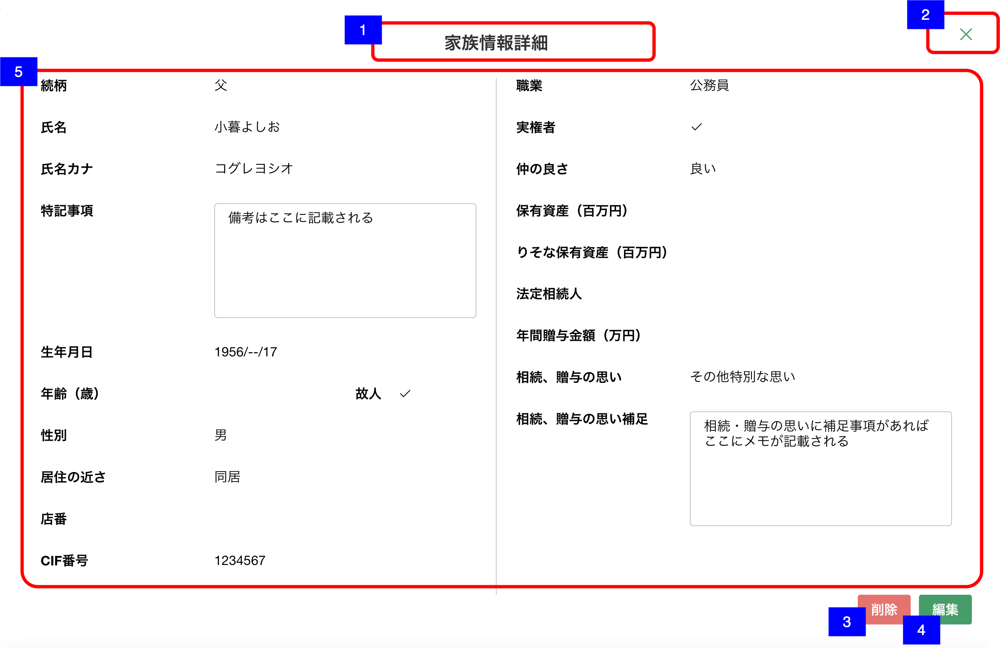

# 家族情報詳細

## 概要

家族情報の詳細を確認するための画面

## 画面遷移

N/A

## 画面レイアウト図

- 家族情報詳細

## 画面項目

家族情報詳細には、以下の情報が上から順に表示する。

1. 画面名
    - [x] 「家族情報詳細」が表示される。
2. 閉じるボタン
    - [x] 押下すると、[閉じるボタンを押下](#閉じるボタンを押下)を実行する。
3. 削除ボタン
    - [x] 押下すると、[削除ボタンを押下](#削除ボタンを押下)を実行する。
4. 編集ボタン
    - [x] 押下すると、[編集ボタンを押下](#編集ボタンを押下)を実行する。
5. 家族情報詳細
    - 続柄
      - [x] 続柄が表示される。
    - 続柄詳細
      - [x] 続柄が「父」/「母」の場合、項目を表示しない。
      - [x] 続柄が「配偶者」/「「子」/「きょうだい」/「子の配偶者」/「きょうだいの配偶者」/「甥姪」/「他パートナー」/「その他」の場合、項目を表示する。
        - [x]  続柄が「配偶者」の場合、「夫」/「妻」のいずれかもしくは非表示
        - [x]  続柄が「子」の場合、「長男」/「長女」/「次男」/「次女」...「九男」/「九女」/「十男」/「十女」のいずれかもしくは非表示
        - [x]  続柄が「子の配偶者」の場合、「子の夫」/「子の妻」のいずれかもしくは非表示
        - [x] 続柄が「きょうだい」の場合、「兄」/「姉」/「弟」/「妹」のいずれかもしくは非表示
        - [x] 続柄が「きょうだいの配偶者」の場合、「きょうだいの夫」/「きょうだいの妻」のいずれかもしくは非表示
        - [x] 続柄が「甥姪」の場合、「甥」/「姪」のいずれかもしくは非表示
        - [x] 続柄が「他パートナー」の場合、「未選択」/「夫（内縁）」/「妻（内縁）」/「前夫」/「前妻」のいずれかもしくは非表示
        - [x] 続柄が「その他」の場合、「祖父」/「祖母」/「養父」/「養母」/「義父」/「義母」/「おじ」/「おば」/「甥姪の夫」/「甥姪の妻」/「孫の夫」/「孫の妻」/「ひ孫」のいずれかもしくは非表示
    - 続柄補足
      - [x] 続柄が「父」/「母」/「配偶者」/「子の配偶者」/「孫」/「甥姪」/「その他」の場合、項目を表示しない。
      - [x] 続柄が「子」/「他パートナー」の場合、項目を表示する。
        - [x] 続柄が「子」の場合、「孫養子」/「養子」/「前夫の子」/「前妻の子」/「非嫡出子」/「連れ子」のいずれかもしくは非表示
        - [x] 続柄が「他パートナー」の場合、「離別」/「死別」のいずれかもしくは非表示
    - 氏名
      - [x] 氏名が表示される。
      - [x] 登録されていない場合は何も表示されない。
    - 氏名カナ
      - [x] 氏名カナが表示される。
      - [x] 登録されていない場合は何も表示されない。
    - 特記事項
      - [x] 特記事項が表示される。
      - [x] 表示領域を超える文字数がある場合は、スクロールして全文を確認できる。
      - [x] 登録されていない場合は何も表示されない。
    - 生年月日
      - [x] 生年月日が表示される。「yyyy/MM/dd」
      - [x] 年月日のいずれかが不明の場合は、`「yyyy/MM/--」`/`「yyyy/--/dd」`/`「----/MM/dd」`の形式で表示される。
      - [x] 登録されていない場合は何も表示されない。
    - 年齢（歳）
      - [x] 年齢が表示される。
      - [x] 生年月日が登録されていない、もしくは年月日のいずれかが不明の場合は年齢は表示されない。
      - [x] 故人の場合は表示されない。
    - 故人
      - [x] 故人に該当する場合、「✔」（チェックマーク）が表示される
      - [x] 故人に該当しない場合、「-」が表示される
    - 性別
      - [x] 性別が表示される。「男」/「女」/「その他」
      - [x] 登録されていない場合、または、「未選択」の場合は何も表示されない。
    - 居住の近さ
      - [x] 居住の近さが表示される。「同居」/「別居」/「別居（近隣）」/「別居（遠方）」/「未選択」
      - [x] 登録されていない場合、または、「未選択」の場合は何も表示されない。
    - 店番
      - [x] 店番が表示される。
      - [x] 登録されていない場合は何も表示されない。
    - CIF番号
      - [x] CIF番号が表示される。
      - [x] 登録されていない場合は何も表示されない。
    - 職業
      - [x] 職業が表示される。「公務員」/「会社員・団体職員」/「その他給与所得者」/「団体役員」/「会社役員」/「個人事業者」/「主婦」/「任意団体」/「無職の方」/「その他」
      - [x] 登録されていない場合、または、「未選択」の場合は何も表示されない。
    - 当人の親
      - [x] 続柄が「孫」、「甥姪」でない場合、表示しない。
      - [x] 当人の親の名前が表示される。
      - [x] 登録されていない項目は表示されない。
    - 当人の配偶者
      - [x] 続柄が「子」、「きょうだい」「子の配偶者」、「きょうだいの配偶者」でない場合、表示しない。
      - [x] 当人の配偶者の続柄、続柄詳細、続柄補足、名前が中点（・）で連結して表示される。
      - [x] 登録されていない項目は表示されない。
    - 実権者
      - [x] 実権者に該当する場合、「✔」（チェックマーク）が表示される
      - [x] 実権者に該当しない場合、「-」が表示される
    - 仲の良さ
      - [x] 仲の良さが表示される。「良い」/「悪い」
      - [x] 登録されていない場合、または、「未選択」の場合は何も表示されない。
    - 保有資産（百万円）
      - [x] 保有資産が百万円単位で表示される。
      - [x] 登録されていない場合は何も表示されない。
    - りそな保有資産（百万円）
      - [x] りそな保有資産が百万円単位で表示される。
      - [x] 登録されていない場合は何も表示されない。
    - 法定相続人
      - [x] 法定相続人に該当する場合「該当」と表示される。
      - [x] 代襲相続人に該当する場合「該当（代襲）」と表示される。
      - [x] 該当しない場合は何も表示されない。
    - 年間贈与金額（万円）
      - [x] 年間贈与金額が万円単位で表示される。
      - [x] 登録されていない場合は何も表示されない。
    - 相続、贈与の思い
      - [x] 相続、贈与の思いが表示される。「多めに遺したい」/「あまり遺したくない」/「不動産を渡したい」/「自社株を渡したい」/「投資商品を渡したい」/「毎年贈与をしたい」/「教育資金の援助をしたい」/「住宅資金の援助をしたい」/「結婚資金の援助をしたい」/「その他特別な思い」
      - [x] 登録されていない場合は何も表示されない。
    - 相続、贈与の思い補足
      - [x] 相続、贈与の思い補足が表示される。選択した内容が全て確認できる。
      - [x] 表示領域を超える文字数がある場合は、スクロールして全文を確認できる。
      - [x] 登録されていない場合は何も表示されない。

## イベント

この項では、当画面にて実行されるイベント一覧を記述する。

### 閉じるボタンを押下

- [x] 当画面を閉じて[家族情報一覧画面](家族情報一覧.md)に戻る。

### 削除ボタンを押下

- [x] 確認ダイアログを表示する。
  - 「キャンセル」を押下した場合
    - [x] ダイアログを閉じてそのまま当画面を表示する。
  - 「削除」を押下した場合
    - [x] 削除処理を実行し当画面を閉じて[家族情報一覧画面](家族情報一覧.md)に戻る。
    - [x] 家族情報一覧から該当家族の情報が削除され表示されない。
    - [x] 子の削除時、その「子」に紐づく「子の配偶者」、「孫」が存在していた場合、「削除した場合、同一世帯内の方々（配偶者、孫）はそれぞれ独立した世帯として登録されます。故人となった場合には、削除ではなく「故人」として登録できます。削除しますか？」のメッセージが表示される。削除を行なった場合、それらの「当人の親」、「当人の配偶者」は削除される。
    - [x] きょうだいの削除時、その「きょうだい」に紐づく「きょうだいの配偶者」、「甥姪」が存在していた場合、「削除した場合、同一世帯内の方々（配偶者、甥姪）はそれぞれ独立した世帯として登録されます。故人となった場合には、削除ではなく「故人」として登録できます。削除しますか？」のメッセージが表示される。削除を行なった場合、それらの「当人の親」、「当人の配偶者」は削除される。
    - [x] 排他制御に関しては渉外アプリiOSの[家族情報詳細画面](../../渉外アプリiOS/家族情報/家族情報詳細.md)と同様

### 編集ボタンを押下

- [x] [家族情報作成・編集画面](./家族情報作成・編集.md)を表示する。
