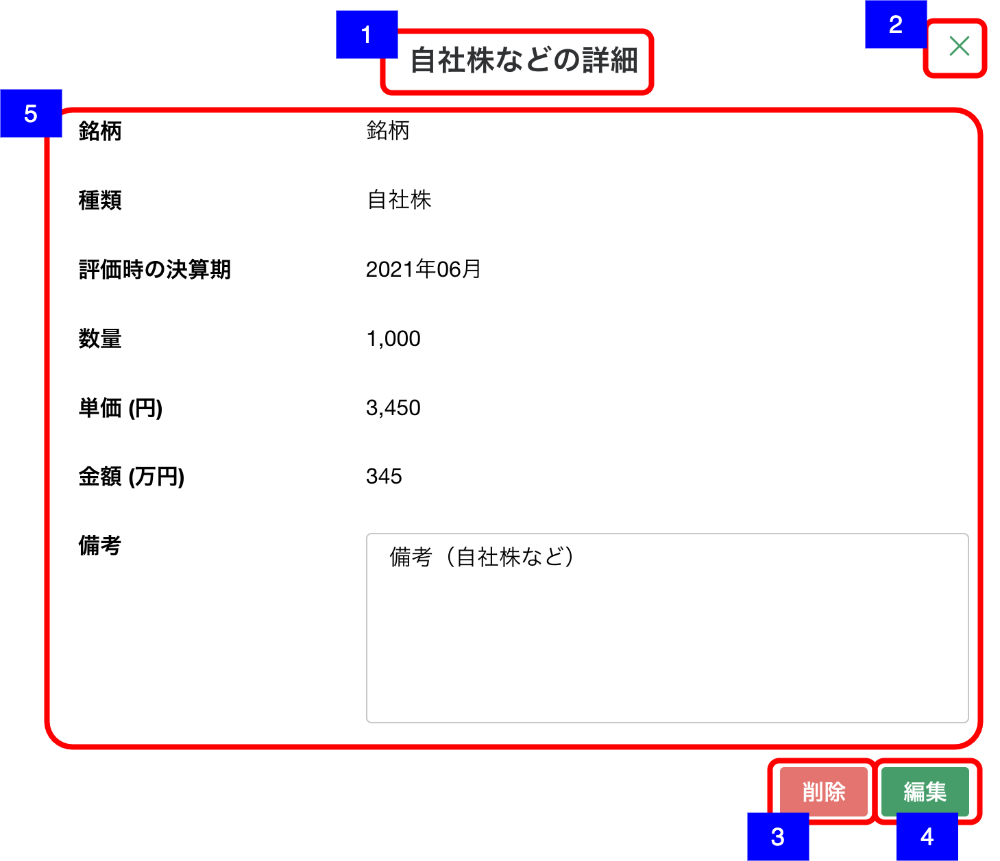

# 明細詳細ダイアログ（その他固定資産-自社株など）

## 概要

資産負債情報 - 自社株などの明細を確認するための画面。

## 画面遷移

N/A

## 画面レイアウト図

- 明細詳細ダイアログ（その他固定資産-自社株など）

## 画面項目

明細詳細ダイアログ（その他固定資産-自社株など）には、以下の情報を上から順に表示する。

1. 画面名
    - [x] "自社株などの詳細" が表示される。
2. 閉じるボタン
    - [x] 押下すると、[閉じるボタンを押下](#閉じるボタンを押下)を実行する。
3. 削除ボタン
    - [x] 押下すると、[削除ボタンを押下](#削除ボタンを押下)を実行する。
4. 編集ボタン
    - [x] 押下すると、[編集ボタンを押下](#編集ボタンを押下)を実行する。
5. 自社株など詳細
    - 銘柄
        - [x] 銘柄が表示される。
        - [x] 登録されていない場合は何も表示されない。
    - 種類
        - [x] 「自社株」/「その他」のいずれかが表示される。
        - [x] 未選択もしくは登録されていない場合は何も表示されない。
    - 評価時の決算期
        - [x] 評価時の決算期が表示される。「yyyy年MM月」
        - [x] 年月のいずれかが不明の場合は、`「yyyy年--月」`/`「----年MM月」`の形式で表示される。
        - [x] 登録されていない場合は何も表示されない。
    - 数量
        - [x] 数量が表示される。
        - [x] 登録されていない場合は何も表示されない。
    - 単価
        - [x] 単価が円単位で表示される。
        - [x] 登録されていない場合は何も表示されない。
    - 金額
        - [x] 金額が整数もしくは小数第一位までの万円単位で表示される。
        - [x] 登録されていない場合は何も表示されない。
    - 備考
        - [x] 備考が表示される。
        - [x] 表示領域を超える文字数がある場合は、スクロールして全文を確認できる。
        - [x] 登録されていない場合は何も表示されない。

## イベント

この項では、当画面にて実行されるイベント一覧を記述する。

### 削除ボタンを押下

- [x] 確認ダイアログを表示する。
  - 「キャンセル」を押下した場合
    - [x] ダイアログを閉じてそのまま当画面を表示する。
  - 「削除」を押下した場合
    - [x] 削除処理を実行し当画面を閉じて[資産負債情報明細一覧（その他固定資産）画面](資産負債情報明細一覧（その他固定資産）.md)に戻る。
    - [x] 資産負債情報明細一覧（その他固定資産）画面から該当明細の情報が削除され表示されない。

### 編集ボタンを押下

- [x] [明細追加・編集ダイアログ（その他固定資産-自社株など）](./明細追加・編集ダイアログ（その他固定資産-自社株など）.md)を表示する。
