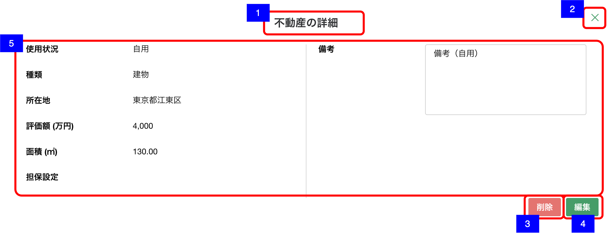

# 明細詳細ダイアログ（不動産）

## 概要

資産負債情報 - 不動産の明細を確認するための画面。

## 画面遷移

N/A

## 画面レイアウト図

- 明細詳細ダイアログ（不動産）

## 画面項目

明細詳細ダイアログ（不動産）には、以下の情報を上から順に表示する。

1. 画面名
    - [x] "不動産の詳細" が表示される。
2. 閉じるボタン
    - [x] 押下すると、[閉じるボタンを押下](#閉じるボタンを押下)を実行する。
3. 削除ボタン
    - [x] 押下すると、[削除ボタンを押下](#削除ボタンを押下)を実行する。
4. 編集ボタン
    - [x] 押下すると、[編集ボタンを押下](#編集ボタンを押下)を実行する。
5. 不動産詳細
    - 使用状況
        - [x] 「自用」/「賃貸（住居）」/「賃貸（住居以外）」/「賃貸（不明」/「底地」/「駐車場」/「更地」/「生産緑地」/「その他」のいずれかが表示される
        - [x] 未選択もしくは登録されていない場合は何も表示されない。
    - 種類
        - [x] 「土地」/「建物」/「土地付建物」/「マンション」/「その他」のいずれかが表示される
        - [x] 未選択もしくは登録されていない場合は何も表示されない。
    - 所在地
        - [x] 所在地が表示される。
        - [x] 登録されていない場合は何も表示されない。
    - 評価額
        - [x] 評価額が整数もしくは小数第一位までの万円単位で表示される。
        - [x] 登録されていない場合は何も表示されない。
    - 面積
        - [x] 面積が小数部2桁固定で表示される。
        - [x] 登録されていない場合は何も表示されない。
    - 担保設定
        - [x] 「有り」/「無し」のいずれかが表示される
        - [x] 未選択もしくは登録されていない場合は何も表示されない。
    - 備考
        - [x] 備考が表示される。
        - [x] 表示領域を超える文字数がある場合は、スクロールして全文を確認できる。
        - [x] 登録されていない場合は何も表示されない。

## イベント

この項では、当画面にて実行されるイベント一覧を記述する。

### 閉じるボタンを押下

- [x] 当画面を閉じ、[資産負債情報明細一覧（不動産）画面](資産負債情報明細一覧（不動産）.md)に戻る。

### 削除ボタンを押下

- [x] 確認ダイアログを表示する。
  - 「キャンセル」を押下した場合
    - [x] ダイアログを閉じてそのまま当画面を表示する。
  - 「削除」を押下した場合
    - [x] 削除処理を実行し当画面を閉じて[資産負債情報明細一覧（不動産）画面](資産負債情報明細一覧（不動産）.md)に戻る。
    - [x] 資産負債情報明細一覧（不動産）一覧から該当明細の情報が削除され表示されない。

### 編集ボタンを押下

- [x] [明細追加・編集ダイアログ（不動産）](./明細追加・編集ダイアログ（不動産）.md)を表示する。
