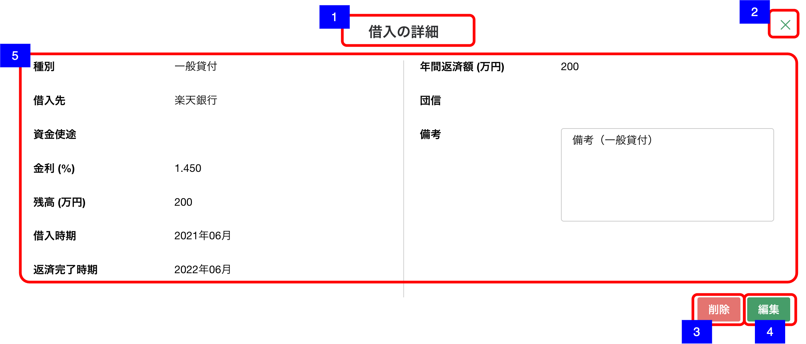

# 明細詳細ダイアログ（借入）

## 概要

資産負債情報 - 借入の明細を確認するための画面。

## 画面遷移

N/A

## 画面レイアウト図

- 明細詳細ダイアログ（借入）

## 画面項目

明細詳細ダイアログ（借入）には、以下の情報を上から順に表示する。

1. 画面名
    - [x] "借入の詳細" が表示される。
2. 閉じるボタン
    - [x] 押下すると、[閉じるボタンを押下](#閉じるボタンを押下)を実行する。
3. 削除ボタン
    - [x] 押下すると、[削除ボタンを押下](#削除ボタンを押下)を実行する。
4. 編集ボタン
    - [x] 押下すると、[編集ボタンを押下](#編集ボタンを押下)を実行する。
5. 借入詳細
    - 種別
        - [x] 「住宅ローン」/「アパマンローン」/「ローン（不明）」/「一般貸付」/「その他借入」のいずれかが表示される。
        - [x] 未選択もしくは登録されていない場合は何も表示されない。
    - 借入先
        - [x] 借入先が表示される。
        - [x] 登録されていない場合は何も表示されない。
    - 資金用途
        - [x] 資金用途が表示される。
        - [x] 登録されていない場合は何も表示されない。
    - 金利
        - [x] 金利が小数部3桁固定で表示される。
        - [x] 登録されていない場合は何も表示されない。
    - 残高
        - [x] 残高が整数もしくは小数第一位までの万円単位で表示される。
        - [x] 登録されていない場合は何も表示されない。
    - 借入時期
        - [x] 借入時期が表示される。「yyyy年MM月」
        - [x] 年月のいずれかが不明の場合は、`「yyyy年--月」`/`「----年MM月」`の形式で表示される。
        - [x] 登録されていない場合は何も表示されない。
    - 返済完了時期
        - [x] 返済完了時期が表示される。「yyyy年MM月」
        - [x] 年月のいずれかが不明の場合は、`「yyyy年--月」`/`「----年MM月」`の形式で表示される。
        - [x] 登録されていない場合は何も表示されない。
    - 年間返済額
        - [x] 年間返済額が整数もしくは小数第一位までの万円単位で表示される。
        - [x] 登録されていない場合は何も表示されない。
    - 団信
        - [x] 「有り」/「無し」のいずれかが表示される。
        - [x] 未選択もしくは登録されていない場合は何も表示されない。
    - 備考
        - [x] 備考が表示される。
        - [x] 表示領域を超える文字数がある場合は、スクロールして全文を確認できる。
        - [x] 登録されていない場合は何も表示されない。

## イベント

この項では、当画面にて実行されるイベント一覧を記述する。

### 閉じるボタンを押下

- [x] 当画面を閉じ、[資産負債情報明細一覧（借入）画面](資産負債情報明細一覧（借入）.md)に戻る。

### 削除ボタンを押下

- [x] 確認ダイアログを表示する。
  - 「キャンセル」を押下した場合
    - [x] ダイアログを閉じてそのまま当画面を表示する。
  - 「削除」を押下した場合
    - [x] 削除処理を実行し当画面を閉じて[資産負債情報明細一覧（借入）画面](資産負債情報明細一覧（借入）.md)に戻る。
    - [x] 資産負債情報明細一覧（借入）一覧から該当明細の情報が削除され表示されない。

### 編集ボタンを押下

- [x] [明細追加・編集ダイアログ（借入）](./明細追加・編集ダイアログ（借入）.md)を表示する。
