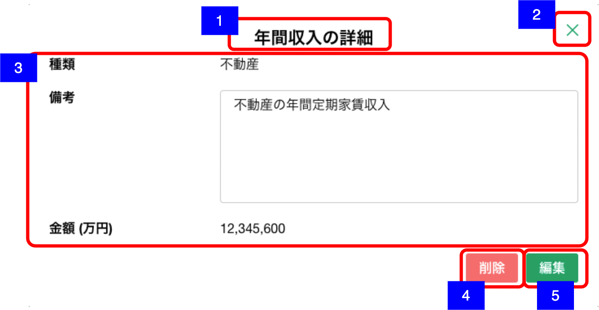

# 明細詳細ダイアログ（年間収入）

## 概要

年間収入の明細を確認するための画面。

## 画面遷移

N/A

## 画面レイアウト図

- 明細詳細ダイアログ（年間収入）

## 画面項目
明細詳細ダイアログ（年間収入）には、以下の情報を上から順に表示する。

1. 画面名
    - [X] "年間収入の詳細" を表示する。
2. 閉じるボタン
    - [X] タップすると、[閉じるボタンをタップ](#閉じるボタンをタップ)を実行する。
3. 詳細
    - 種類
      - [X] "未選択"の場合、ブランクで表示される。
      - [X] "給与/事業/不動産/利子・配当/年金/その他"のいずれかが表示される。
    - 備考
      - [X] 存在しない場合、ブランクで表示する。
      - [X] 存在する場合、登録されている備考が表示される。
      - [X] 表示領域を超える文字数がある場合は、スクロールして全文を確認できる。
    - 金額
      - [X] 存在しない場合、ブランクで表示する。
      - [X] 存在する場合、対象の金額は"万円"単位で小数点第一位まで表示される。
4. 削除ボタン
    - [X] タップすると、[削除ボタンをタップ](#削除ボタンをタップ)を実行する。
5. 編集ボタン
    - [X] タップすると、[編集ボタンをタップ](#編集ボタンをタップ)を実行する。

## イベント
この項では、当画面にて実行されるイベント一覧を記述する。

### 閉じるボタンをタップ
- [X] 当画面を閉じ、[資産負債収入情報明細一覧（収入見込情報）](./資産負債収入情報明細一覧（収入見込情報）.md)に戻る。

### 削除ボタンをタップ
- [X] 確認ダイアログを表示する。
  - 「キャンセル」を押下した場合
    - [X] ダイアログを閉じてそのまま当画面を表示する。
  - 「削除」を押下した場合
    - [X] 削除処理を実行し当画面を閉じて[資産負債収入情報明細一覧（収入見込情報）](./資産負債収入情報明細一覧（収入見込情報）.md)に戻る。
    - [X] 資産負債収入情報明細一覧（収入見込情報）の年間収入エリアから該当明細の情報が削除されて表示されない。

### 編集ボタンをタップ
- [X] [明細追加・編集ダイアログ（年間収入）](./明細追加・編集ダイアログ（年間収入）.md)を表示する。
