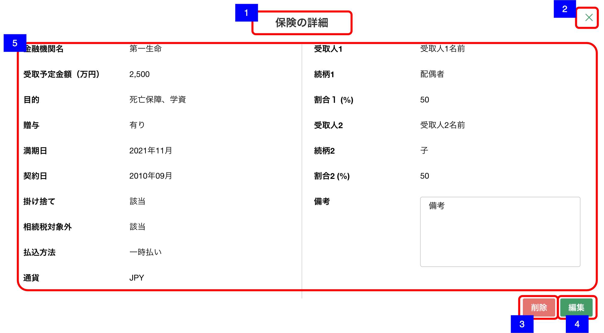

# 明細詳細ダイアログ（預金・投資商品-保険）

## 概要

資産負債情報 - 保険の明細を確認するための画面。

## 画面遷移

N/A

## 画面レイアウト図

- 明細詳細ダイアログ（預金・投資商品-保険）

## 画面項目

明細詳細ダイアログ（預金・投資商品-保険）には、以下の情報を上から順に表示する。

1. 画面名
    - [x] "保険の詳細" が表示される。
2. 閉じるボタン
    - [x] 押下すると、[閉じるボタンを押下](#閉じるボタンを押下)を実行する。
3. 削除ボタン
    - [x] 押下すると、[削除ボタンを押下](#削除ボタンを押下)を実行する。
4. 編集ボタン
    - [x] 押下すると、[編集ボタンを押下](#編集ボタンを押下)を実行する。
5. 預金詳細
    - 金融機関名
        - [x] 金融機関名が表示される。
        - [x] 登録されていない場合は何も表示されない。
    - 受取予定金額
        - [x] 受取予定金額が整数もしくは小数第一位までの万円単位で表示される。
        - [x] 登録されていない場合は何も表示されない。
    - 目的
        - [x] 「死亡保障」/「学費」/「年金」/「貯蓄」/「医療」/「介護」が表示される。
        - [x] 複数登録されている場合は「、」区切りで表示される。
        - [x] 登録されていない場合は何も表示されない。
    - 贈与
        - [x] 「有り」/「無し」が表示される。
        - [x] 登録されていない場合は何も表示されない。
    - 満期日
        - [x] 満期日が表示される。「yyyy年MM月」
        - [x] 年月のいずれかが不明の場合は、`「yyyy年--月」`/`「----年MM月」`の形式で表示される。
        - [x] 登録されていない場合は何も表示されない。
    - 契約日
        - [x] 満期日が表示される。「yyyy年MM月」
        - [x] 年月のいずれかが不明の場合は、`「yyyy年--月」`/`「----年MM月」`の形式で表示される。
        - [x] 登録されていない場合は何も表示されない。
    - 掛け捨て
        - [x] 該当の場合、「該当」が表示される。
        - [x] 非該当もしくは登録されていない場合は何も表示されない。
    - 相続税対象外
        - [x] 該当の場合、「該当」が表示される。
        - [x] 非該当もしくは登録されていない場合は何も表示されない。
    - 払込方法
        - [x] 「一時払い」/「平準払い」が表示される。
        - [x] 未選択もしくは登録されていない場合は何も表示されない。
    - 通貨
        - [x] 「JPY」/「USD」/「AUD」/「EUR」/「その他」が表示される。
        - [x] 未選択もしくは登録されていない場合は何も表示されない。
    - 受取人1
        - [x] 受取人1の名前が表示される。
        - [x] 登録されていない場合は何も表示されない。
    - 続柄1
        - [x] 受取人1の続柄が表示される。
        - [x] 登録されていない場合は何も表示されない。
    - 割合1
        - [x] 受取人1の受け取り割合が表示される。
        - [x] 登録されていない場合は何も表示されない。
    - 受取人2
        - [x] 受取人2の名前が表示される。
        - [x] 登録されていない場合は何も表示されない。
    - 続柄2
        - [x] 受取人2の続柄が表示される。
        - [x] 登録されていない場合は何も表示されない。
    - 割合2
        - [x] 受取人2の受け取り割合が表示される。
        - [x] 登録されていない場合は何も表示されない。
    - 備考
        - [x] 備考が表示される。
        - [x] 表示領域を超える文字数がある場合は、スクロールして全文を確認できる。
        - [x] 登録されていない場合は何も表示されない。

## イベント

この項では、当画面にて実行されるイベント一覧を記述する。

### 閉じるボタンを押下

- [x] 当画面を閉じ、[資産負債情報明細一覧（預金・投資商品）画面](資産負債情報明細一覧（預金・投資商品）.md)に戻る。

### 削除ボタンを押下

- [x] 確認ダイアログを表示する。
  - 「キャンセル」を押下した場合
    - [x] ダイアログを閉じてそのまま当画面を表示する。
  - 「削除」を押下した場合
    - [x] 削除処理を実行し当画面を閉じて[資産負債情報明細一覧（預金・投資商品）画面](資産負債情報明細一覧（預金・投資商品）.md)に戻る。
    - [x] 資産負債情報明細一覧（預金・投資商品）一覧から該当明細の情報が削除され表示されない。

### 編集ボタンを押下

- [x] [明細追加・編集ダイアログ（預金・投資商品-保険）](./明細追加・編集ダイアログ（預金・投資商品-保険）.md)を表示する。
