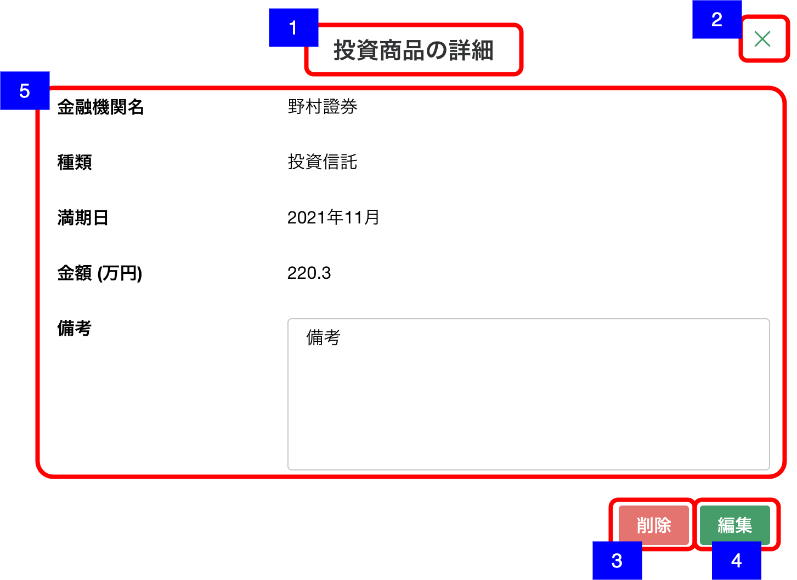

# 明細詳細ダイアログ（預金・投資商品-投資商品）

## 概要

資産負債情報 - 投資商品の明細を確認するための画面。

## 画面遷移

N/A

## 画面レイアウト図

- 明細詳細ダイアログ（預金・投資商品-投資商品）

## 画面項目

明細詳細ダイアログ（預金・投資商品-投資商品）には、以下の情報を上から順に表示する。

1. 画面名
    - [x] "投資商品の詳細" が表示される。
2. 閉じるボタン
    - [x] 押下すると、[閉じるボタンを押下](#閉じるボタンを押下)を実行する。
3. 削除ボタン
    - [x] 押下すると、[削除ボタンを押下](#削除ボタンを押下)を実行する。
4. 編集ボタン
    - [x] 押下すると、[編集ボタンを押下](#編集ボタンを押下)を実行する。
5. 投資商品詳細
    - 金融機関名
        - [x] 金融機関名が表示される。
        - [x] 登録されていない場合は何も表示されない。
    - 種類
        - [x] 「投資信託」/「外貨預金」/「公共債」/「上場株式」/「その他」のいずれかが表示される。
        - [x] 未選択もしくは登録されていない場合は何も表示されない。
    - 満期日
        - [x] 満期日が表示される。「yyyy年MM月」
        - [x] 年月のいずれかが不明の場合は、`「yyyy年--月」`/`「----年MM月」`の形式で表示される。
        - [x] 登録されていない場合は何も表示されない。
    - 金額
        - [x] 金額が整数もしくは小数第一位までの万円単位で表示される。
        - [x] 登録されていない場合は何も表示されない。
    - 備考
        - [x] 備考が表示される。
        - [x] 表示領域を超える文字数がある場合は、スクロールして全文を確認できる。
        - [x] 登録されていない場合は何も表示されない。

## イベント

この項では、当画面にて実行されるイベント一覧を記述する。

### 閉じるボタンを押下

- [x] 当画面を閉じ、[資産負債情報明細一覧（預金・投資商品）画面](資産負債情報明細一覧（預金・投資商品）.md)に戻る。

### 削除ボタンを押下

- [x] 確認ダイアログを表示する。
  - 「キャンセル」を押下した場合
    - [x] ダイアログを閉じてそのまま当画面を表示する。
  - 「削除」を押下した場合
    - [x] 削除処理を実行し当画面を閉じて[資産負債情報明細一覧（預金・投資商品）画面](資産負債情報明細一覧（預金・投資商品）.md)に戻る。
    - [x] 資産負債情報明細一覧（預金・投資商品）一覧から該当明細の情報が削除され表示されない。

### 編集ボタンを押下

- [x] [明細追加・編集ダイアログ（預金・投資商品-投資商品）](./明細追加・編集ダイアログ（預金・投資商品-投資商品）.md)を表示する。
