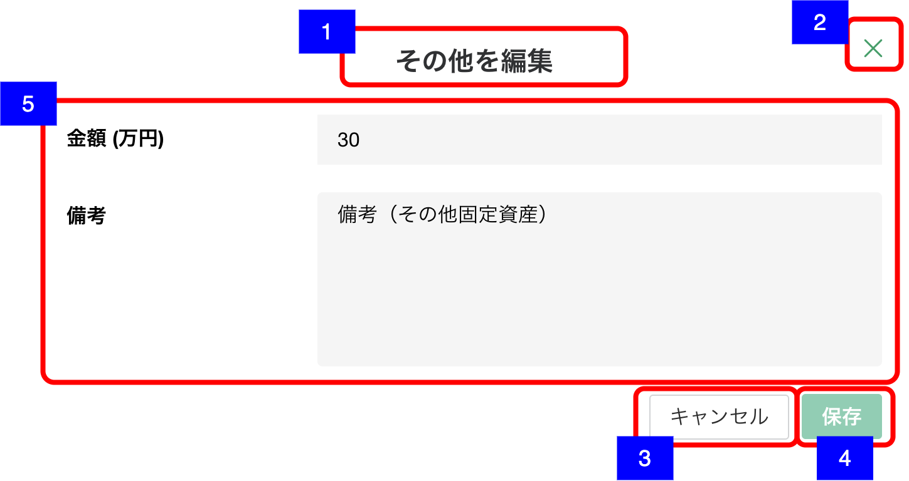

# 明細追加・編集ダイアログ（その他固定資産-その他）

## 概要

資産負債情報 − その他固定資産の明細を作成・編集するための画面。

## 画面遷移

N/A

## 画面レイアウト図

- 明細追加・編集ダイアログ（その他固定資産-その他）

## 画面項目

明細追加・編集ダイアログ（その他固定資産-その他）には、以下の情報を上から順に表示する。

1. 画面名
    - [x] 作成の場合、"その他を追加" が表示される。
    - [x] 編集の場合は、"その他を編集" が表示される。
2. 閉じるボタン
    - [x] 押下すると、[閉じるボタンを押下](#閉じるボタンを押下)を実行する。
    - [ ] 編集の場合は、表示されない。
3. キャンセルボタン
    - [x] 作成の場合は表示されない。
    - [x] 押下すると、[キャンセルボタンを押下](#キャンセルボタンを押下)を実行する。
4. 保存ボタン
    - [x] 作成の場合、初期状態では非活性で、いずれかの値が入ると活性になる。
    - [x] 編集の場合、初期状態では非活性で、いずれかの値が更新されると活性になる。
    - [x] 押下すると、[保存ボタンを押下](#保存ボタンを押下)を実行する。
5. その他固定資産詳細
    - 金額
        - [x] 編集の場合、登録されている金額が万円単位で表示される。
        - [x] 数値のみ入力可能とし、数値以外を入力した場合エラーメッセージを表示する。
        - [x] 整数部が7桁まで、小数部は1桁まで入力可能である。(1000億円未満)
    - 備考
        - [x] 編集の場合、登録されている備考が表示される。
        - [x] 表示領域を超える文字数がある場合は、スクロールして全文を確認できる。
        - [x] 入力可能文字が250文字である。

## イベント

この項では、当画面にて実行されるイベント一覧を記述する。

### 閉じるボタンを押下

- [x] 変更がない場合は、そのまま当画面を閉じ[資産負債情報明細一覧（その他固定資産）](./資産負債情報明細一覧（その他固定資産）.md)に戻る。
- [x] 追加・編集ともに変更がある場合は、確認ダイアログを表示する。
  - 「キャンセル」を押下した場合
    - [x] ダイアログを閉じてそのまま当画面を表示する。
  - 「破棄」を押下した場合
    - [x] 当画面を閉じ[資産負債情報明細一覧（その他固定資産）](./資産負債情報明細一覧（その他固定資産）.md)に戻る。

### キャンセルボタンを押下

- [x] 変更がない場合は、そのまま当画面を閉じ[明細詳細ダイアログ（その他固定資産-その他）](./明細詳細ダイアログ（その他固定資産-その他）.md)に戻る。
- [x] 追加・編集ともに変更がある場合は、確認ダイアログを表示する。
  - 「キャンセル」を押下した場合
    - [x] ダイアログを閉じてそのまま当画面を表示する。
  - 「破棄」を押下した場合
    - [x] [明細詳細ダイアログ（その他固定資産-その他）](./明細詳細ダイアログ（その他固定資産-その他）.md)に戻る。

### 保存ボタンを押下

- [x] [登録・更新処理を実施](#登録・更新処理を実施)を実行する。

### 登録・更新処理を実施

- [x] 作成の場合は資産負債明細情報登録処理を、編集の場合は資産負債明細情報更新処理を実行し当画面を閉じて[資産負債情報明細一覧（その他固定資産）画面](資産負債情報明細一覧（その他固定資産）.md)に戻る。
- [x] 資産負債情報明細一覧に保存したその他明細が反映される。
- [x] 「その他」のヒアリングの更新日と更新者が更新される。
