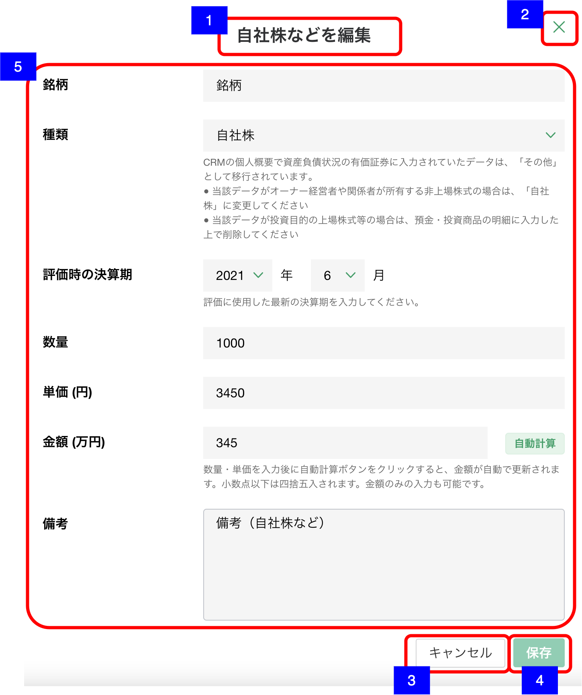

# 明細追加・編集ダイアログ（その他固定資産-自社株など）

## 概要

資産負債情報 − 自社株などの明細を作成・編集するための画面。

## 画面遷移

N/A

## 画面レイアウト図

- 明細追加・編集ダイアログ（その他固定資産-自社株など）

## 画面項目

明細追加・編集ダイアログ（その他固定資産-自社株など）には、以下の情報を上から順に表示する。

1. 画面名
    - [x] 作成の場合、"自社株などを追加" が表示される。
    - [x] 編集の場合は、"自社株などを編集" が表示される。
2. 閉じるボタン
    - [x] 押下すると、[閉じるボタンを押下](#閉じるボタンを押下)を実行する。
    - [ ] 編集の場合は、表示されない。
3. キャンセルボタン
    - [x] 作成の場合は表示されない。
    - [x] 押下すると、[キャンセルボタンを押下](#キャンセルボタンを押下)を実行する。
4. 保存ボタン
    - [x] 作成の場合、初期状態では非活性で、いずれかの値が入ると活性になる。
    - [x] 編集の場合、初期状態では非活性で、いずれかの値が更新されると活性になる。
    - [x] 押下すると、[保存ボタンを押下](#保存ボタンを押下)を実行する。
5. 自社株など詳細
    - 銘柄
        - [x] 編集の場合、登録されている銘柄が表示される。
        - [x] 入力可能文字が20文字である。
    - 種類
        - [x] 編集の場合、登録されている種類が初期選択される。
        - [x] 選択項目から値を選択できる。「未選択」/「自社株」/「その他」
        - [x] 項目名の下に注釈が表示される。
    - 評価時の決算期
        - [x] 編集の場合、登録されている年月が表示される。
        - [x] 年は選択肢から値を選択できる（1902年〜現在の年+50年）。ソート順は降順。
        - [x] 月は選択肢から値を選択できる（1月〜12月）。ソート順は昇順。
        - [x] 未来を選択しても特にチェックは行わない。(提案サポートのカレンダーを使う機能で共通の仕様)
        - [x] 値が選択されていない状態でドロップダウンを開くと現在の年から選択肢が表示される。
        - [x] 値が選択されている状態でマウスオーバーした際に「ｘ」ボタンが出現し、値をクリアできる。
        - [x] 項目名の下に注釈が表示される。
    - 数量
        - [x] 編集の場合、登録されている数量が表示される。
        - [x] 数値のみ入力可能とし、数値以外を入力した場合エラーメッセージを表示する。
        - [x] 整数値のみ、15桁目まで入力できる
    - 単価
        - [x] 編集の場合、登録されている単価が円単位で表示される。
        - [x] 数値のみ入力可能とし、数値以外を入力した場合エラーメッセージを表示する。
        - [x] 整数値のみ、15桁目まで入力できる
    - 自動計算ボタン
        - [x] 数量と単価が入力されている状態→計算ボタンを押下すると金額を計算する。
        - [x] 数量×単価の値を金額に表示する。
            - [x] 小数第二位を四捨五入し小数第一位まで表示する。
            - [x] 整数の場合（.0）は小数部は表示しない。
        - [x] 数量と単価が入力されていない状態→計算ボタンが非活性化。
        - [x] 自動計算によって算出された値が8桁(1000億円)を超える場合、数量もしくは単価が大きすぎるため金額算出不可である旨をエラーダイアログに表示する。
    - 金額
        - [x] 編集の場合、登録されている金額が万円単位で表示される。
        - [x] 数値のみ入力可能とし、数値以外を入力した場合エラーメッセージを表示する。
        - [x] 整数部が7桁まで、小数部は1桁まで入力可能である。(1000億円未満)
        - [x] 項目名の下に注釈が表示される。
    - 備考
        - [x] 編集の場合、登録されている備考が表示される。
        - [x] 表示領域を超える文字数がある場合は、スクロールして全文を確認できる。
        - [x] 入力可能文字が250文字である。

## イベント

この項では、当画面にて実行されるイベント一覧を記述する。

### 閉じるボタンを押下

- [x] 変更がない場合は、そのまま当画面を閉じ[資産負債情報明細一覧（その他固定資産）](./資産負債情報明細一覧（その他固定資産）.md)に戻る。
- [x] 追加・編集ともに変更がある場合は、確認ダイアログを表示する。
  - 「キャンセル」を押下した場合
    - [x] ダイアログを閉じてそのまま当画面を表示する。
  - 「破棄」を押下した場合
    - [x] 当画面を閉じ[資産負債情報明細一覧（その他固定資産）](./資産負債情報明細一覧（その他固定資産）.md)に戻る。

### キャンセルボタンを押下

- [x] 変更がない場合は、そのまま当画面を閉じ[明細詳細ダイアログ（その他固定資産-自社株など）](./明細詳細ダイアログ（その他固定資産-自社株など）.md)に戻る。
- [x] 追加・編集ともに変更がある場合は、確認ダイアログを表示する。
  - 「キャンセル」を押下した場合
    - [x] ダイアログを閉じてそのまま当画面を表示する。
  - 「破棄」を押下した場合
    - [x] [明細詳細ダイアログ（その他固定資産-自社株など）](./明細詳細ダイアログ（その他固定資産-自社株など）.md)に戻る。

### 保存ボタンを押下

- 数量、単価、金額が入力されており数量×単価の値と金額が一致しない場合
  - [x] 金額が合わない旨の警告ダイアログを表示する
    - 「保存」を押下した場合
      - [x] [登録・更新処理を実施](#登録・更新処理を実施)を実行する。
    - 「キャンセル」を押下した場合
      - [x] ダイアログを閉じ、そのまま当画面を表示する。
- 数量、単価、金額が入力されており数量×単価の値と金額が一致する場合、もしくは数量、単価、金額のいずれかが入力されていない場合
  - [x] [登録・更新処理を実施](#登録・更新処理を実施)を実行する。

### 登録・更新処理を実施

- [x] 作成の場合は資産負債明細情報登録処理を、編集の場合は資産負債明細情報更新処理を実行し当画面を閉じて[資産負債情報明細一覧（その他固定資産）画面](資産負債情報明細一覧（その他固定資産）.md)に戻る。
- [x] 資産負債情報明細一覧に保存した自社株など明細が反映される。
- [x] 「自社株など」のヒアリングの更新日と更新者が更新される。
