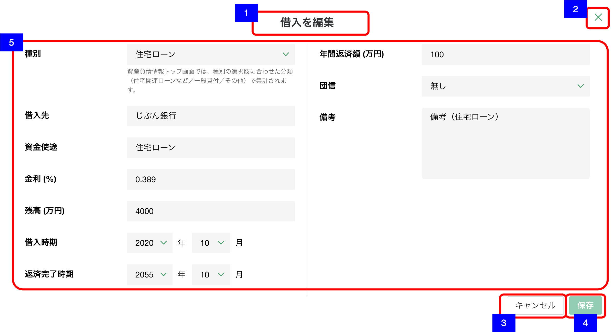

# 明細追加・編集ダイアログ（借入）

## 概要

資産負債情報 − 借入の明細を作成・編集するための画面。

## 画面遷移

N/A

## 画面レイアウト図

- 明細追加・編集ダイアログ（借入）

## 画面項目

明細追加・編集ダイアログ（借入）には、以下の情報を上から順に表示する。

1. 画面名
    - [x] 作成の場合は、"借入を追加" が表示される。
    - [x] 編集の場合は、"借入を編集" が表示される。
2. 閉じるボタン
    - [x] 押下すると、[閉じるボタンを押下](#閉じるボタンを押下)を実行する。
    - [ ] 編集の場合は、表示されない。
3. キャンセルボタン
    - [x] 作成の場合は表示されない。
    - [x] 押下すると、[キャンセルボタンを押下](#キャンセルボタンを押下)を実行する。
4. 保存ボタン
    - [x] 作成の場合、初期状態では非活性で、いずれかの値が入ると活性になる。
    - [x] 編集の場合、初期状態では非活性で、いずれかの値が更新されると活性になる。
    - [x] 押下すると、[保存ボタンを押下](#保存ボタンを押下)を実行する。
5. 借入詳細
    - 種別
        - [x] 編集の場合、登録されている種類が初期選択される。
        - [x] 選択項目から値を選択できる。
        - [x] 選択肢は分類ごとにセクションに分かれて表示される。
            - [x] "住宅関連ローンなど"(橙): 「住宅ローン」/「アパマンローン」/「ローン（不明）」
            - [x] "一般貸付"(緑): 「一般貸付」
            - [x]  "その他"(紫): 「その他借入」/「未選択」
    - 借入先
        - [x] 編集の場合、登録されている借入先が表示される。
        - [x] 入力可能文字が20文字である。
    - 資金用途
        - [x] 編集の場合、登録されている資金用途が表示される。
        - [x] 入力可能文字が20文字である。
    - 金利
        - [x] 編集の場合、登録されている金利が表示される。
        - [x] 数値のみ入力可能とし、数値以外を入力した場合エラーメッセージを表示する。
        - [x] 整数部が2桁まで、小数部は3桁まで入力可能である。
    - 残高
        - [x] 編集の場合、登録されている残高が万円単位で表示される。
        - [x] 数値のみ入力可能とし、数値以外を入力した場合エラーメッセージを表示する。
        - [x] 整数部が7桁まで、小数部は1桁まで入力可能である。(1000億円未満)
    - 借入時期
        - [x] 編集の場合、登録されている年月が表示される。
        - [x] 年は選択肢から値を選択できる（1902年〜現在の年+50年）。ソート順は降順。
        - [x] 月は選択肢から値を選択できる（1月〜12月）。ソート順は昇順。
        - [x] 未来を選択しても特にチェックは行わない。(提案サポートのカレンダーを使う機能で共通の仕様)
        - [x] 値が選択されていない状態でドロップダウンを開くと現在の年から選択肢が表示される。
        - [x] 値が選択されている状態でマウスオーバーした際に「ｘ」ボタンが出現し、値をクリアできる。
    - 返済完了時期
        - [x] 編集の場合、登録されている年月が表示される。
        - [x] 年は選択肢から値を選択できる（1902年〜現在の年+50年）。ソート順は降順。
        - [x] 月は選択肢から値を選択できる（1月〜12月）。ソート順は昇順。
        - [x] 未来を選択しても特にチェックは行わない。(提案サポートのカレンダーを使う機能で共通の仕様)
        - [x] 値が選択されていない状態でドロップダウンを開くと現在の年から選択肢が表示される。
        - [x] 値が選択されている状態でマウスオーバーした際に「ｘ」ボタンが出現し、値をクリアできる。
    - 年間返済額
        - [x] 編集の場合、登録されている年間返済額が万円単位で表示される。
        - [x] 数値のみ入力可能とし、数値以外を入力した場合エラーメッセージを表示する。
        - [x] 整数部が7桁まで、小数部は1桁まで入力可能である。(1000億円未満)
    - 団信
        - [x] 編集の場合、登録されている団信有無が初期選択される。
        - [x] 選択項目から値を選択できる。「未選択」/「有り」/「無し」
    - 備考
        - [x] 編集の場合、登録されている備考が表示される。
        - [x] 表示領域を超える文字数がある場合は、スクロールして全文を確認できる。
        - [x] 入力可能文字が250文字である。

## イベント

この項では、当画面にて実行されるイベント一覧を記述する。

### 閉じるボタンを押下

- [x] 変更がない場合は、そのまま当画面を閉じ[資産負債情報明細一覧（借入）](./資産負債情報明細一覧（借入）.md)に戻る。
- [x] 追加・編集ともに変更がある場合は、確認ダイアログを表示する。
  - 「キャンセル」を押下した場合
    - [x] ダイアログを閉じてそのまま当画面を表示する。
  - 「破棄」を押下した場合
    - [x] 当画面を閉じ[資産負債情報明細一覧（借入）](./資産負債情報明細一覧（借入）.md)に戻る。

### キャンセルボタンを押下

- [x] 変更がない場合は、そのまま当画面を閉じ[明細詳細ダイアログ（借入）](./明細詳細ダイアログ（借入）.md)に戻る。
- [x] 追加・編集ともに変更がある場合は、確認ダイアログを表示する。
  - 「キャンセル」を押下した場合
    - [x] ダイアログを閉じてそのまま当画面を表示する。
  - 「破棄」を押下した場合
    - [x] [明細詳細ダイアログ（借入）](./明細詳細ダイアログ（借入）.md)に戻る。

### 保存ボタンを押下

- [x] [登録・更新処理を実施](#登録・更新処理を実施)を実行する。

### 登録・更新処理を実施

- [x] 作成の場合は資産負債明細情報登録処理を、編集の場合は資産負債明細情報更新処理を実行し当画面を閉じて[資産負債情報明細一覧（借入）画面](資産負債情報明細一覧（借入）.md)に戻る。
- [x] 資産負債情報明細一覧に保存した借入明細が反映される。
- [x] 「借入」のヒアリングの更新日と更新者が更新される。
