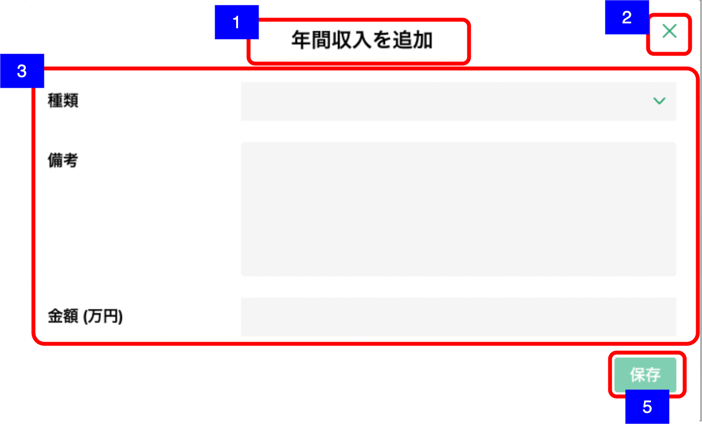
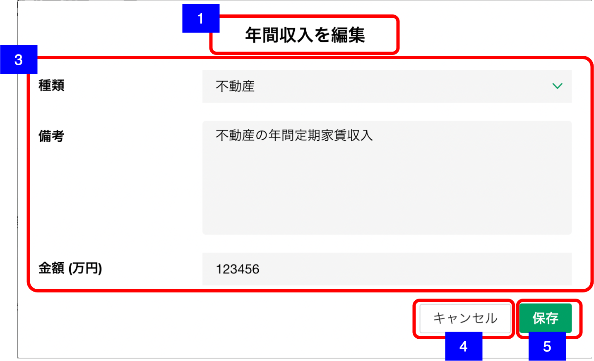

# 明細追加・編集ダイアログ（年間収入）

## 概要

年間収入の明細を追加・編集するための画面。

## 画面遷移

N/A

## 画面レイアウト図

- 明細追加ダイアログ（年間収入）

- 明細編集ダイアログ（年間収入）

## 画面項目
明細追加・編集ダイアログ（年間収入）には、以下の情報を上から順に表示する。

1. 画面名
    - [X] 追加の場合、"年間収入を追加" を表示する。
    - [X] 編集の場合、"年間収入を編集" を表示する。

2. 閉じるボタン
    - [X] 追加の場合、閉じるボタンを表示する。
    - [X] タップすると、[閉じるボタンをタップ](#閉じるボタンをタップ)を実行する。
    - [X] 編集の場合、表示しない。

3. 詳細
    - 種類
      - [X] 編集の場合、登録されている種類が初期選択される。
      - [X] "未選択/給与/事業/不動産/利子・配当/年金/その他"の中から選択できる。
    - 備考
      - [X] 編集の場合、登録されている備考が表示される。
      - [X] 表示領域を超える文字数がある場合は、スクロールして全文を確認できる。
      - [X] 入力可能文字が250文字である。
    - 金額
      - [X] 編集の場合、登録されている金額が万円単位で表示される。
      - [X] 数値のみ入力可能とし、数値以外を入力した場合エラーメッセージを表示する。
      - [X] 整数部が7桁まで、小数部は1桁まで入力可能である。

4. キャンセルボタン
    - [X] 追加の場合、表示しない。
    - [X] 編集の場合、キャンセルボタンを表示する。
    - [X] タップすると、[キャンセルボタンをタップ](#キャンセルボタンをタップ)を実行する。

5. 保存ボタン
    - [X] 追加の場合、初期状態では非活性で、いずれかの値が入ると活性になる。
    - [X] 編集の場合、初期状態では非活性で、いずれかの値が更新されると活性になる。
    - [X] タップすると、[保存ボタンをタップ](#保存ボタンをタップ)を実行する。

## イベント
この項では、当画面にて実行されるイベント一覧を記述する。

### 閉じるボタンをタップ
- [X] 変更がない場合は、そのまま当画面を閉じて[資産負債収入情報明細一覧（収入見込情報）](./資産負債収入情報明細一覧（収入見込情報）.md)に戻る。
- [X] 変更がある場合は、確認ダイアログを表示する。
  - 「キャンセル」を押下した場合
    - [X] ダイアログを閉じてそのまま当画面を表示する。
  - 「破棄」を押下した場合
    - [X] 当画面を閉じて[資産負債収入情報明細一覧（収入見込情報）](./資産負債収入情報明細一覧（収入見込情報）.md)に戻る。

### キャンセルボタンをタップ
- [X] 変更がない場合は、そのまま当画面を閉じ[明細詳細ダイアログ（年間収入）](./明細詳細ダイアログ（年間収入）.md)に戻る。
- [X] 変更がある場合は、確認ダイアログを表示する。
  - 「キャンセル」を押下した場合
    - [X] ダイアログを閉じてそのまま当画面を表示する。
  - 「破棄」を押下した場合
    - [X] [明細詳細ダイアログ（年間収入）](./明細詳細ダイアログ（年間収入）.md)に戻る。

### 保存ボタンをタップ
- [X] 作成の場合は登録処理を実行し、当画面を閉じて[資産負債収入情報明細一覧（収入見込情報）](./資産負債収入情報明細一覧（収入見込情報）.md)に戻る。
- [ ] 編集の場合は更新処理を実行し、当画面を閉じて[資産負債収入情報明細一覧（収入見込情報）](./資産負債収入情報明細一覧（収入見込情報）.md)に戻る。
- [X] 資産負債収入情報明細一覧（収入見込情報）の年間収入エリアに保存した年間収入明細が反映される。
- [X] 資産負債収入情報明細一覧（収入見込情報）の年間収入エリアのヒアリング情報（更新日・更新者）が更新される。
