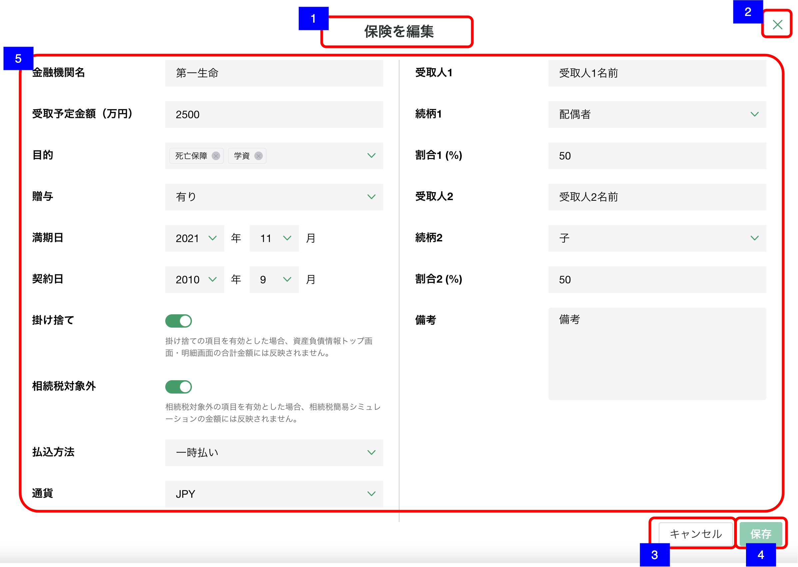

# 明細追加・編集ダイアログ（預金・投資商品-保険）

## 概要

資産負債情報 − 保険の明細を作成・編集するための画面。

## 画面遷移

N/A

## 画面レイアウト図

- 明細追加・編集ダイアログ（預金・投資商品-保険）

## 画面項目

明細追加・編集ダイアログ（預金・投資商品-保険）には、以下の情報を上から順に表示する。

1. 画面名
    - [x] 作成の場合は、"保険を追加" が表示される。
    - [x] 編集の場合は、"保険を編集" が表示される。
2. 閉じるボタン
    - [x] 押下すると、[閉じるボタンを押下](#閉じるボタンを押下)を実行する。
    - [ ] 編集の場合は、表示されない。
3. キャンセルボタン
    - [x] 作成の場合は表示されない。
    - [x] 押下すると、[キャンセルボタンを押下](#キャンセルボタンを押下)を実行する。
4. 保存ボタン
    - [x] 作成の場合、初期状態では非活性で、いずれかの値が入ると活性になる。
    - [x] 編集の場合、初期状態では非活性で、いずれかの値が更新されると活性になる。
    - [x] 押下すると、[保存ボタンを押下](#保存ボタンを押下)を実行する。
5. 保険詳細
    - 金融機関名
        - [x] 編集の場合、登録されている金融機関名が表示される。
        - [x] 入力可能文字が20文字である。
    - 受取予定金額
        - [x] 編集の場合、登録されている金額が万円単位で表示される。
        - [x] 数値のみ入力可能とし、数値以外を入力した場合エラーメッセージを表示する。
        - [x] 整数部が7桁まで、小数部は1桁まで入力可能である。(1000億円未満)
    - 目的
        - [x] 編集の場合、登録されている目的が初期選択される。
        - [x] 選択項目から値を複数選択できる。「死亡保障」/「学費」/「年金」/「貯蓄」/「医療」/「介護」が表示される。
        - [x] 選択された項目はタグ表示される。
        - [x] タグ内の「ｘ」アイコンを押下することで選択解除できる。
    - 贈与
        - [x] 編集の場合、登録されている贈与有無が初期選択される。
        - [x] 選択項目から値を選択できる。「未選択」/「有り」/「無し」
    - 満期日
        - [x] 編集の場合、登録されている年月が表示される。
        - [x] 年は選択肢から値を選択できる（1902年〜現在の年+50年）。ソート順は降順。
        - [x] 月は選択肢から値を選択できる（1月〜12月）。ソート順は昇順。
        - [x] 未来を選択しても特にチェックは行わない。(提案サポートのカレンダーを使う機能で共通の仕様)
        - [x] 値が選択されていない状態でドロップダウンを開くと現在の年から選択肢が表示される。
        - [x] 値が選択されている状態でマウスオーバーした際に「ｘ」ボタンが出現し、値をクリアできる。
    - 契約日
        - [x] 編集の場合、登録されている年月が表示される。
        - [x] 年は選択肢から値を選択できる（1902年〜現在の年+50年）。ソート順は降順。
        - [x] 月は選択肢から値を選択できる（1月〜12月）。ソート順は昇順。
        - [x] 未来を選択しても特にチェックは行わない。(提案サポートのカレンダーを使う機能で共通の仕様)
        - [x] 値が選択されていない状態でドロップダウンを開くと現在の年から選択肢が表示される。
        - [x] 値が選択されている状態でマウスオーバーした際に「ｘ」ボタンが出現し、値をクリアできる。
    - 掛け捨て
        - [x] 編集かつ掛け捨てに該当する場合スイッチ（トグル）がオンで表示される。
        - [x] スイッチ（トグル）でオン・オフを切り替えできる。
    - 相続税対象外
        - [x] 編集かつ相続税対象外に該当する場合スイッチ（トグル）がオンで表示される。
        - [x] スイッチ（トグル）でオン・オフを切り替えできる。
    - 払込方法
        - [x] 編集の場合、登録されている贈与有無が初期選択される。
        - [x] 選択項目から値を選択できる。「未選択」/「一時払い」/「平準払い」
    - 通貨
        - [x] 編集の場合、登録されている贈与有無が初期選択される。
        - [x] 選択項目から値を選択できる。「未選択」/「JPY」/「USD」/「AUD」/「EUR」/「その他」
    - 受取人1
        - [x] 編集の場合、登録されている受取人1の名前が表示される。
        - [x] 入力可能文字が20文字である。
    - 続柄1
        - [x] 編集の場合、登録されている受取人1の続柄が初期選択される。
        - [ ] 選択項目から値を選択できる。「未選択」/「本人」/「父」/「母」/「配偶者」/「他パートナー」/「子」/「子の配偶者」/「孫」/「きょうだい」/「きょうだいの配偶者」/「甥姪」/「その他」
    - 割合1
        - [x] 編集の場合、登録されている受取人1の受け取り割合が表示される。
        - [x] 0 ~ 100までの整数値が入力できる。
        - [x] 数値のみ入力可能とし、数値以外を入力した場合エラーメッセージを表示する。
    - 受取人2
        - [x] 編集の場合、登録されている受取人2の名前が表示される。
        - [x] 入力可能文字が20文字である。
    - 続柄2
        - [x] 編集の場合、登録されている受取人2の続柄が初期選択される。
        - [ ] 選択項目から値を選択できる。「未選択」/「本人」/「父」/「母」/「配偶者」/「他パートナー」/「子」/「子の配偶者」/「孫」/「きょうだい」/「きょうだいの配偶者」/「甥姪」/「その他」
    - 割合2
        - [x] 編集の場合、登録されている受取人2の受け取り割合が表示される。
        - [x] 0 ~ 100までの整数値が入力できる。
        - [x] 数値のみ入力可能とし、数値以外を入力した場合エラーメッセージを表示する。
    - 備考
        - [x] 編集の場合、登録されている備考が表示される。
        - [x] 表示領域を超える文字数がある場合は、スクロールして全文を確認できる。
        - [x] 入力可能文字が250文字である。

## イベント

この項では、当画面にて実行されるイベント一覧を記述する。

### 閉じるボタンを押下

- [x] 変更がない場合は、そのまま当画面を閉じ[資産負債情報明細一覧（預金・投資商品）](./資産負債情報明細一覧（預金・投資商品）.md)に戻る。
- [x] 追加・編集ともに変更がある場合は、確認ダイアログを表示する。
  - 「キャンセル」を押下した場合
    - [x] ダイアログを閉じてそのまま当画面を表示する。
  - 「破棄」を押下した場合
    - [x] 当画面を閉じ[資産負債情報明細一覧（預金・投資商品）](./明資産負債情報明細一覧（預金・投資商品）.md)に戻る。

### キャンセルボタンを押下

- [x] 変更がない場合は、そのまま当画面を閉じ[明細詳細ダイアログ（預金・投資商品-保険）](./明細詳細ダイアログ（預金・投資商品-保険）.md)に戻る。
- [x] 追加・編集ともに変更がある場合は、確認ダイアログを表示する。
  - 「キャンセル」を押下した場合
    - [x] ダイアログを閉じてそのまま当画面を表示する。
  - 「破棄」を押下した場合
    - [x] [明細詳細ダイアログ（預金・投資商品-保険）](./明細詳細ダイアログ（預金・投資商品-保険）.md)に戻る。

### 保存ボタンを押下

- [x] [登録・更新処理を実施](#登録・更新処理を実施)を実行する。

### 登録・更新処理を実施

- [x] 作成の場合は資産負債明細情報登録処理を、編集の場合は資産負債明細情報更新処理を実行し当画面を閉じて[資産負債情報明細一覧（預金・投資商品）画面](資産負債情報明細一覧（預金・投資商品）.md)に戻る。
- [x] 資産負債情報明細一覧に保存した保険明細が反映される。
- [x] 「保険」のヒアリングの更新日と更新者が更新される。
