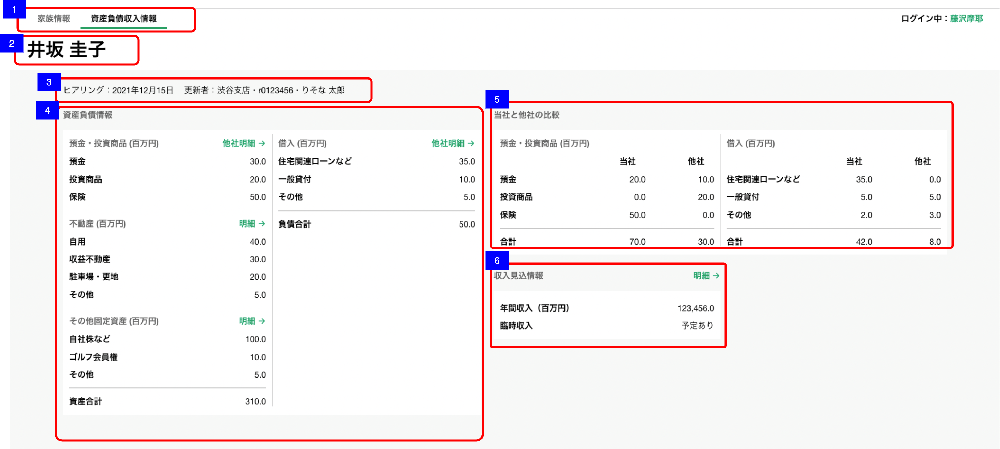

# 資産負債収入情報トップ

## 概要

CRMから取得した資産負債情報とヒアリングした資産負債情報の全体像を俯瞰するための画面

## 画面遷移

N/A

## 画面レイアウト図

- 資産負債収入情報トップ  


## 画面項目

1. タブ
    - [x] 「資産負債収入情報」タブが選択されている。
    - [x] 「家族情報」タブを押下すると[家族情報タブを押下](#家族情報タブを押下)を実行する。
2. 顧客名
    - [x] 顧客名が表示される。
3. ヒアリング情報
    - [x] ヒアリングを年内に行った場合、 `MM月dd日` の形式で更新日が表示される
      - [x] 更新日は登録明細ごとの更新日付及び備考更新日付のうち最も大きい日付を表示する。
      - [x] 最大更新日時を有する明細を削除した場合、残りの登録明細のうち最も大きい日付が表示されることになる。
    
     ```md
      存在するデータの中で最も大きい日付を表示するので、最も大きい日付が削除された場合、次に大きい日付が表示されることとなる。
      例: 1明細のみ登録されたデータを削除した場合、 
      ①何も登録していない状態（更新日「まだヒアリングしていません」と表示される状態）
      ②1/31　預金に1明細を登録
      ③2/1　  ②で登録した預金1明細を削除
       → ヒアリングには「まだヒアリングしていません」が表示される。なお家族の備考が存在する場合は、備考の更新日が表示される。
      ```
    - [x] ヒアリングを去年より過去に行った場合、 `yyyy年MM月dd日` の形式で更新日が表示される。
    - [x] ヒアリングを行った場合、更新者の所属店名、R2ID、更新者氏名が中点（・）で連結して表示される。
        - [x] 更新者が退職済みの場合、所属店名、R2ID、更新者氏名が表示される。
        - [x] 所属店名が不明な場合、「不明な支店」を表示する
    - [x]  ヒアリングが行われていない場合、「まだヒアリングしていません」が表示される。
4. 科目分類カード
    - [x] 各項目共通: 金額表示は、百万円単位で小数第一位(十万円単位)。小数第二位切捨て。
    - [x] 何も値が入っていない状態（りそな資産が無く、何もヒアリングできていない状態）では、全ての金額は0で表示される。【イレギュラー4(科目分類カード)】　 :point_left: 顧客「No.4」で確認できる。
    - [x] 預金・投資商品
        - [x] カードにヒアリングにて登録した科目分類の合計金額をりそな預りと合算で百万円単位で表示する。(りそな資産/他社資産合算)
            - [x] 合計（百万円）＝預金金額＋投資商品金額＋保険金額
            - [x] 預金＝りそな合計金額＋他社合計金額
                - [x] りそな合計金額＝流動性預金+固定性預金の残高 ※顧客詳細預り資産一覧画面の対応項目の値と一致する
                - [x] 他社合計金額＝他社該当科目の集計値
                - [x] りそな資産がマイナス値の場合でも正しく集計される(りそな資産の預金・投資商品のみマイナス値がありうる)
            - [x] 投資商品＝りそな合計金額＋他社合計金額
                - [x] りそな合計金額＝外貨預金+投資信託+ファンドラップ+実績配当型金銭信託+公共債+金融仲介商品 ※顧客詳細預り資産一覧画面の対応項目の値と一致する
                - [x] 他社合計金額＝他社該当科目の集計値
                - [x] りそな資産がマイナス値の場合でも正しく集計される(りそな資産の預金・投資商品のみマイナス値がありうる)
            - [x] 保険＝りそな合計金額＋他社合計金額　りそな保険資産には掛け捨て対象と相続税対象外の判別を適用しない。
                - [x] りそな合計金額＝生命保険 ※顧客詳細預り資産一覧画面の対応項目の値と一致する
                - [x] 他社合計金額＝他社該当科目の集計値　ただし、保険の明細で「掛け捨て」の項目が有効になっている明細は集計金対象外。
        - [x] カード右上の「他社明細」リンクを押下すると[資産負債収入情報明細一覧（預金・投資商品）の表示](#資産負債収入情報明細一覧（預金・投資商品）の表示)を実行する。
    - [x] 不動産
        - [x] カードにヒアリングにて登録した科目別の科目分類の合計金額を百万円単位で表示する。(りそな以外資産のみ)
            - [x] 自用＝他社該当科目(自用)の集計値
            - [x] 収益不動産＝他社該当科目(賃貸（不明/賃貸（住居）/賃貸（住居以外）/底値)の集計値
            - [x] 駐車場・更地＝他社該当科目(駐車場/更地)の集計値
            - [x] その他＝他社該当科目(生産緑地/その他/未選択)の集計値
        - [x] カード右上の「明細」リンクを押下すると[資産負債収入情報明細一覧（不動産）の表示](#資産負債収入情報明細一覧（不動産）の表示)を実行する。
    - [x] その他固定資産
        - [x] カードにヒアリングにて登録した科目分類の合計金額ををりそな借入と合算で表示する。(りそな以外資産のみ)
            - [x] 自社株＝他社該当科目の集計値
            - [x] ゴルフ会員権＝他社該当科目の集計値
            - [x] その他＝他社該当科目の集計値
        - [x] カード右上の「明細」リンクを押下すると[資産負債収入情報明細一覧（その他固定資産）の表示](#資産負債収入情報明細一覧（その他固定資産）の表示)を実行する。
    - [x] 資産合計
        - [x] 資産合計(預金・投資商品＋不動産＋その他固定資産)が表示される。
    - [x] 借入
        - [x] 合計（百万円）＝住宅関連ローンなど＋一般貸付＋その他
        - [x] カードにヒアリングにて登録した科目分類の合計金額を百万円単位で表示する。(りそな資産/他社資産合算)
            - [x] 住宅関連ローンなど＝りそな合計金額＋他社合計金額
                - [x] りそな合計金額＝住宅関連ローン合計 ※顧客詳細預り資産一覧画面の対応項目の値と一致する
                - [x] 他社合計金額＝他社該当科目(住宅ローン（自己居住用）/住宅ローン（アパマン）/ローン)の集計値
            - [x] 一般貸付＝りそな合計金額＋他社合計金額
                - [x] りそな合計金額＝一般貸付合計 ※顧客詳細預り資産一覧画面の対応項目の値と一致する
                - [x] 他社合計金額＝他社該当科目(一般貸付)の集計値
            - [x] その他＝りそな合計金額＋他社合計金額
                - [x] りそな合計金額＝総合口座貸越＋カードローン＋その他ローン ※顧客詳細預り資産一覧画面の対応項目の値と一致する
                - [x] 他社合計金額＝他社該当科目(その他借入/未選択)の集計値
        - [x] カード右上の「他社明細」リンクを押下すると[資産負債収入情報明細一覧（借入）の表示](#資産負債収入情報明細一覧（借入）の表示)を実行する。
    - [x] 負債合計
        - [x] 借入の各明細の合計を百万円単位で表示する。
5. 当社と他社の比較
    - [x] 各項目共通: 金額表示は、百万円単位で小数第一位(十万円単位)。小数第二位切捨て。
    - [x] 何も値が入っていない状態（りそな資産が無く、何もヒアリングできていない状態）では、全ての金額は0で表示される。【イレギュラー4(当社と他社の比較)】　 :point_left: 顧客「No.4」で確認できる。
    - [x] 預金・投資商品
        - [x] 当社: 個人CRMの基本情報から取得する。各科目の金額は科目分類カード「預金・投資商品」の「りそな合計金額」を参照。
        - [x] 他社: 担当者が資産負債情報明細画面から登録した他社の資産負債情報（ヒアリング情報）を表示する。
            - [x] 保険の明細で「掛け捨て」の項目が有効になっている明細は集計金対象外。
    - [x] 借入
        - [x] 当社: 個人CRMの基本情報から取得する。各科目の金額は科目分類カード「借入」の「りそな合計金額」を参照。
        - [x] 他社: 担当者が資産負債情報明細画面から登録した他社の資産負債情報（ヒアリング情報）を表示する。

6. 収入見込情報
    - [X] カード右上の「明細」リンクを押下すると[資産負債収入情報明細一覧（収入見込情報）の表示](#資産負債収入情報明細一覧（収入見込情報）の表示)を実行する。
    - 年間収入
      - [X] 金額表示は、百万円単位で小数第一位(十万円単位)。小数第二位切捨て。
      - [ ] 年間収入明細がない場合、金額は0.0で表示される。
      - [X] 年間収入明細がある場合、カードに年間収入明細の合計金額を百万円単位で表示する。
    - 臨時収入
      - [X] 入金予定時期が未来日付または未定の明細がある場合"予定あり"を表示する。
      - [X] 上記以外の場合、ブランクで表示される。
          
          ```text
          【判定方法】
          未来、過去を判定する場合、月末・年末判定とする
          例：2022年6月22日に渉外アプリを立ち上げた場合
          •未来日付の明細（開いた日も含む）
          2022年6月以降で登録されたもの（2022年7月1日になった時点で、2022年6月登録の明細は過去明細となる。）
          2022年--月で登録されたもの（月が不明な場合は12月末で判定。2023年1月1日になった時点で2022年--月登録の明細は過去明細となる。）
          •未定の明細
          ----年--月で登録されたもの
          ----年6月で登録されたもの
          •過去明細
          2022年5月以前に登録されたもの
          ```

## イベント

この項では、当画面にて実行されるイベント一覧を記述する。

### 家族情報タブを押下

- [x] [家族情報トップ画面](../家族情報/家族情報一覧.md)に遷移する。

### 資産負債収入情報明細一覧（預金・投資商品）の表示

- [x] [資産負債収入情報明細一覧（預金・投資商品）](資産負債収入情報明細一覧（預金・投資商品）.md)を表示する。

### 資産負債収入情報明細一覧（不動産）の表示

- [x] [資産負債収入情報明細一覧（不動産）](資産負債収入情報明細一覧（不動産）.md)を表示する。

### 資産負債収入情報明細一覧（その他固定資産）の表示

- [x] [資産負債収入情報明細一覧（その他固定資産）](資産負債収入情報明細一覧（その他固定資産）.md)を表示する。

### 資産負債収入情報明細一覧（借入）の表示

- [x] [資産負債収入情報明細一覧（借入）](資産負債収入情報明細一覧（借入）.md)を表示する。

### 資産負債収入情報明細一覧（収入見込情報）の表示

- [x] [資産負債収入情報明細一覧（収入見込情報）](資産負債収入情報明細一覧（収入見込情報）.md)を表示する。
