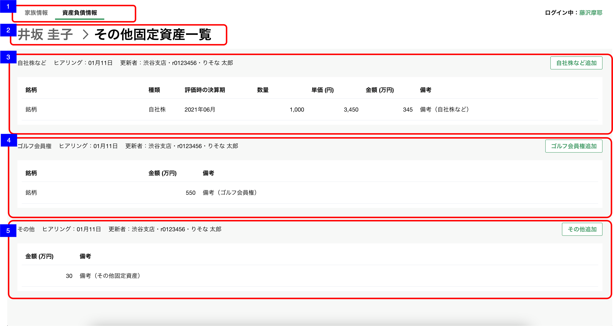

# 資産負債収入情報明細一覧（その他固定資産）

## 概要

資産負債情報の明細（その他固定資産）を確認するための画面

## 画面遷移

N/A

## 画面レイアウト図

- 資産負債収入情報明細一覧（その他固定資産）


## 画面項目

1. タブ
    - [資産負債収入情報トップ画面](資産負債収入情報トップ.md)と同様。
2. パンくずリスト
    - [x] 「顧客名 > その他固定資産一覧」  が表示される。
    - [x] 顧客名のテキストを押下すると[資産負債収入情報トップ画面への遷移](#資産負債収入情報トップ画面への遷移)を実行する。
3. 自社株などエリア
    - ヘッダー
        - エリア名
            - [x] "自社株など"を表示する。
        - ヒアリング情報
            - [x] 明細が存在しない場合、「まだヒアリングしていません」が表示される。
            - ヒアリング
                - [x] 分類が"自社株など"の明細のうち最終更新日時が最も新しいものの、最終更新年月日を`YYYY.MM.DD`の形式で表示する。

                ```md
                    存在するデータの中で最も大きい日付を表示するので、最も大きい日付が削除された場合、次に大きい日付が表示されることとなる。
                    例: 1明細のみ登録されたデータを削除した場合、
                    ①何も登録していない状態（更新日「まだヒアリングしていません」と表示される状態）
                    ②1/31　1明細を登録
                    ③2/1　  ②で登録した1明細を削除
                    → ヒアリングには「まだヒアリングしていません」が表示される。
                ```

            - 更新者
                - [x] 分類が"自社株など"の明細のうち最終更新日時が最も新しいものの、更新者情報を`支店名・R2ID・更新者名`の形式で表示する。
                - [x] 更新者が退職済みの場合、所属店名、R2ID、更新者氏名を表示する。
                - [x] 所属店名が不明な場合、「不明な支店」を表示する。
        - 明細追加ボタン
            - [x] "自社株など追加"ボタンを表示する。
            - [x] 押下すると[自社株など追加ボタンを押下](#自社株など追加ボタンを押下)を実行する。
    - 明細一覧
        - [x] 明細が存在しない場合は、"ヒアリングして追加ボタンから更新しましょう"が表示される。
        - [x] 明細が存在する場合は、明細が追加された順(明細ID)の昇順でソートされていること。
        - [x] 明細を押下すると[自社株など明細を押下](#自社株など明細を押下)を実行する。
        - [x] 明細が5件を超えるx1場合は表の高さが固定となり表の中をスクロールすることができる。
        - 銘柄
            - [x] 存在しない場合はブランクで表示される。
            - [x] 存在する場合は銘柄が表示される。
        - 種類
            - [x] "未選択"の場合、ブランクで表示される。
            - [x] "自社株", "その他"が表示される。
        - 評価時の決算期
            - [x] 存在しない場合はブランクで表示される。
            - [x] 存在する場合、年月が明瞭な場合は"YYYY年M月"が表示される。
            - [x] 存在する場合、年が不明な場合は"----年M月"が表示される。
            - [x] 存在する場合、月が不明な場合は"YYYY年--月"が表示される。
        - 数量
            - [x] 存在しない場合はブランクで表示される。
            - [x] 存在する場合は数量は単位なしで整数で表示される。
        - 単価
            - [x] 存在しない場合はブランクで表示される。
            - [x] 存在する場合は対象の金額が"円"単位で整数で表示される。
        - 金額
            - [x] 存在しない場合はブランクで表示される。
            - [x] 存在する場合は対象の金額が"万円"単位で小数点第一位まで表示される。
        - 備考
            - [x] 存在する場合は、対象の備考が表示される。
            - [x] 全文が表示できない場合、三点リーダーが表示される。
4. ゴルフ会員権
    - ヘッダー
        - エリア名
            - [x] "ゴルフ会員権"を表示する。
        - ヒアリング情報
            - [x] 明細が存在しない場合、「まだヒアリングしていません」が表示される。
            - ヒアリング
                - [x] 分類が"ゴルフ会員権"の明細のうち最終更新日時が最も新しいものの、最終更新年月日を`YYYY.MM.DD`の形式で表示する。

                ```md
                    存在するデータの中で最も大きい日付を表示するので、最も大きい日付が削除された場合、次に大きい日付が表示されることとなる。
                    例: 1明細のみ登録されたデータを削除した場合、
                    ①何も登録していない状態（更新日「まだヒアリングしていません」と表示される状態）
                    ②1/31　1明細を登録
                    ③2/1　  ②で登録した1明細を削除
                    → ヒアリングには「まだヒアリングしていません」が表示される。
                ```

            - 更新者
                - [x] 分類が"ゴルフ会員権"の明細のうち最終更新日時が最も新しいものの、更新者情報を`支店名・R2ID・更新者名`の形式で表示する。
                - [x] 更新者が退職済みの場合、所属店名、R2ID、更新者氏名を表示する。
                - [x] 所属店名が不明な場合、「不明な支店」を表示する。
        - 明細追加ボタン
            - [x] "追加"ボタンを表示する。
            - [x] 押下すると[ゴルフ会員権追加ボタンを押下](#ゴルフ会員権追加ボタンを押下)を実行する。
    - 明細一覧
        - [x] 明細が存在しない場合は、"ヒアリングして追加ボタンから更新しましょう"が表示される。
        - [x] 明細が存在する場合は、明細が追加された順(明細ID)の昇順でソートされていること。
        - [x] 明細を押下すると[ゴルフ会員権明細を押下](#ゴルフ会員権明細を押下)を実行する。
        - [x] 明細が5件を超える場合は表の高さが固定となり表の中をスクロールすることができる。
        - 銘柄
            - [x] 存在しない場合はブランクで表示される。
            - [x] 存在する場合は銘柄が表示される。
        - 金額
            - [x] 存在しない場合はブランクで表示される。
            - [x] 存在する場合は対象の金額が"万円"単位で小数点第一位まで表示される。
        - 備考
            - [x] 存在する場合は、対象の備考が表示される。
            - [x] 全文が表示できない場合、三点リーダーが表示される。
5. その他エリア
    - ヘッダー
        - エリア名
            - [x] "その他"を表示する。
        - ヒアリング情報
            - [x] 明細が存在しない場合、「まだヒアリングしていません」が表示される。
            - ヒアリング
                - [x] 分類が"その他"の明細のうち最終更新日時が最も新しいものの、最終更新年月日をヒアリングを年内に行った場合、 `MM月dd日` の形式で、ヒアリングを去年より過去に行った場合、 `yyyy年MM月dd日` の形式で表示する。

                ```md
                    存在するデータの中で最も大きい日付を表示するので、最も大きい日付が削除された場合、次に大きい日付が表示されることとなる。
                    例: 1明細のみ登録されたデータを削除した場合、
                    ①何も登録していない状態（更新日「まだヒアリングしていません」と表示される状態）
                    ②1/31　1明細を登録
                    ③2/1　  ②で登録した1明細を削除
                    → ヒアリングには「まだヒアリングしていません」が表示される。
                ```

            - 更新者
                - [x] 分類が"その他"の明細のうち最終更新日時が最も新しいものの、更新者情報を`支店名・R2ID・更新者名`の形式で表示する。
                - [x] 更新者が退職済みの場合、所属店名、R2ID、更新者氏名を表示する。
                - [x] 所属店名が不明な場合、「不明な支店」を表示する。
        - 明細追加ボタン
            - [x] "追加"ボタンを表示する。
            - [x] 押下すると[その他追加ボタンを押下](#その他追加ボタンを押下)を実行する。
    - 明細一覧
        - [x] 明細が存在しない場合は、"ヒアリングして追加ボタンから更新しましょう"が表示される。
        - [x] 明細が存在する場合は、明細が追加された順(明細ID)の昇順でソートされていること。
        - [x] 明細を押下すると[その他明細を押下](#その他明細を押下)を実行する。
        - [x] 明細が5件を超える場合は表の高さが固定となり表の中をスクロールすることができる。
        - 金額
            - [x] 存在しない場合はブランクで表示される。
            - [x] 存在する場合は対象の金額が"万円"単位で小数点第一位まで表示される。
        - 備考
            - [x] 存在する場合は、対象の備考が表示される。
            - [x] 全文が表示できない場合、三点リーダーが表示される。

## イベント

この項では、当画面にて実行されるイベント一覧を記述する。

### 資産負債収入情報トップ画面への遷移

- [x] [資産負債収入情報トップ画面](./資産負債収入情報トップ.md)に遷移する。

### 自社株など追加ボタンを押下

- [x] [明細追加・編集ダイアログ（その他固定資産-自社株など）](./明細追加・編集ダイアログ（その他固定資産-自社株など）.md)を表示する。

### 自社株など明細を押下

- [x] [明細詳細ダイアログ（その他固定資産-自社株など）](./明細詳細ダイアログ（その他固定資産-自社株など）.md)を表示する。

### ゴルフ会員権追加ボタンを押下

- [x] [明細追加・編集ダイアログ（その他固定資産-ゴルフ会員権）](./明細追加・編集ダイアログ（その他固定資産-ゴルフ会員権）.md)を表示する。

### ゴルフ会員権明細を押下

- [x] [明細詳細ダイアログ（その他固定資産-ゴルフ会員権）](./明細詳細ダイアログ（その他固定資産-ゴルフ会員権）.md)を表示する。

### その他追加ボタンを押下

- [x] [明細追加・編集ダイアログ（その他固定資産-その他）](./明細追加・編集ダイアログ（その他固定資産-その他）.md)を表示する。

### その他明細を押下

- [x] [明細詳細ダイアログ（その他固定資産-その他）](./明細詳細ダイアログ（その他固定資産-その他）.md)を表示する。
