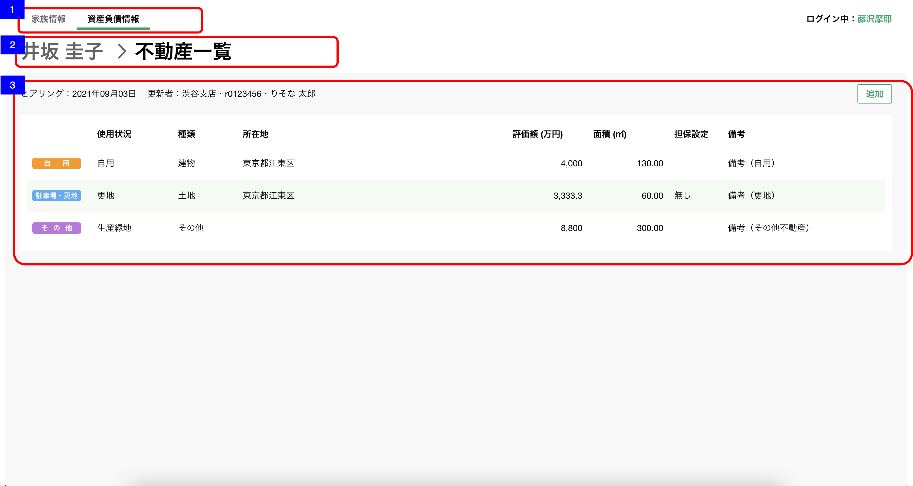

# 資産負債収入情報明細一覧（不動産）

## 概要

資産負債情報の明細（不動産）を確認するための画面

## 画面遷移

N/A

## 画面レイアウト図

- 資産負債収入情報明細一覧（不動産）


## 画面項目


1. タブ
    - [資産負債収入情報トップ画面](資産負債収入情報トップ.md)と同様。
2. パンくずリスト
    - [x] 「顧客名 > 不動産一覧」  が表示される。
    - [x] 顧客名のテキストを押下すると[資産負債収入情報トップ画面への遷移](#資産負債収入情報トップ画面への遷移)を実行する。
3. 不動産エリア
    - ヘッダー
        - ヒアリング情報
            - [x] 明細が存在しない場合、「まだヒアリングしていません」が表示される。
            - ヒアリング
                - [x] 分類が"不動産"の明細のうち最終更新日時が最も新しいものの、最終更新年月日を`YYYY.MM.DD`の形式で表示する。
  
                ```md
                    存在するデータの中で最も大きい日付を表示するので、最も大きい日付が削除された場合、次に大きい日付が表示されることとなる。
                    例: 1明細のみ登録されたデータを削除した場合、
                    ①何も登録していない状態（更新日「まだヒアリングしていません」と表示される状態）
                    ②1/31　1明細を登録
                    ③2/1　  ②で登録した1明細を削除
                    → ヒアリングには「まだヒアリングしていません」が表示される。
                ```

            - 更新者
                - [x] 分類が"不動産"の明細のうち最終更新日時が最も新しいものの、更新者情報を`支店名・R2ID・更新者名`の形式で表示する。
                - [x] 更新者が退職済みの場合、所属店名、R2ID、更新者氏名を表示する。
                - [x] 所属店名が不明な場合、「不明な支店」を表示する。
        - 明細追加ボタン
            - [x] "追加"ボタンを表示する。
            - [x] 押下すると[追加ボタンを押下](#追加ボタンを押下)を実行する。
    - 明細一覧
        - [x] 明細が存在しない場合は、"ヒアリングして追加ボタンから更新しましょう"が表示される。
        - [x] 明細が存在する場合は、明細が追加された順(明細ID)の昇順でソートされていること。
        - [x] 明細を押下すると[明細を押下](#明細を押下)を実行する。
        - [x] 明細が5件を超える場合は表の高さが固定となり表の中をスクロールすることができる。
        - 分類
            - [x] 使用状況に応じて、"自用"(橙), "収益不動産"(緑), "駐車場・更地"(青), "その他"(紫)が表示される。
            - [x] "自用"(橙): 使用状況 → "自用"
            - [x] "収益不動産"(緑): 使用状況 → "賃貸（住居）", "賃貸（住居以外）", "賃貸（不明）", "底地"
            - [x] "駐車場・更地"(青): 使用状況 → "駐車場", "更地"
            - [x] "その他"(紫): 使用状況 → "未選択", "生産緑地", "その他"
        - 使用状況
            - [x] "未選択"の場合、ブランクで表示される。
            - [x] "自用", "賃貸（住居）", "賃貸（住居以外）", "賃貸（不明）", "底地", "駐車場", "更地", "生産緑地", "その他"が表示される。
        - 種類
            - [x] "未選択"の場合、ブランクで表示される。
            - [x] "自用", "土地", "建物", "土地付建物", "マンション", "その他"が表示される。
        - 所在地
            - [x] 存在しない場合はブランクで表示される。
            - [x] 存在する場合は、対象の所在地が表示される。
            - [x] 文字の全長が、表示領域を超える場合、三点リードの領域を含んだ文字数分が表示される。例:  1234567890123456789012345678901234銀...
        - 評価額
            - [x] 存在しない場合はブランクで表示される。
            - [x] 存在する場合は対象の金額が"万円"単位で小数点第一位まで表示される。
        - 面積
            - [x] 存在しない場合はブランクで表示される。
            - [x] 存在する場合は"㎡"の単位で小数点第二位まで表示される。
        - 担保設定
            - [x] "未選択"の場合、ブランクで表示される。
            - [x] "有り", "無し"が表示される。
        - 備考
            - [x] 存在する場合は、対象の備考が表示される。
            - [x] 全文が表示できない場合、三点リーダーが表示される。

## イベント

この項では、当画面にて実行されるイベント一覧を記述する。

### 資産負債収入情報トップ画面への遷移

- [x] [資産負債収入情報トップ画面](./資産負債収入情報トップ.md)に遷移する。

### 追加ボタンを押下

- [x] [明細追加・編集ダイアログ（不動産）](./明細追加・編集ダイアログ（不動産）.md)を表示する。

### 明細を押下

- [x] [明細詳細ダイアログ（不動産）](./明細詳細ダイアログ（不動産）.md)を表示する。
