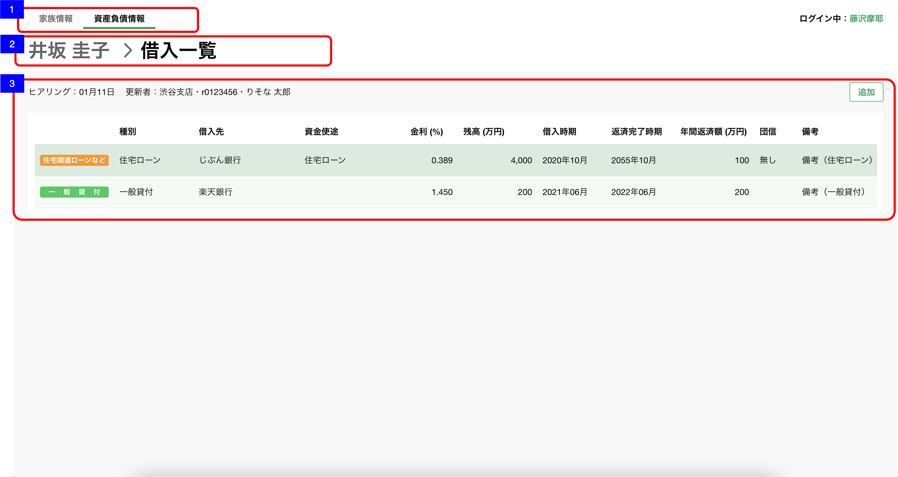

# 資産負債収入情報明細一覧（借入）

## 概要

資産負債情報の明細（借入）を確認するための画面

## 画面遷移

N/A

## 画面レイアウト図

- 資産負債収入情報明細一覧（借入）


## 画面項目

1. タブ
    - [資産負債収入情報トップ画面](資産負債収入情報トップ.md)と同様。
2. パンくずリスト
    - [x] 「顧客名 > 借入一覧」  が表示される。
    - [x] 顧客名のテキストを押下すると[資産負債収入情報トップ画面への遷移](#資産負債収入情報トップ画面への遷移)を実行する。
3. 借入エリア
    - ヘッダー
        - ヒアリング情報
            - [x] 明細が存在しない場合、「まだヒアリングしていません」が表示される。
            - ヒアリング
                - [x] 分類が"借入"の明細のうち最終更新日時が最も新しいものの、最終更新年月日を`YYYY.MM.DD`の形式で表示する。

                ```md
                    存在するデータの中で最も大きい日付を表示するので、最も大きい日付が削除された場合、次に大きい日付が表示されることとなる。
                    例: 1明細のみ登録されたデータを削除した場合、
                    ①何も登録していない状態（更新日「まだヒアリングしていません」と表示される状態）
                    ②1/31　1明細を登録
                    ③2/1　  ②で登録した1明細を削除
                    → ヒアリングには「まだヒアリングしていません」が表示される。
                ```

            - 更新者
                - [x] 分類が"借入"の明細のうち最終更新日時が最も新しいものの、更新者情報を`支店名・R2ID・更新者名`の形式で表示する。
                - [x] 更新者が退職済みの場合、所属店名、R2ID、更新者氏名を表示する。
                - [x] 所属店名が不明な場合、「不明な支店」を表示する。
        - 明細追加ボタン
            - [x] "追加"ボタンを表示する。
            - [x] 押下すると[追加ボタンを押下](#追加ボタンを押下)を実行する。
    - 明細一覧
        - [x] 明細が存在しない場合は、"ヒアリングして追加ボタンから更新しましょう"が表示される。
        - [x] 明細が存在する場合は、明細が追加された順(明細ID)の昇順でソートされていること。
        - [x] 明細を押下すると[明細を押下](#明細を押下)を実行する。
        - [x] 明細が5件を超える場合は表の高さが固定となり表の中をスクロールすることができる。
        - 分類
            - [x] 種別に応じた分類 "住宅関連ローンなど"(橙), "一般貸付"(緑),  "その他"(紫)が表示される。
            - [x] "住宅関連ローンなど"(橙): "住宅ローン", "アパマンローン", "ローン（不明）"
            - [x] "一般貸付"(緑): "一般貸付"
            - [x]  "その他"(紫): "その他借入", ブランク
        - 種別
            - [x] ブランク(未選択の場合), "住宅ローン", "アパマンローン", "ローン（不明）", "一般貸付", "その他借入" が表示される。
        - 借入先
            - [x] 存在しない場合はブランクで表示される。
            - [x] 存在する場合は対象の借入先が表示される。
            - [x] 文字の全長が、表示領域を超える場合、三点リードの領域を含んだ文字数分が表示される。例:  123456789銀...
        - 資金用途
            - [x] 存在しない場合はブランクで表示される。
            - [x] 存在する場合は対象の資金用途が表示される。
            - [x] 文字の全長が、表示領域を超える場合、三点リードの領域を含んだ文字数分が表示される。例:  123456789銀...
        - 金利
            - [x] 存在しない場合はブランクで表示される。
            - [x] 存在する場合は対象の金額が"%"単位で小数点第三位まで表示される。
        - 残高
            - [x] 存在しない場合はブランクで表示される。
            - [x] 存在する場合は対象の残高が"万円"単位で小数点第一位まで表示される。
        - 借入時期
            - [x] 存在しない場合はブランクで表示される。
            - [x] 存在する場合、年月が明瞭な場合は"YYYY年M月"が表示される。
            - [x] 存在する場合、年が不明な場合は"----年M月"が表示される。
            - [x] 存在する場合、月が不明な場合は"YYYY年--月"が表示される。
        - 返済完了時期
            - [x] 存在しない場合はブランクで表示される。
            - [x] 存在する場合、年月が明瞭な場合は"YYYY年M月"が表示される。
            - [x] 存在する場合、年が不明な場合は"----年M月"が表示される。
            - [x] 存在する場合、月が不明な場合は"YYYY年--月"が表示される。
        - 年間返済額
            - [x] 存在しない場合はブランクで表示される。
            - [x] 存在する場合は対象の年間返済額が"万円"単位で小数点第一位まで表示される。
        - 団信
            - [x] 存在しない場合はブランクで表示される。
            - [x] 存在する場合は、"有り", "無し"が表示される。
        - 備考
            - [x] 存在する場合は、対象の備考が表示される。
            - [x] 全文が表示できない場合、三点リーダーが表示される。
## イベント

この項では、当画面にて実行されるイベント一覧を記述する。

### 資産負債収入情報トップ画面への遷移

- [x] [資産負債収入情報トップ画面](./資産負債収入情報トップ.md)に遷移する。

### 追加ボタンを押下

- [x] [明細追加・編集ダイアログ（借入）](./明細追加・編集ダイアログ（借入）.md)を表示する。

### 明細を押下

- [x] [明細詳細ダイアログ（借入）](./明細詳細ダイアログ（借入）.md)を表示する。
