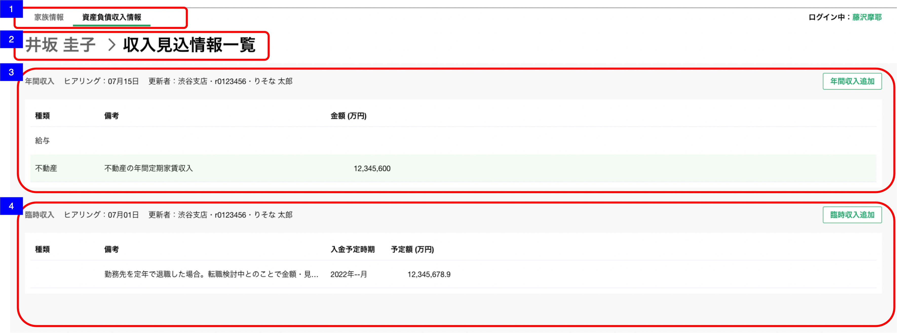
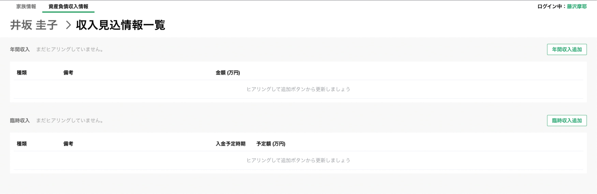

# 資産負債収入情報明細一覧（収入見込情報）

## 概要

資産負債収入情報の明細（収入見込情報）を確認するための画面。

## 画面遷移

N/A

## 画面レイアウト図

- 資産負債収入情報明細一覧（収入見込情報）（入力後）


- 資産負債収入情報明細一覧（収入見込情報）（入力前）



## 画面項目

1. タブ
    - [資産負債収入情報トップ画面](資産負債収入情報トップ.md)と同様。

2. パンくずリスト
    - [X] 「顧客名 > 収入見込情報一覧」が表示される。
    - [X] 顧客名のテキストをタップすると[顧客名をタップ](#顧客名をタップ)を実行する。

3. 年間収入エリア
    - ヘッダー
      - エリア名
        - [X] "年間収入"を表示する。
      - ヒアリング情報
        - [ ] 明細が存在しない場合、"まだヒアリングしていません"を表示する。
        - [X] 明細が存在する場合、更新日、更新者を表示する。
        - 更新日
          - [X] 年間収入の明細のうち、最終更新日時が最も新しい明細の最終更新年月日を表示する。
          - [X] ヒアリングを年内に行った場合、 `MM月dd日` の形式で表示する。
          - [ ] ヒアリングを去年より過去に行った場合、 `yyyy年MM月dd日` の形式で表示する。
          
          ```md
              存在するデータの中で最も大きい日付を表示するので、最も大きい日付が削除された場合、次に大きい日付が表示されることとなる。
              例: 1明細のみ登録されたデータを削除した場合、
              ①何も登録していない状態（更新日「まだヒアリングしていません」と表示される状態）
              ②1/31　1明細を登録
              ③2/1　  ②で登録した1明細を削除
              → ヒアリングには「まだヒアリングしていません」が表示される。
          ```
        - 更新者
          - [X] 年間収入の明細のうち、最終更新日時が最も新しい明細の更新者情報を`支店名・R2ID・更新者名`の形式で表示する。
          - [ ] 更新者が退職済みの場合、所属店名、R2ID、更新者氏名を表示する。
          - [ ] 所属店名が不明な場合、"不明な支店"を表示する。
      - 明細追加ボタン
        - [X] "年間収入追加"ボタンを表示する。
        - [X] タップすると[年間収入追加ボタンをタップ](#年間収入追加ボタンをタップ)を実行する。
    - コンテンツ
      - [X] 明細が存在しない場合、"ヒアリングして追加ボタンから更新しましょう"を表示する。
      - [X] 明細が存在する場合、種類、備考、金額を表示する。
      - [ ] 明細が存在する場合は、明細が追加された順(明細ID)の昇順でソートされていること。
      - [X] 明細が5件を超える場合は表の高さが固定となり表の中をスクロールすることができる。
      - [X] 明細をタップすると[年間収入明細をタップ](#年間収入明細をタップ)を実行する。
      - 種類
        - [X] "未選択"の場合、ブランクで表示される。
        - [X] "給与/事業/不動産/利子・配当/年金/その他"が表示される。
      - 備考
        - [X] 存在しない場合、ブランクで表示される。
        - [X] 存在する場合、対象の備考が表示される。
        - [X] 全文が表示できない場合、三点リーダーが表示される。
      - 金額
        - [X] 存在しない場合、ブランクで表示される。
        - [X] 存在する場合、対象の金額は"万円"単位で小数点第一位まで表示される。

4. 臨時収入エリア
    - ヘッダー
      - エリア名
        - [X] "臨時収入"を表示する。
      - ヒアリング情報
        - [ ] 明細が存在しない場合、"まだヒアリングしていません"を表示する。
        - [X] 明細が存在する場合、更新日、更新者を表示する。
        - 更新日
          - [X] 年間収入の明細のうち、最終更新日時が最も新しい明細の最終更新年月日を表示する。
          - [X] ヒアリングを年内に行った場合、 `MM月dd日` の形式で表示する。
          - [ ] ヒアリングを去年より過去に行った場合、 `yyyy年MM月dd日` の形式で表示する。
          
          ```md
            存在するデータの中で最も大きい日付を表示するので、最も大きい日付が削除された場合、次に大きい日付が表示されることとなる。
            例: 1明細のみ登録されたデータを削除した場合、
            ①何も登録していない状態（更新日「まだヒアリングしていません」と表示される状態）
            ②1/31　1明細を登録
            ③2/1　  ②で登録した1明細を削除
            → ヒアリングには「まだヒアリングしていません」が表示される。
          ```
        - 更新者
          - [X] 臨時収入の明細のうち、最終更新日時が最も新しい明細の更新者情報を`支店名・R2ID・更新者名`の形式で表示する。
          - [ ] 更新者が退職済みの場合、所属店名、R2ID、更新者氏名を表示する。
          - [ ] 所属店名が不明な場合、"不明な支店"を表示する。
      - 明細追加ボタン
        - [X] "臨時収入追加"ボタンを表示する。
        - [X] タップすると[臨時収入追加ボタンをタップ](#臨時収入追加ボタンをタップ)を実行する。
    - コンテンツ
      - [X] 明細が存在しない場合、"ヒアリングして追加ボタンから更新しましょう"を表示する。
      - [X] 明細が存在する場合、種類、備考、入金予定時期、予定額を表示する。
      - [X] 明細が存在する場合の並び順は、渉外アプリiOSの[収入見込情報一覧](../../渉外アプリiOS/資産情報/収入見込情報一覧.md)の「3.臨時収入エリア」と同様。
      - [X] 入金予定時期が過去の明細については薄いグレーの文字で表示する。※過去の明細とは、2022年7月22日にアプリを開いた場合、入金予定時期が2022年6月以前の年月で登録された明細を指す。
      - [X] 明細が5件を超える場合は表の高さが固定となり表の中をスクロールすることができる。
      - [X] 明細をタップすると[臨時収入明細をタップ](#臨時収入明細をタップ)を実行する。
      - 種類
        - [X] "未選択"の場合、ブランクで表示される。
        - [X] "退職金/相続資金/贈与資金/不動産の売却資金/自社株の売却資金/その他"のいずれかが表示される。
      - 備考
        - [X] 存在しない場合、ブランクで表示される。
        - [X] 存在する場合、対象の備考が表示される。
        - [X] 全文が表示できない場合、三点リーダーが表示される。
      - 入金予定時期
        - [X] 存在しない場合、ブランクで表示される。
        - [X] 年月が明瞭な場合、"YYYY年M月"が表示される。
        - [X] 年が不明な場合、"----年M月"が表示される。
        - [X] 月が不明な場合、"YYYY年--月"が表示される。
      - 金額
        - [X] 存在しない場合、ブランクで表示される。
        - [X] 存在する場合、対象の金額は"万円"単位で小数点第一位まで表示される。


## イベント
この項では、当画面にて実行されるイベント一覧を記述する。

### 顧客名をタップ
- [X] [資産負債収入情報トップ画面](./資産負債収入情報トップ.md)に遷移する。

### 年間収入追加ボタンをタップ
- [X] [明細追加・編集ダイアログ（年間収入）](./明細追加・編集ダイアログ（年間収入）.md)に遷移する。

### 年間収入明細をタップ
- [X] [明細詳細ダイアログ（年間収入）](./明細詳細ダイアログ（年間収入）.md)に遷移する。

### 臨時収入追加ボタンをタップ
- [X] [明細追加・編集ダイアログ（臨時収入）](./明細追加・編集ダイアログ（臨時収入）.md)に遷移する。

### 臨時収入明細をタップ
- [X] [明細詳細ダイアログ（臨時収入）](./明細詳細ダイアログ（臨時収入）.md)に遷移する。
