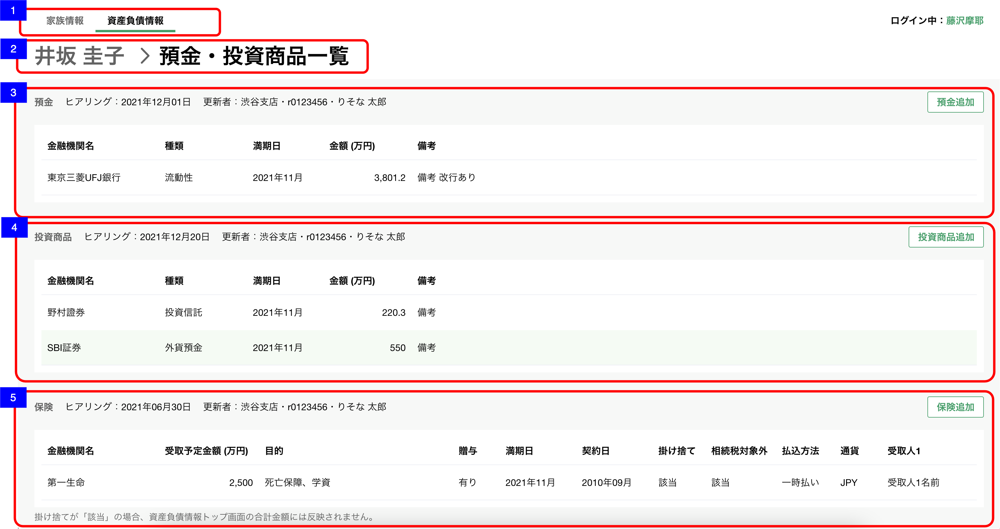

# 資産負債収入情報明細一覧（預金・投資商品）

## 概要

資産負債情報の明細（預金・投資商品）を確認するための画面

## 画面遷移

N/A

## 画面レイアウト図

- 資産負債収入情報明細一覧（預金・投資商品）


## 画面項目

1. タブ
    - [資産負債収入情報トップ画面](資産負債収入情報トップ.md)と同様。
2. パンくずリスト
    - [x] 「顧客名 > 預金・投資商品一覧」  が表示される。
    - [x] 顧客名のテキストを押下すると[資産負債収入情報トップ画面への遷移](#資産負債収入情報トップ画面への遷移)を実行する。
3. 預金エリア
    - ヘッダー
        - エリア名
            - [x] "預金"を表示する。
        - ヒアリング情報
            - [x] 明細が存在しない場合、「まだヒアリングしていません」が表示される。
            - ヒアリング
                - [x] 分類が"預金"の明細のうち最終更新日時が最も新しいものの、最終更新年月日をヒアリングを年内に行った場合、 `MM月dd日` の形式で、ヒアリングを去年より過去に行った場合、 `yyyy年MM月dd日` の形式で表示する。

                ```md
                    存在するデータの中で最も大きい日付を表示するので、最も大きい日付が削除された場合、次に大きい日付が表示されることとなる。
                    例: 1明細のみ登録されたデータを削除した場合、
                    ①何も登録していない状態（更新日「まだヒアリングしていません」と表示される状態）
                    ②1/31　1明細を登録
                    ③2/1　  ②で登録した1明細を削除
                    → ヒアリングには「まだヒアリングしていません」が表示される。
                ```

            - 更新者
                - [x] 分類が"預金"の明細のうち最終更新日時が最も新しいものの、更新者情報を`支店名・R2ID・更新者名`の形式で表示する。
                - [x] 更新者が退職済みの場合、所属店名、R2ID、更新者氏名を表示する。
                - [x] 所属店名が不明な場合、「不明な支店」を表示する。
        - 明細追加ボタン
            - [x] "預金追加"ボタンを表示する。
            - [x] 押下すると[預金追加ボタンを押下](#預金追加ボタンを押下)を実行する。
    - 明細一覧
        - [x] 明細が存在しない場合は、"ヒアリングして追加ボタンから更新しましょう"が表示される。
        - [x] 明細が存在する場合は、明細が追加された順(明細ID)の昇順でソートされていること。
        - [x] 明細を押下すると[預金明細を押下](#預金明細を押下)を実行する。
        - [x] 明細が5件を超える場合は表の高さが固定となり表の中をスクロールすることができる。
        - 金融機関名
            - [x] 存在しない場合はブランクで表示される。
            - [x] 存在する場合は対象の機関名が表示される。
        - 種類
            - [x] "未選択"の場合、ブランクで表示される。
            - [x] "流動性", "固定性"が表示される。
        - 満期日
            - [x] 存在しない場合はブランクで表示される。
            - [x] 存在する場合、年月が明瞭な場合は"YYYY年M月"が表示される。
            - [x] 存在する場合、年が不明な場合は"----年M月"が表示される。
            - [x] 存在する場合、月が不明な場合は"YYYY年--月"が表示される。
        - 金額
            - [x] 存在しない場合はブランクで表示される。
            - [x] 存在する場合は対象の金額が"万円"単位で小数点第一位まで表示される。
            - [x] 小数が存在しない場合は整数のみ表示される。
        - 備考
            - [x] 存在する場合は、対象の備考が表示される。
            - [x] 全文が表示できない場合、三点リーダーが表示される。
4. 投資商品エリア
    - ヘッダー
        - エリア名
            - [x] "投資商品"を表示する。
        - ヒアリング情報
            - [x] 明細が存在しない場合、「まだヒアリングしていません」が表示される。
            - ヒアリング
                - [x] 分類が"投資商品"の明細のうち最終更新日時が最も新しいものの、最終更新年月日をヒアリングを年内に行った場合、 `MM月dd日` の形式で、ヒアリングを去年より過去に行った場合、 `yyyy年MM月dd日` の形式で表示する。

                ```md
                    存在するデータの中で最も大きい日付を表示するので、最も大きい日付が削除された場合、次に大きい日付が表示されることとなる。
                    例: 1明細のみ登録されたデータを削除した場合、
                    ①何も登録していない状態（更新日「まだヒアリングしていません」と表示される状態）
                    ②1/31　1明細を登録
                    ③2/1　  ②で登録した1明細を削除
                    → ヒアリングには「まだヒアリングしていません」が表示される。
                ```

            - 更新者
                - [x] 分類が"投資商品"の明細のうち最終更新日時が最も新しいものの、更新者情報を`支店名・R2ID・更新者名`の形式で表示する。
                - [x] 更新者が退職済みの場合、所属店名、R2ID、更新者氏名を表示する。
                - [x] 所属店名が不明な場合、「不明な支店」を表示する。
        - 明細追加ボタン
            - [x] "投資商品追加"ボタンを表示する。
            - [x] 押下すると[投資商品追加ボタンを押下](#投資商品追加ボタンを押下)を実行する。
    - 明細一覧
        - [x] 明細が存在しない場合は、"ヒアリングして追加ボタンから更新しましょう"が表示される。
        - [x] 明細が存在する場合は、明細が追加された順(明細ID)の昇順でソートされていること。
        - [x] 明細を押下すると[投資商品明細を押下](#投資商品明細を押下)を実行する。
        - [x] 明細が5件を超える場合は表の高さが固定となり表の中をスクロールすることができる。
        - 金融機関名
            - [x] 存在しない場合はブランクで表示される。
            - [x] 存在する場合は対象の機関名が表示される。
        - 種類
            - [x] "未選択"の場合、ブランクで表示される。
            - [x] "投資信託", "外貨預金","公共債", "上場株式", "その他"が表示される。
        - 満期日
            - [x] 存在しない場合はブランクで表示される。
            - [x] 存在する場合、年月が明瞭な場合は"YYYY年M月"が表示される。
            - [x] 存在する場合、年が不明な場合は"----年M月"が表示される。
            - [x] 存在する場合、月が不明な場合は"YYYY年--月"が表示される。
        - 金額
            - [x] 存在しない場合はブランクで表示される。
            - [x] 存在する場合は対象の金額が"万円"単位で小数点第一位まで表示される。
            - [x] 小数が存在しない場合は整数のみ表示される。
        - 備考
            - [x] 存在する場合は、対象の備考が表示される。
            - [x] 全文が表示できない場合、三点リーダーが表示される。
5. 保険エリア
    - ヘッダー
        - エリア名
            - [x] "保険"を表示する。
        - ヒアリング情報
            - [x] 明細が存在しない場合、「まだヒアリングしていません」が表示される。
            - ヒアリング
                - [x] 分類が"保険"の明細のうち最終更新日時が最も新しいものの、最終更新年月日をヒアリングを年内に行った場合、 `MM月dd日` の形式で、ヒアリングを去年より過去に行った場合、 `yyyy年MM月dd日` の形式で表示する。

                ```md
                    存在するデータの中で最も大きい日付を表示するので、最も大きい日付が削除された場合、次に大きい日付が表示されることとなる。
                    例: 1明細のみ登録されたデータを削除した場合、
                    ①何も登録していない状態（更新日「まだヒアリングしていません」と表示される状態）
                    ②1/31　1明細を登録
                    ③2/1　  ②で登録した1明細を削除
                    → ヒアリングには「まだヒアリングしていません」が表示される。
                ```

            - 更新者
                - 分類が"保険"の明細のうち最終更新日時が最も新しいものの、更新者情報を`支店名・R2ID・更新者名`の形式で表示する。
                - 更新者が退職済みの場合、所属店名、R2ID、更新者氏名を表示する。
                - 所属店名が不明な場合、「不明な支店」を表示する。
        - 明細追加ボタン
            - [x] "保険追加"ボタンを表示する。
            - [x] 押下すると[保険追加ボタンを押下](#保険追加ボタンを押下)を実行する。
    - 明細一覧
        - [x] 明細が存在しない場合は、"ヒアリングして追加ボタンから更新しましょう"が表示される。
        - [x] 明細が存在する場合は、明細が追加された順(明細ID)の昇順でソートされていること。
        - [x] 明細を押下すると[保険明細を押下](#保険明細を押下)を実行する。
        - [x] 明細が5件を超える場合は表の高さが固定となり表の中をスクロールすることができる。
        - 金融機関名
            - [x] 存在しない場合はブランクで表示される。
            - [x] 存在する場合は対象の機関名が表示される。
            - [x] 文字の全長が、表示領域を超える場合、三点リードの領域を含んだ文字数分が表示される。例:  123456789銀...
        - 目的
            - [x] 存在しない場合、ブランクで表示される。
            - [x] 存在する場合、それぞれ"、"で区切られて表示される。4つ以上存在する場合は、4つ目が"..."として3つまで表示される。例: 死亡保険、学費、年金、…
            - [x] "死亡保証", "学資", "年金", "運用", "医療", "介護"のうち該当するものが表示される。
        - 贈与  
            - [x] "未選択"の場合、ブランクで表示される。
            - [x] "有り", "無し"が表示される。
        - 契約日
            - [x] 存在しない場合はブランクで表示される。
            - [x] 存在する場合、年月が明瞭な場合は"YYYY年M月"が表示される。
            - [x] 存在する場合、年が不明な場合は"----年M月"が表示される。
            - [x] 存在する場合、月が不明な場合は"YYYY年--月"が表示される。
        - 満期日
            - [x] 存在しない場合はブランクで表示される。
            - [x] 存在する場合、年月が明瞭な場合は"YYYY年M月"が表示される。
            - [x] 存在する場合、年が不明な場合は"----年M月"が表示される。
            - [x] 存在する場合、月が不明な場合は"YYYY年--月"が表示される。
        - 相続税対象外
            - [x] falseの場合は何も表示されない。
            - [x] trueの場合は"該当"が表示される。
        - 掛け捨て
            - [x] falseの場合は何も表示されない。
            - [x] trueの場合は"該当"が表示される。
        - 払込方法
            - [x] "未選択"の場合、ブランクで表示される。
            - [x] "一時払い", "平準払い"が表示される。
        - 通貨
            - [x] "未選択"の場合、ブランクで表示される。
            - [x] "JPY", "USD", "AUD", "EUR", "その他"が表示される。
        - 受取予定金額
            - [x] 存在しない場合はブランクで表示される。
            - [x] 存在する場合は対象の金額が"万円"単位で小数点第一位まで表示される。
        - 受取人1
            - [x] 存在しない場合はブランクで表示される。
            - [x] 存在する場合は、対象の受取人1が表示される。
        - 続柄1
            - [x] 存在しない場合はブランクで表示される。
            - [ ] 存在する場合は、"本人", "父", "母", "配偶者", "他パートナー", "子", "子の配偶者", "孫", "きょうだい", "きょうだいの配偶者", "甥姪", "その他"が表示される。
        - 割合1
            - [x] 存在しない場合はブランクで表示される。
            - [x] 存在する場合は対象の割合1が表示される。
        - 受取人2
            - [x] 存在しない場合はブランクで表示される。
            - [x] 存在する場合は、対象の受取人2が表示される。
        - 続柄2
            - [x] 存在しない場合はブランクで表示される。
            - [ ] 存在する場合は、"本人", "父", "母", "配偶者", "その他のパートナー", "子", "子の配偶者", "孫", "きょうだい", "きょうだいの配偶者", "甥姪", "その他"が表示される。
        - 割合2
            - [x] 存在しない場合はブランクで表示される。
            - [x] 存在する場合は対象の割合2が表示される。
        - 備考
            - [x] 存在する場合は、対象の備考が表示される。
            - [x] 全文が表示できない場合、三点リーダーが表示される。

## イベント

この項では、当画面にて実行されるイベント一覧を記述する。

### 資産負債収入情報トップ画面への遷移

- [x] [資産負債収入情報トップ画面](./資産負債収入情報トップ.md)に遷移する。

### 預金追加ボタンを押下

- [x] [明細追加・編集ダイアログ（預金・投資商品-預金）](./明細追加・編集ダイアログ（預金・投資商品-預金）.md)を表示する。

### 預金明細を押下

- [x] [明細詳細ダイアログ（預金・投資商品-預金）](./明細詳細ダイアログ（預金・投資商品-預金）.md)を表示する。

### 投資商品追加ボタンを押下

- [x] [明細追加・編集ダイアログ（預金・投資商品-投資商品）](./明細追加・編集ダイアログ（預金・投資商品-投資商品）.md)を表示する。

### 投資商品明細を押下

- [x] [明細詳細ダイアログ（預金・投資商品-投資商品）](./明細詳細ダイアログ（預金・投資商品-投資商品）.md)を表示する。

### 保険追加ボタンを押下

- [x] [明細追加・編集ダイアログ（預金・投資商品-保険）](./明細追加・編集ダイアログ（預金・投資商品-保険）.md)を表示する。

### 保険明細を押下

- [x] [明細詳細ダイアログ（預金・投資商品-保険）](./明細詳細ダイアログ（預金・投資商品-保険）.md)を表示する。
