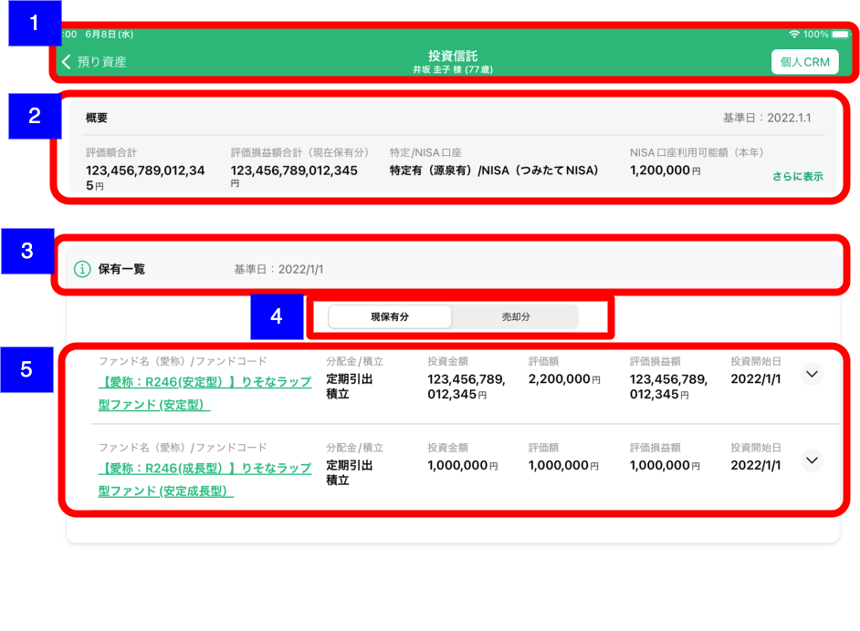
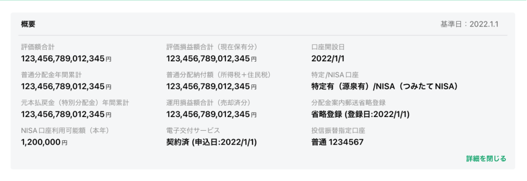
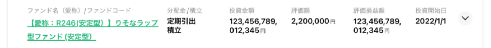
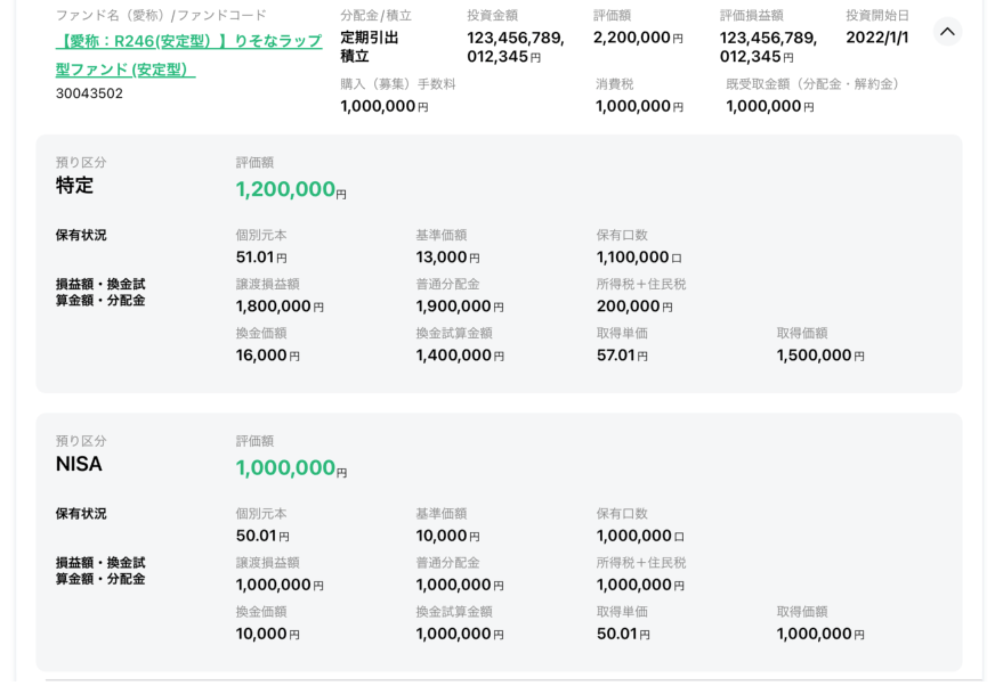
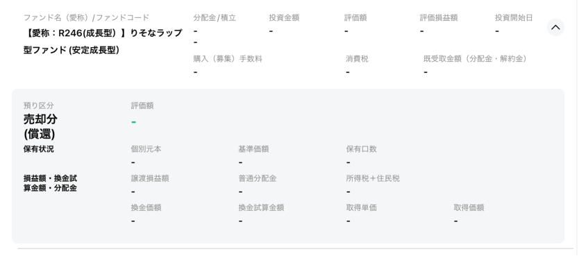
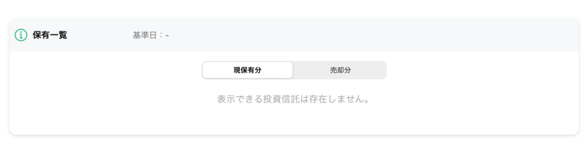

# 投資信託

## 概要

CRMから取得した投資信託の銘柄一覧を確認するための画面

## 画面遷移

N/A

## 画面レイアウト図

- 投資信託  

## 画面項目

1. ヘッダー
    - 顧客詳細リンク
        - [ ] タップすると、[顧客詳細画面への遷移イベント](#顧客詳細画面への遷移)を実行する。
    - 画面名
        - [ ] 「投資信託」を表示する。
    - 顧客情報
        - [ ] 顧客詳細画面にて表示されている対象顧客の氏名と年齢を表示する。
        - [ ] 顧客詳細画面にて年齢が表示されていない場合、年齢（-歳）を表示する。
    - 個人CRMリンク
        - [ ] タップすると[個人CRMへの遷移イベント](#個人CRMへの遷移)を実行する。個人CRMの該当CIFのトップ画面に遷移する
2. 投資信託概要情報
    - [ ] 基準日が`YYYY.M.D`形式で表示される。正しい基準日が存在しない場合はハイフンが表示される。
    - [ ] `さらに表示`をタップすると概要エリアが展開する。
    - [ ] 展開時に`詳細を閉じる`をタップすると概要エリアが初期状態に戻る。
    - 通常時
      - 評価額合計
          - [ ] 投資信託サマリー取得API応答の評価額合計が円単位で表示される。
      - 評価損益額合計（現在保有分）
          - [ ] 投資信託サマリー取得API応答の評価損益額合計（現在保有分）が円単位で表示される。
      - 特定/NISA口座
          - [ ] 投資信託サマリー取得API応答の特定口座とNISA種別が`<特定口座>（<NISA種別>）`の形式で表示される。
          - [ ] NISA種別の応答が`NONE（無）`の場合は`（<NISA種別>）`は表示されない。
      - NISA口座利用可能額（本年）
          - [ ] 投資信託サマリー取得API応答のNISA口座利用可能額（本年）が円単位で表示される。
    - 展開時  
      
      - 評価額合計
          - [ ] 投資信託サマリー取得API応答の評価額合計が円単位で表示される。
      - 評価損益額合計（現在保有分）
          - [ ] 投資信託サマリー取得API応答の評価損益額合計（現在保有分）が円単位で表示される。
      - 口座開設日
          - [ ] 投資信託サマリー取得API応答の口座開設日が表示される。正常な日付がない場合ハイフンが表示される。
      - 普通分配金年間累計
          - [ ] 投資信託サマリー取得API応答の普通分配金年間累計が円単位で表示される。
      - 普通分配金納付額（所得税＋住民税）
          - [ ] 投資信託サマリー取得API応答の普通分配金納付額（所得税＋住民税）が円単位で表示される。
      - 特定/NISA口座
          - [ ] 投資信託サマリー取得API応答の特定口座とNISA種別が`<特定口座>（<NISA種別>）`の形式で表示される。
          - [ ] NISA種別の応答が`NONE（無）`の場合は`（<NISA種別>）`は表示されない。
      - 元本払戻金（特別分配金）年間累計
          - [ ] 投資信託サマリー取得API応答の元本払戻金（特別分配金）年間累計が円単位で表示される。
      - 運用損益額合計（売却分）
          - [ ] 投資信託サマリー取得API応答の運用損益額合計（売却分）が円単位で表示される。
      - 分配金案内郵便省略登録
          - [ ] 投資信託サマリー取得API応答の分配金案内郵便省略登録が`省略登録（登録日:YYYY/M/D）` / `郵送登録（登録日:YYYY/M/D）`の形式で表示される。（正常な日付データが無い場合はカッコとカッコ内は表示されない）
      - NISA口座利用可能額（本年）
          - [ ] 投資信託サマリー取得API応答のNISA口座利用可能額（本年）が円単位で表示される。
      - 電子交付サービス
          - [ ] 投資信託サマリー取得API応答の電子交付サービスが`未契約` / `契約済み（登録日:YYYY/M/D）` / `解約済み（解約日:YYYY/M/D）`の形式で表示される。（正常な日付データが無い場合はカッコとカッコ内は表示されない）
      - 投信振替指定口座
          - [ ] 投資信託サマリー取得API応答の投信振替指定口座が`<振替相手預金種目> <振替相手口座番号>`の形式で表示される。（正常な振替相手口座番号が無い場合は表示されない）
3. 保有一覧ヘッダー
    - [ ] 「保有一覧」と表示される。
    - [ ]  基準日が`基準日：YYYY.M.D`形式で表示される。正しい基準日が存在しない場合はハイフンが表示される。
    - [ ]  「i」アイコンをタップすると[投資信託各項目のご説明を表示](#投資信託各項目のご説明を表示)を実行する。
4. セグメントコントロール
    - [ ] セグメントコントロール内に現保有分と売却分が表示される。
    - [ ] タップすることで「5. 投資信託銘柄一覧」内の銘柄がそれぞれ現保有分と売却分でフィルターされる。
5. 投資信託銘柄一覧
    - 通常時  
    
      - [ ] ファンドごとの銘柄一覧が表示される。
      - [ ] セルをタップすると展開して詳細情報が表示される。
      - ファンド名
          - [ ] ラベルに「ファンド名（愛称）」と表示される。
          - [ ] 投資信託銘柄位取得API応答のファンド名が表示される。APIの応答にファンドコードも含まれる場合、文字が緑色で下線付きで表示される。
          - [ ] 文字が緑色で下線付きで表示される場合、タップすると[りそなHPファンド詳細ページを表示](#りそなHPファンド詳細ページを表示)を実行する。
      - 分配金/積立
          - [ ] 上段に投資信託銘柄位取得API応答の分配金の取扱を表示する。定期引出に該当する場合は`定期引出`が表示され、該当しない場合はハイフンが表示される。
          - [ ] 下段に投資信託銘柄位取得API応答の積立区分を表示する。積立に該当する場合は`積立`が表示され、該当しない場合はハイフンが表示される。
      - 投資金額
          - [ ] 投資信託銘柄位取得API応答の投資額が円単位で表示される。
      - 評価額
          - [ ] 投資信託銘柄位取得API応答の特定口座または一般口座の価格等に関する情報とNISA口座の価格等に関する情報に含まれる評価額の合計が表示される。APIの応答に特定口座または一般口座の価格等に関する情報とNISA口座の価格等に関する情報がともに含まれない場合ハイフンが表示される。
      - 評価損益額
          - [ ] 投資信託銘柄位取得API応答の評価損益額(運用損益額)が円単位で表示される。APIの応答に評価損益額(運用損益額)が含まれない場合ハイフンが表示される。
      - 投資開始日
          - [ ] 投資信託銘柄位取得API応答の投資開始日が`YYYY/M/D`形式で表示される。APIの応答に投資開始日が含まれない場合ハイフンが表示される。
    - 展開時  
    
      - ファンド名・ファンドコード
          - [ ] ラベルに「ファンド名（愛称）/ファンドコード」と表示される。売却時などAPIの応答にファンドコードがない場合「ファンド名（愛称）」と表示される。
          - [ ] ファンド名の下に投資信託銘柄位取得API応答のファンドコードが表示される。売却時などAPIの応答にファンドコードがない場合何も表示されない。
      - 購入（募集）手数料
          - [ ] 投資信託銘柄位取得API応答の購入（募集）手数料が円単位で表示される。APIの応答に購入（募集）手数料が含まれない場合ハイフンが表示される。
      - 消費税
          - [ ] 投資信託銘柄位取得API応答の消費税が円単位で表示される。APIの応答に消費税が含まれない場合ハイフンが表示される。
      - 既受取金額（分配金・解約金）
          - [ ] 投資信託銘柄位取得API応答の既受取金額（分配金・解約金）が円単位で表示される。APIの応答に既受取金額（分配金・解約金）が含まれない場合ハイフンが表示される。
      - 特定口座または一般口座の価格等に関する情報
          - [ ] 預り区分が`NISA預りのみ`の場合もしくは売約済みの場合は表示されない。
          - 預り区分
            - [ ] 預り区分が`特定預り、NISA預り`もしくは`特定預りのみ`の場合は`特定`が表示される。
            - [ ] 預り区分が`一般預り、NISA預り`もしくは`一般預りのみ`の場合は`一般`が表示される。
          - 評価額
            - [ ] 投資信託銘柄位取得API応答の特定口座または一般口座の価格等に関する情報に含まれる評価額が円単位で表示される。
            - [ ] 数値は緑色、単位の円は黒色で表示される。
            - [ ] APIの応答に基準価額が含まれない場合ハイフン（単位なし）が表示される。
          - 個別元本
            - [ ] 投資信託銘柄位取得API応答の特定口座または一般口座の価格等に関する情報に含まれる個別元本が小数第二位までの円単位で表示される。
            - [ ] APIの応答に個別元本が含まれない場合ハイフン（単位なし）が表示される。
          - 基準価額
            - [ ] 投資信託銘柄位取得API応答の特定口座または一般口座の価格等に関する情報に含まれる基準価額が小数第二位までの円単位で表示される。
            - [ ] APIの応答に基準価額が含まれない場合ハイフン（単位なし）が表示される。
          - 保有口数
            - [ ] 投資信託銘柄位取得API応答の特定口座または一般口座の価格等に関する情報に含まれる保有口数が口単位で表示される。
            - [ ] APIの応答に保有口数が含まれない場合ハイフン（単位なし）が表示される。
          - 譲渡損益額
            - [ ] 投資信託銘柄位取得API応答の特定口座または一般口座の価格等に関する情報に含まれる譲渡損益額が円単位で表示される。
            - [ ] APIの応答に譲渡損益額が含まれない場合ハイフン（単位なし）が表示される。
          - 普通分配金
            - [ ] 投資信託銘柄位取得API応答の特定口座または一般口座の価格等に関する情報に含まれる普通分配金が円単位で表示される。
            - [ ] APIの応答に普通分配金が含まれない場合ハイフン（単位なし）が表示される。
          - 所得税＋住民税
            - [ ] 投資信託銘柄位取得API応答の特定口座または一般口座の価格等に関する情報に含まれる所得税＋住民税が円単位で表示される。
            - [ ] APIの応答に所得税＋住民税が含まれない場合ハイフン（単位なし）が表示される。
          - 換金価額
            - [ ] 投資信託銘柄位取得API応答の特定口座または一般口座の価格等に関する情報に含まれる換金価額が円単位で表示される。
            - [ ] APIの応答に換金価額が含まれない場合ハイフン（単位なし）が表示される。
          - 換金試算価額
            - [ ] 投資信託銘柄位取得API応答の特定口座または一般口座の価格等に関する情報に含まれる換金試算価額が円単位で表示される。
            - [ ] APIの応答に換金試算価額が含まれない場合ハイフン（単位なし）が表示される。
          - 取得単価
            - [ ] 投資信託銘柄位取得API応答の特定口座または一般口座の価格等に関する情報に含まれる取得単価が小数第二位までの円単位で表示される。
            - [ ] APIの応答に取得単価が含まれない場合ハイフン（単位なし）が表示される。
          - 取得価格
            - [ ] 投資信託銘柄位取得API応答の特定口座または一般口座の価格等に関する情報に含まれる取得価格が円単位で表示される。
            - [ ] APIの応答に取得価格が含まれない場合ハイフン（単位なし）が表示される。
      - NISA口座の価格等に関する情報
          - [ ] 預り区分が`特定預りのみ`、`一般預りのみ`もしくは売約済みの場合は表示されない。
          - 預り区分
            - [ ] 預り区分に`NISA`が表示される。
          - 評価額
            - [ ] 投資信託銘柄位取得API応答のNISA口座の価格等に関する情報に含まれる評価額が円単位で表示される。
            - [ ] 数値は緑色、単位の円は黒色で表示される。
            - [ ] APIの応答に基準価額が含まれない場合ハイフン（単位なし）が表示される。
          - 個別元本
            - [ ] 投資信託銘柄位取得API応答のNISA口座の価格等に関する情報に含まれる個別元本が小数第二位までの円単位で表示される。
            - [ ] APIの応答に個別元本が含まれない場合ハイフン（単位なし）が表示される。
          - 基準価額
            - [ ] 投資信託銘柄位取得API応答のNISA口座の価格等に関する情報に含まれる基準価額が小数第二位までの円単位で表示される。
            - [ ] APIの応答に基準価額が含まれない場合ハイフン（単位なし）が表示される。
          - 保有口数
            - [ ] 投資信託銘柄位取得API応答のNISA口座の価格等に関する情報に含まれる保有口数が口単位で表示される。
            - [ ] APIの応答に保有口数が含まれない場合ハイフン（単位なし）が表示される。
          - 譲渡損益額
            - [ ] 投資信託銘柄位取得API応答のNISA口座の価格等に関する情報に含まれる譲渡損益額が円単位で表示される。
            - [ ] APIの応答に譲渡損益額が含まれない場合ハイフン（単位なし）が表示される。
          - 普通分配金
            - [ ] 投資信託銘柄位取得API応答のNISA口座の価格等に関する情報に含まれる普通分配金が円単位で表示される。
            - [ ] APIの応答に普通分配金が含まれない場合ハイフン（単位なし）が表示される。
          - 所得税＋住民税
            - [ ] 投資信託銘柄位取得API応答のNISA口座の価格等に関する情報に含まれる所得税＋住民税が円単位で表示される。
            - [ ] APIの応答に所得税＋住民税が含まれない場合ハイフン（単位なし）が表示される。
          - 換金価額
            - [ ] 投資信託銘柄位取得API応答のNISA口座の価格等に関する情報に含まれる換金価額が円単位で表示される。
            - [ ] APIの応答に換金価額が含まれない場合ハイフン（単位なし）が表示される。
          - 換金試算価額
            - [ ] 投資信託銘柄位取得API応答のNISA口座の価格等に関する情報に含まれる換金試算価額が円単位で表示される。
            - [ ] APIの応答に換金試算価額が含まれない場合ハイフン（単位なし）が表示される。
          - 取得単価
            - [ ] 投資信託銘柄位取得API応答のNISA口座の価格等に関する情報に含まれる取得単価が小数第二位までの円単位で表示される。
            - [ ] APIの応答に取得単価が含まれない場合ハイフン（単位なし）が表示される。
          - 取得価格
            - [ ] 投資信託銘柄位取得API応答のNISA口座の価格等に関する情報に含まれる取得価格が円単位で表示される。
            - [ ] APIの応答に取得価格が含まれない場合ハイフン（単位なし）が表示される。
      - 売却済明細展開時  
      
          - [ ] 売約済みの場合のみ表示される。
          - 預り区分
            - [ ] 預り区分に`売却済(償還)`が表示される。
          - 評価額
            - [ ] ハイフン（単位なし）が緑色で表示される。
          - 個別元本
            - [ ] ハイフン（単位なし）が表示される。
          - 基準価額
            - [ ] ハイフン（単位なし）が表示される。
          - 保有口数
            - [ ] ハイフン（単位なし）が表示される。
          - 譲渡損益額
            - [ ] ハイフン（単位なし）が表示される。
          - 普通分配金
            - [ ] ハイフン（単位なし）が表示される。
          - 所得税＋住民税
            - [ ] ハイフン（単位なし）が表示される。
          - 換金価額
            - [ ] ハイフン（単位なし）が表示される。
          - 換金試算価額
            - [ ] ハイフン（単位なし）が表示される。
          - 取得単価
            - [ ] ハイフン（単位なし）が表示される。
          - 取得価格
            - [ ] ハイフン（単位なし）が表示される。
      - 明細なしの場合  
      
        - [ ] `表示する投資信託は存在しません`という文言が表示される。

## イベント

この項では、当画面にて実行されるイベント一覧を記述する。

### 顧客詳細画面への遷移

顧客情報詳細画面に遷移する。

### 個人CRMへの遷移

個人CRM（他システム）に遷移し、該当顧客画面を表示する。

### 投資信託各項目のご説明を表示

投資信託各項目のご説明画面をモーダル表示する。

### りそなHPファンド詳細ページを表示

りそなHP上の該当するファンド詳細Webページを全画面モーダル表示する。
