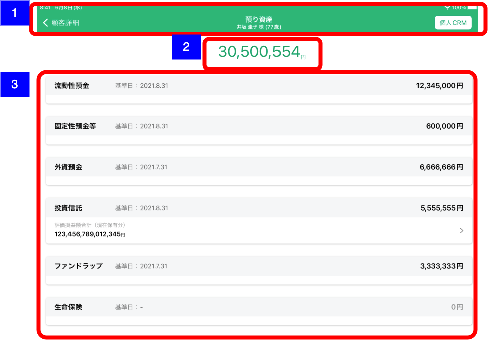
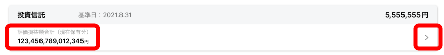

# 預り資産サマリー

## 概要

CRMから取得した預り資産の一覧を確認するための画面

## 画面遷移

N/A

## 画面レイアウト図

- 預り資産サマリー  

## 画面項目

1. ヘッダー
    - 顧客詳細リンク
        - [ ] タップすると、[顧客詳細画面への遷移イベント](#顧客詳細画面への遷移)を実行する。
    - 画面名
        - [ ] 「預り資産」を表示する。
    - 顧客情報
        - [ ] 顧客詳細画面にて表示されている対象顧客の氏名と年齢を表示する。
        - [ ] 顧客詳細画面にて年齢が表示されていない場合、年齢（-歳）を表示する。
    - 個人CRMリンク
        - [ ] タップすると[個人CRMへの遷移イベント](#個人CRMへの遷移)を実行する。個人CRMの該当CIFのトップ画面に遷移する
2. 預り資産合計
    - [ ] 預り資産の合計金額が円単位で表示される。
3. 預り資産一覧
    - 流動性預金
      - [ ] 基準日が`YYYY.M.D`形式で表示される。正しい基準日が存在しない場合はハイフンが表示される。
      - [ ] セルの右端に金額が表示される。0円の場合はグレーで表示される。
    - 固定性預金等
      - [ ] 基準日が`YYYY.M.D`形式で表示される。正しい基準日が存在しない場合はハイフンが表示される。
      - [ ] セルの右端に金額が表示される。0円の場合はグレーで表示される。
    - 外貨預金
      - [ ] 基準日が`YYYY.M.D`形式で表示される。正しい基準日が存在しない場合はハイフンが表示される。
      - [ ] セルの右端に金額が表示される。0円の場合はグレーで表示される。
    - 投資信託
      - [ ] 基準日が`YYYY.M.D`形式で表示される。正しい基準日が存在しない場合はハイフンが表示される。
      - [ ] セルの右端に金額が表示される。0円の場合はグレーで表示される。
      - [ ] 投信口座が存在しない場合（APIの応答がE404-008の場合）、口座なしが表示される。
    　
      - [ ] 投信口座が存在し、投資信託サマリー情報が取得できる場合、「評価損益額合計（現在保有分）」とシェブロンが表示される。
        
      - [ ] 投資信託サマリー情報から評価損益額合計（現在保有分）が取得できない場合、ハイフンが表示される。
      - [ ] 投信口座が存在し、投資信託サマリー情報が取得できる場合、セル全体がタップ可能となり、タップすると[投資信託画面への遷移](#投資信託画面への遷移)を実行する。
    - ファンドラップ
      - [ ] 基準日が`YYYY.M.D`形式で表示される。正しい基準日が存在しない場合はハイフンが表示される。
      - [ ] セルの右端に金額が表示される。0円の場合はグレーで表示される。
    - 生命保険
      - [ ] 基準日が`YYYY.M.D`形式で表示される。正しい基準日が存在しない場合はハイフンが表示される。
      - [ ] セルの右端に金額が表示される。0円の場合はグレーで表示される。
    - 実配型金信
      - [ ] 基準日が`YYYY.M.D`形式で表示される。正しい基準日が存在しない場合はハイフンが表示される。
      - [ ] セルの右端に金額が表示される。0円の場合はグレーで表示される。
    - 公共債
      - [ ] 基準日が`YYYY.M.D`形式で表示される。正しい基準日が存在しない場合はハイフンが表示される。
      - [ ] セルの右端に金額が表示される。0円の場合はグレーで表示される。
    - 金融商品仲介
      - [ ] 基準日が`YYYY.M.D`形式で表示される。正しい基準日が存在しない場合はハイフンが表示される。
      - [ ] セルの右端に金額が表示される。0円の場合はグレーで表示される。

## イベント

この項では、当画面にて実行されるイベント一覧を記述する。

### 顧客詳細画面への遷移

顧客情報詳細画面に遷移する。

### 個人CRMへの遷移

個人CRM（他システム）に遷移し、該当顧客画面を表示する。

### 投資信託画面への遷移

投資信託画面にプッシュ遷移する。
