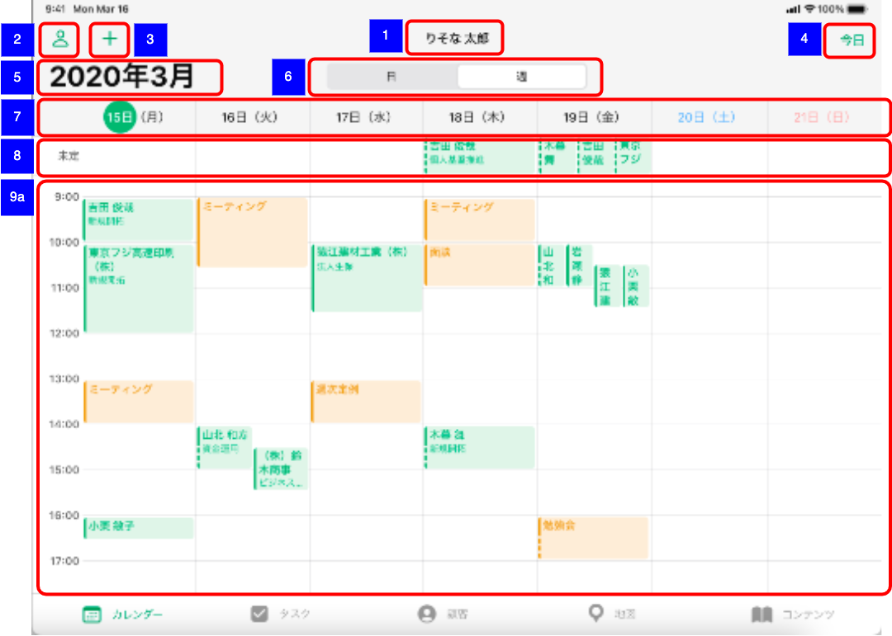
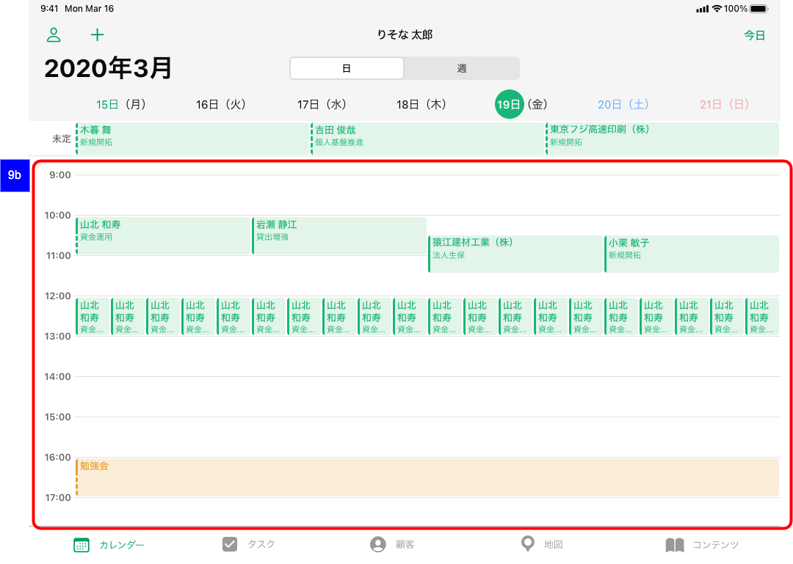
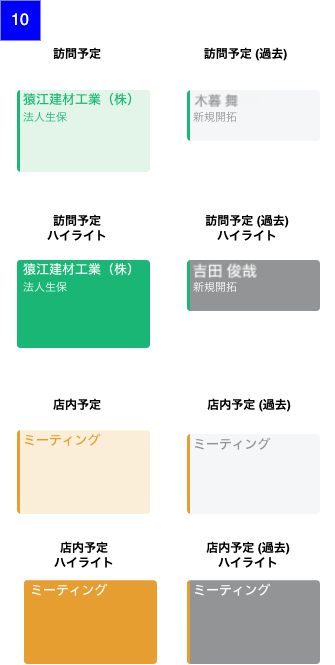

# カレンダートップ

## 概要

担当者および同僚の予定を参照、作成、更新するための画面。

## 画面遷移

N/A

## 画面レイアウト図

- カレンダートップ_週表示

- カレンダートップ_日表示

- カレンダー訪問予定表示

## 画面項目

1. タイトル
    - [ ] 表示している担当者の名前を表示する。
    - [ ] 初期状態では、渉外アプリ利用ユーザーの名前を表示する。
2. 担当者切り替えボタン
    - [ ] 人のアイコンのボタンを表示する。
    - [ ] タップすると[担当者切り替えボタンをタップ](#担当者切り替えボタンをタップ)を実行する。
3. 新規訪問予定作成ボタン
    - [ ] ＋アイコンのボタンを表示する。
    - [ ] タップすると[新規訪問予定作成ボタンをタップ](#新規訪問予定作成ボタンをタップ)を実行する。
4. 今日ボタン
    - [ ] 今日というラベルのボタンを表示する。
    - [ ] タップすると[今日ボタンをタップ](#今日ボタンをタップ)を実行する。
5. 年月表示
    - [ ] 表示しているカレンダーの年月を`yyyy年M月`形式で表示する。
6. セグメントコントロール
    - [ ] セグメントコントロールをタップ（スライド）することで日表示と週表示を切り替えて表示する。
7. 日付（曜日）表示
    - [ ] 該当週の月曜から日曜までを`d日（<曜日>）`形式で表示する。
8. 未定イベント表示エリア
    - [ ] 未定イベントを表示する。
    - [ ] 週表示の場合、未定イベントが同日に5件以上ある際には最初の2件のみ表示し`+○件`を表示する。（○は全件数から2件を引いた数）
    - [ ] 日表示の場合、**要確認**
    - [ ] `+○件`をタップすると[追加表示のリンクをタップ](#追加表示のリンクをタップ)を実行する。
9. 予定表示エリア
    - [ ] 週表示（**9a**）の場合1週間分7列で「1.タイトル」で表示された担当者が所有する予定が表示される。
    - [ ] 日表示（**9b**）の場合1日分が1列で「1.タイトル」で表示された担当者が所有する予定が表示される。
    - [ ] 予定表示エリアをスワイプすることで前週（前日）や次週（翌日）を切り替えて表示できる。
    - [ ] 予定をタップすると[予定をタップ](#予定をタップ)を実行する。
10. カレンダー予定表示
    - 訪問予定（個人顧客/法人顧客）
      - [ ] 背景を薄い緑（#E3F4E9）で表示する。
      - [ ] 左枠線を緑（#009F64）で表示する。
      - [ ] 予定をタップした際のハイライト色を緑（#009F64）で表示する。
      - [ ] タイトルに訪問先の顧客名を表示する。
      - [ ] 過去の予定[※]かつ顧客訪問のステータスが`訪問結果未入力`の場合、タイトルの先頭にグレーの○を表示する。
      - [ ] 過去の予定[※]かつ顧客訪問のステータスが`訪問結果未閲覧`の場合、タイトルの先頭に黄色の●を表示する。
      - [ ] 過去の予定[※]かつ顧客訪問のステータスが`訪問結果閲覧済み`/`コメント確認済み`の場合、タイトルの先頭に青色の●を表示する。
      - [ ] 過去の予定[※]かつ顧客訪問のステータスが`コメント入力済み(未確認)`の場合、タイトルの先頭に赤色の●を表示する。
      - [ ] サブタイトルに訪問予定の訪問目的を表示する。
    - 店内予定
      - [ ] 背景を薄いオレンジ色（#FBEED9）で表示する。
      - [ ] 左枠線をオレンジ色（#E69E30）で表示する。
      - [ ] 予定をタップした際のハイライト色をオレンジ色（#E69E30）で表示する。
      - [ ] タイトルに店内予定の予定内容を表示する。
    - 共通
      - [ ] 予定の開始時刻、終了時刻ともに空の場合、左枠線を破線で表示する。
      - [ ] 予定の終了時刻が未定の場合、左枠線の下半分を破線で表示する。
      - [ ] 予定の開始時刻、終了時刻ともに設定されている場合、左枠線を実戦で表示する。
      - [ ] 過去の予定[※]の場合、背景色を薄いグレー（#F5F6F7）で表示する。
      - [ ] 過去の予定[※]の場合、予定をタップした際のハイライト色をグレー（#939495）で表示する。

    ※ 過去の予定は、以下の条件を満たす場合をいう。

    - 未定（開始時刻、終了時刻ともに空）の場合、前日以前の予定である
    - 終了時刻が表示時点の時刻より前である
    - 終了時刻が空の場合、開始時刻+1時間の時刻が表示時点の時刻より前である

## イベント

### 担当者切り替えボタンをタップ

- [ ] [担当者切り替え画面](./担当者切り替え.md)をポップオーバー表示する。

### 新規訪問予定作成ボタンをタップ

- [ ] [新規訪問予定作成画面](./新規訪問予定作成.md)をポップオーバー表示する。

### 今日ボタンをタップ

- [ ] 日表示であれば当日を、週表示であれば当日を含む週を表示する。

### 予定をタップ

- [ ] タップされた予定の背景がハイライトされる。
- [ ] 個人顧客の訪問予定の場合、[個人顧客訪問予定詳細](./個人顧客訪問予定詳細.md)をポップオーバー表示する。
- [ ] 法人顧客の訪問予定の場合、[法人顧客訪問予定詳細](./法人顧客訪問予定詳細.md)をポップオーバー表示する。
- [ ] 店内予定の場合、[店内予定詳細](./店内予定詳細.md)をポップオーバー表示する。

### 追加表示のリンクをタップ

- [ ] **要確認（ポップオーバーor日表示）**
