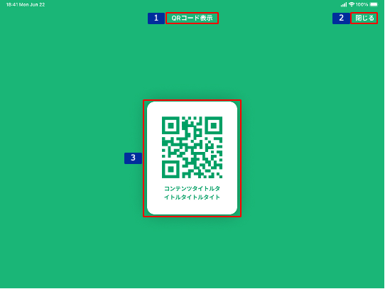

# QRコード表示

## 概要

顧客のデバイスで公開可能なコンテンツを閲覧してもらうためのQRコードを表示する画面。

## 画面遷移

[Figma](https://www.figma.com/file/wwW1SVp7aIw78nTzVOsTmM/-%E3%81%8A%E5%AE%A2%E6%A7%98%E3%83%BB%E9%96%8B%E7%99%BA%E9%80%A3%E6%90%BA-%E6%8F%90%E6%A1%88%E3%82%B5%E3%83%9D%E3%83%BC%E3%83%88%E3%82%B7%E3%82%B9%E3%83%86%E3%83%A0-iOS?node-id=1235%3A12026)

## 画面レイアウト図

- QRコード表示

## 画面項目

1. タイトル
    - [X] "QRコード表示"を表示する。
2. 閉じるボタン
    - [X] タップすると、[閉じるボタンをタップ](#閉じるボタンをタップ)を実行する。
3. QRコード
    - [X] コンテンツWebページのURLのQRコードを表示する。
    - [X] QRコードの下にコンテンツタイトルを表示する。
    - [X] コンテンツタイトルは全文表示する。

## イベント

この項目では、当画面にて実行されるイベント一覧を記述する。

### 閉じるボタンをタップ

- [X] QRコード表示画面を閉じて、QRコード表示画面に遷移する前に表示していた画面（[コンテンツ説明](./コンテンツ説明.md)）を表示する。
