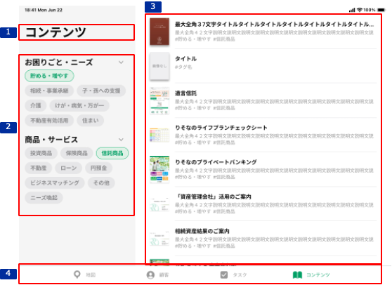

# コンテンツ一覧

## 概要

顧客の困りごと・ニーズの観点や提案予定の商品・サービスの観点から、顧客公開可能なコンテンツを効率的に探すことができる。
説明や内容を確認するための画面に遷移することができる。

## 画面遷移

[Figma](https://www.figma.com/file/wwW1SVp7aIw78nTzVOsTmM/-%E3%81%8A%E5%AE%A2%E6%A7%98%E3%83%BB%E9%96%8B%E7%99%BA%E9%80%A3%E6%90%BA-%E6%8F%90%E6%A1%88%E3%82%B5%E3%83%9D%E3%83%BC%E3%83%88%E3%82%B7%E3%82%B9%E3%83%86%E3%83%A0-iOS?node-id=1235%3A12026)

## 画面レイアウト図

- コンテンツ一覧

## 画面項目

1. タイトル
    - [X] "コンテンツ"を表示する。
2. タグ選択エリア
    - [X] お困りごと・ニーズエリア、商品・サービスエリアが表示される。
    - [X] "お困りごと・ニーズ""商品・サービス"のヘッダーをタップするとそれぞれのエリアが開閉する。初期ではそれぞれのエリアが開いた状態とする。
    - [X] タグをタップした場合、右ペインのコンテンツ一覧エリアには選択したタグで絞り込まれたコンテンツが表示される。and条件で絞り込む。
    - [X] タグは複数選択可能である。
    - [X] 初期はタグが選択されていないため、右ペインのコンテンツ一覧エリアには全量のコンテンツが表示される。
    - [X] タブバーで他画面に遷移して戻ってきた場合、遷移前に選択していたタグでフィルタされた状態となる。
    - お困りごと・ニーズ
      - ヘッダー
          - [X] タイトルに"お困りごと・ニーズ"を表示する。
          - [X] タイトルの右側にシェブロンを表示する。
      - 選択ボタン
          - [X] "貯める・増やす/相続・事業承継/子・孫への支援/介護/けが・病気・万が一/不動産有効活用/住まい"を表示する。
    - 商品・サービス
      - ヘッダー
          - [X] タイトルに"商品・サービス"を表示する。
          - [X] タイトルの右側にシェブロンを表示する。
      - 選択ボタン
          - [X] "投資商品/保険商品/信託商品/不動産/ローン/円預金/ビジネスマッチング/その他/ニーズ喚起"を表示する。
3. コンテンツ一覧エリア
    - [X] コンテンツの一覧が表示される。
    - [X] ログインユーザの所属銀行により出し分けてコンテンツが表示される。
    - [X] Pull to Refresh（一覧を下に引っ張ったのち離すこと）で再読み込みできる。
    - [X] 該当条件でコンテンツが存在しない場合、"検索結果が0件です。検索条件を変えて検索してください。"が表示される。
    - 表紙画像
      - [X] 外部HPに格納された表紙画像を読み込んで表示する。
      - [X] コンテンツ一覧表示直後で画像が読み込めていない場合、代替画像を表示する。
      - [ ] 該当する画像が無い場合、「画像なし」を表示。
      - [X] タップすると、[表紙画像をタップ](#表紙画像をタップ)を実行する。
    - タイトル
      - [ ] 画面の表示領域を超える場合、三点リードで表示する。
      - [X] タップすると、[タイトル・概要・タグをタップ](#タイトル・概要・タグをタップ)を実行する。
    - 概要
      - [X] 画面の表示領域を超える場合、三点リードで表示する。
      - [ ] 概要の登録がない場合、非表示とする。
      - [X] タップすると、[タイトル・概要・タグをタップ](#タイトル・概要・タグをタップ)を実行する。
    - タグ
      - [X] コンテンツごとに紐づけたタグを表示する。
      - [X] 左ペインで表示したタグの順番に該当タグを表示する。
      - [X] 画面の表示領域を超える場合、三点リードで表示する。
      - [X] タップすると、[タイトル・概要・タグをタップ](#タイトル・概要・タグをタップ)を実行する。

4. タブバー
    - [X] "地図/顧客/タスク/コンテンツ"を表示する。
    - [X] 地図をタップすると、[地図をタップ](#地図をタップ)を実行する。
    - [X] 顧客をタップすると、[顧客をタップ](#顧客をタップ)を実行する。
    - [X] タスクをタップすると、[タスクをタップ](#タスクをタップ)を実行する。

## イベント

この項目では、当画面にて実行されるイベント一覧を記述する。

### 表紙画像をタップ

- [X] アプリ内ブラウザ（SFSafariView）でコンテンツ画面を表示する。

### タイトル・概要・タグをタップ

- [X] [コンテンツ説明](./コンテンツ説明.md)を表示する。

### 地図をタップ

- [X] 地図画面に遷移する。

### 顧客をタップ

- [X] [コンテンツ説明](../顧客一覧/顧客一覧（担当顧客）.md)に遷移する。

### タスクをタップ

- [X] [コンテンツ説明](../推進タスク/推進タスク一覧（担当顧客）.md)に遷移する。
