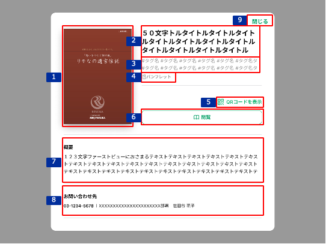

# コンテンツ説明

## 概要

コンテンツの詳細を確認するための画面。

## 画面遷移

[Figma](https://www.figma.com/file/wwW1SVp7aIw78nTzVOsTmM/-%E3%81%8A%E5%AE%A2%E6%A7%98%E3%83%BB%E9%96%8B%E7%99%BA%E9%80%A3%E6%90%BA-%E6%8F%90%E6%A1%88%E3%82%B5%E3%83%9D%E3%83%BC%E3%83%88%E3%82%B7%E3%82%B9%E3%83%86%E3%83%A0-iOS?node-id=1235%3A12026)

## 画面レイアウト図

- コンテンツ説明

## 画面項目

1. 表紙画像
    - [X] 外部HPに格納された表紙画像を読み込んで表示する。
    - [ ] 該当する画像が無い場合、"画像なし"を表示する。
2. タイトル
    - [X] タイトルの全文を表示する。
3. タグ
    - [X] コンテンツごとに紐づけたタグを全て表示する。
    - [X] コンテンツ一覧の左ペインで表示したタグの順番に該当タグを表示する。
4. ジャンル
    - [X] コンテンツごとに設定したジャンルを表示する。
    - [X] ジャンルには、"パンフレット/チラシ/提案書サンプル/汎用提案書"のいずれかを表示する。
    - [ ] ジャンルが未設定の場合、ラベル名含めて非表示とする。
5. QRコード表示
    - [X] 顧客への公開可能なコンテンツの場合、QRコードを表示する。
    - [X] タップすると[QRコード表示をタップ](#QRコード表示をタップ)を実行する。
6. 閲覧ボタン
    - [X] タップすると、[閲覧ボタンをタップ](#閲覧ボタンをタップ)を実行する。
7. 概要
    - [X] 概要の全文を表示する。
    - [ ] 概要が未設定の場合、ラベル名含めて非表示とする。
8. お問い合わせ先
    - [X] コンテンツごとに設定したお問い合わせ先を"<外線電話番号> | <担当部署>"の形式で表示する。
    - [X] 外線電話番号が未設定の場合、"-"(ハイフン)を表示する。
    - [X] お問い合わせ先が未設定の場合、ラベル名含めて非表示とする。
9. 閉じるボタン
    - [X] タップすると、[閉じるボタンをタップ](#閉じるボタンをタップ)を実行する。

## イベント

この項目では、当画面にて実行されるイベント一覧を記述する。

### 閲覧ボタンをタップ

- [X] アプリ内ブラウザ（SFSafariView）でコンテンツ画面を表示する。

### QRコード表示をタップ

- [X] [QRコード表示](./QRコード表示.md)を表示する。

### 閉じるボタンをタップ

- [X] コンテンツ説明画面を閉じて、コンテンツ説明画面に遷移する前に表示していた画面（[コンテンツ一覧](./コンテンツ一覧.md)）を表示する。
