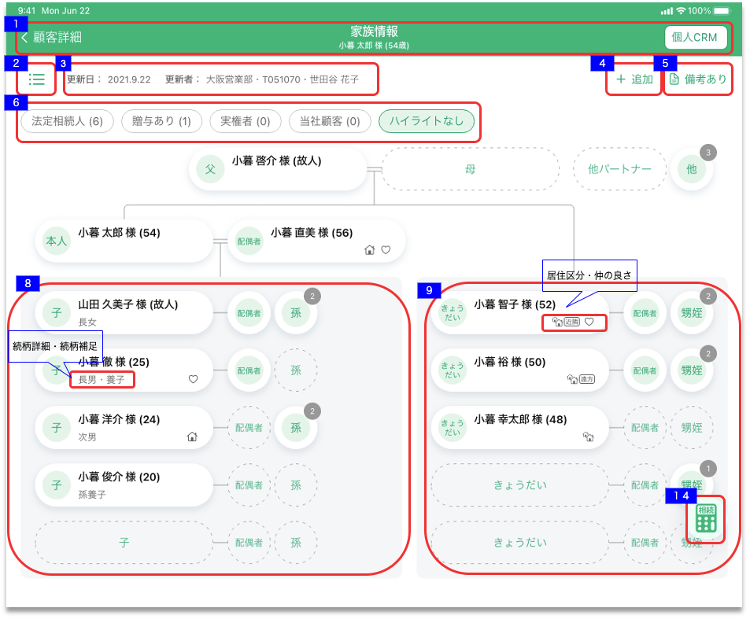

# 画面設計: 家族情報カードView

## 概要

家族情報の全体像を把握するための画面

## 画面遷移

N/A

## 画面レイアウト図

- 家族情報カードView  


## 画面項目

> :point_up: 麻布支店ユーザーでログインし、顧客ID「13001003000」(家族情報カードViewのサンプル)の家族カードを表示することで確認できる。
> 選択項目について確認したい場合は、顧客ID「13001003001」（各選択項目を網羅）の家族カードを表示することで確認できる。
> 上記２顧客で確認できない項目については、都度注釈にて顧客を指定する。

1. ヘッダー
    - 顧客詳細リンク
        - [x] タップすると、[顧客詳細画面への遷移イベント](#顧客詳細画面への遷移)を実行する。
    - 画面名
        - [x] 「家族情報」を表示する。
    - 顧客情報
        - [x] 顧客詳細画面にて表示されている対象顧客の氏名と年齢を表示する。
        - [x] 顧客詳細画面にて年齢が表示されていない場合、年齢（-歳）を表示する。
    - 個人CRMリンク
        - [x] タップすると[個人CRMへの遷移イベント](#個人CRMへの遷移)を実行する。
2. 家族情報View切替
    - タップすると[家族情報リストView](家族情報リストView.md)に遷移する。
3. ヒアリング・更新者
    - [x] ヒアリングを年内に行った場合、 `MM月dd日` の形式で更新日が表示される
    - [x] 更新日は登録明細ごとの更新日付及び備考更新日付のうち最も大きい日付を表示する。
    - [x] 明細を削除した場合、更新日は削除した日付が表示される。

    ```md
    存在するデータの中で最も大きい日付を表示するので、最も大きい日付が削除された場合、次に大きい日付が表示されることとなる。
    例: 1明細のみ登録されたデータを削除した場合、
    ①何も登録していない状態（更新日「まだヒアリングしていません」と表示される状態）
    ②1/31　1明細を登録
    ③2/1　  ②で登録した1明細を削除
    → ヒアリングには「まだヒアリングしていません」が表示される。
    ```
    - [x] ヒアリングを去年より過去に行った場合、 `yyyy.mm.dd` の形式で更新日を表示する。
    - [x] ヒアリングを行った場合、更新者の所属店名、R2ID、更新者氏名を表示する。
        - [x] 更新者が退職済みの場合、所属店名、R2ID、更新者氏名を表示する。
        - [x] 所属店名が不明な場合、「不明な支店」を表示する。
    - [x] ヒアリングが行われていない場合、「まだヒアリングしていません」を表示する。
4. 追加ボタン
    - [x] タップすると、[追加ボタンをタップ](#追加ボタンをタップ)を実行する。
5. 備考作成 / 備考詳細へのリンクボタン
    - [家族情報リストView](家族情報リストView.md) と同様。
6. フィルター
    - 法定相続人
        - [x] 該当する人数が表示される。
        - [x] タップすると法定相続人とみなされるカードがハイライトされる。ハイライトされうるカードは配偶者、子、孫、父母、きょうだい、甥姪。
        - [x] バッチ表示されるカードの場合は、1件でも該当者がいればハイライトされる。
    - 贈与あり
        - [x] 該当する人数が表示される。
        - [x] タップすると法定相続人とみなされるカードがハイライトされる。ハイライトされうるカードは配偶者、子、孫、父母、きょうだい、甥姪、他パートナー、他。
        - [x] バッチ表示されるカードの場合は、1件でも該当者がいればハイライトされる。
    - 実権者
        - [x] 該当する人数が表示される。
        - [x] タップすると法定相続人とみなされるカードがハイライトされる。ハイライトされうるカードは配偶者、子、孫、父母、きょうだい、甥姪、他パートナー、他。
        - [x] バッチ表示されるカードの場合は、1件でも該当者がいればハイライトされる。
    - 当社顧客
        - [x] 該当する人数が表示される。
        - [x] タップすると法定相続人とみなされるカードがハイライトされる。ハイライトされうるカードは配偶者、子、孫、父母、きょうだい、甥姪、他パートナー、他。
        - [x] バッチ表示されるカードの場合は、1件でも該当者がいればハイライトされる。
    - ハイライトなし
        - [x] 画面初期表示時はハイライトなしが選択されている。
        - [x] タップすると、ハイライトされていたカードがハイライトなしで表示される。
7. 本人カード
    - [x] 対象顧客の氏名と年齢を表示する。
    - [x] 表示領域を超える文字数の名前が登録されている場合、三点リードを表示する。
    - [x] 顧客詳細画面にて年齢が表示されていない場合、年齢（-歳）を表示する。
8. 子エリア  
    「子」、「子の配偶者」、「孫」を表示するエリア
    「子」-「配偶者」-「孫」で1行とする。
    - [x] 登録されていない場合、点線の枠を1行表示する。
    - [x] 登録されている場合、登録されている行数と点線の枠を1行表示する。
    - [x] 「子」に紐づかない「子の配偶者」または「孫」が登録されている場合、「子」が登録されている行>「子」が登録されていない行の順で表示する。
    - 「子」が複数存在する場合、生年月日>年齢>続柄詳細>明細IDの順で評価し、ソートする。
        - 生年月日
            - [x] 昇順で評価する。
            - [x] 年月日のいずれかが不明で、`yyyymm--`,`yyyy--dd`,`yyyy----`の形式で登録されている生年月日の`--`は99として評価する。
            - [x] 年月日のいずれかが不明で、`----mmdd`,`----mm--`,`------dd`の形式で登録されている生年月日は入力なしとして評価する。
        - 年齢
            - [x] 降順で評価する。
        - 続柄詳細
            - [x] 長男,長女、次男、次女...九男、九女、十男、十女の順で評価する。

            > :point_up: 顧客ID「13001003001」で確認
        - 明細ID
            - [x] 昇順で評価する。

        > :point_up: 麻布支店ユーザーでログインし、顧客ID「13001003013」（子ソート確認用顧客）にて確認できる。

9. きょうだいエリア
    「きょうだい」、「きょうだいの配偶者」、「甥姪」を表示するエリア
    「きょうだい」-「配偶者」-「甥姪」で1行とする。
    - [x] 登録されていない場合、点線の枠を1行表示する。
    - [x] 登録されている場合、登録されている行数と点線の枠を1行表示する。
    - [x] 「きょうだい」に紐づかない「きょうだいの配偶者」または「甥姪」が登録されている場合、「きょうだい」が登録されている行>「きょうだい」が登録されていない行の順で表示する。
    - 「きょうだい」が複数存在する場合、生年月日>年齢>続柄詳細>明細IDの順で評価し、ソートする。
        - 生年月日
            - [x] 昇順で評価する。
            - [x] 年月日のいずれかが不明で、`yyyymm--`,`yyyy--dd`,`yyyy----`の形式で登録されている生年月日の`--`は99として評価する。
            - [x] 年月日のいずれかが不明で、`----mmdd`,`----mm--`,`------dd`の形式で登録されている生年月日は入力なしとして評価する。
        - 年齢
            - [x] 降順で評価する。
        - 続柄詳細
            - [x] 続柄がきょうだいの場合、兄、姉、弟、妹の順で評価する。

            > :point_up: 顧客ID「13001003001」で確認
        - 明細ID
            - [x] 昇順で評価する。

        > :point_up: 麻布支店ユーザーでログインし、顧客ID「13001003014」（きょうだいソート確認用顧客）にて確認できる。

10. 「父」、「母」、「配偶者」、「子」、「きょうだい」カード
    - 登録されている場合、各項目を表示する。
        - [x] 続柄
        - 続柄詳細
            - [x] 登録されている場合、表示する。
            - [x] 登録されていない場合、表示しない。
            - [x] 登録可能な値を全て表示する。
                - [x] 「父」「母」カードの場合、表示しない。
                - [x] 「子」カードの場合、長男,長女、次男、次女...九男、九女、十男、十女のいずれかを表示する。
                - [x] 「きょうだい」カードの場合、兄、姉、弟、妹のいずれかを表示する。
        - 続柄補足
            - [x] 登録されている場合、表示する。
            - [x] 続柄詳細、続柄補足が登録されている場合、それぞれの登録内容を表示する。
            - [x] 登録されていない場合、表示しない。
            - [x] 登録可能な値を全て表示する。
                - [x] 「父」「母」「きょうだい」カードの場合、表示しない。
                - [x] 「子」カードの場合、孫養子、養子、前夫の子、前妻の子、非嫡出子、連れ子、婿養子、嫁養子のいずれかを表示する。
        - 氏名
            - [x] 登録されている場合、 登録内容を表示する。
            - [x] 登録されていない場合、表示しない。
            - [x] 表示領域を超える文字数の名前が登録されている場合、三点リードを表示する。
        - 年齢/故人
            - [x] 故人として登録されている場合、`年齢`が表示されず、 （故人） を表示する。
            - [x] 故人として登録されておらず、年齢が登録されている場合、 （`年齢`） を表示する。
            - [x] 故人として登録されておらず、年齢が登録されていない場合、表示されない。
        - 居住区分
            - [x] 登録されている場合、登録内容のアイコンを表示する。
            - [x] 居住区分、仲の良さが登録されている場合、左から順に `居住区分` `仲の良さ` を表すアイコンを表示する。
            - [x] 登録されていない場合、表示しない。
            - [x] 登録可能な値を全て表示する。（同居、別居、別居（近隣）、別居（遠方）を示すアイコン）
        - 仲の良さ
            - [x] 登録されている場合、登録内容のアイコンを表示する。
            - [x] 居住区分、仲の良さが登録されている場合、左から順に `居住区分` `仲の良さ` を表すアイコンを表示する。
            - [x] 登録されていない場合、表示されない。
            - [x] 登録可能な値を全て表示する。（仲が良い、仲が悪いを示すアイコン）
    - [x] 登録されている場合、白丸の枠で表示し、タップすると[白丸の枠をタップ](#白丸の枠をタップ)を実行する。
    - [x] 登録されていない場合、点線の枠で表示し、タップすると[白丸の枠をタップ](#白丸の枠をタップ)を実行する。
11. 子の配偶者、きょうだいの配偶者カード
    - [x] 登録されている場合、白丸の枠で表示し、タップすると[ポップアップの表示](#ポップアップの表示)を実行する。
        - [x] 子の配偶者が登録されている場合、子エリアの配偶者を白丸の枠で表示する。
        - [x] きょうだいの配偶者が登録されている場合、きょうだいエリアの配偶者を白丸の枠で表示する。
    - [x] 登録されていない場合、点線の枠で表示され、タップすると[白丸の枠をタップ](#白丸の枠をタップ)を実行する。
    - [x] 当人の配偶者が登録されている場合、当人の配偶者として登録されている続柄「子」/「きょうだい」と同じ行に表示する。
    - [x] 当人の配偶者が登録されていない場合、続柄「子」/「きょうだい」を点線の枠の行に表示する。
12. 孫、甥姪カード
    - [x] 登録されている場合、白丸の枠で表示し、各項目を表示する。
        - [x] 続柄
        - 人数
            - [x] 「子」に紐づく「孫」が登録されている場合、各「子」に紐づく「孫」の人数を表示する。
            - [x] 「子」に紐づかない「孫」が登録されている場合、「孫」の人数を1として人数を表示する。
            - [x] 「きょうだい」に紐づく「甥姪」が登録されている場合、各「きょうだい」に紐づく「甥姪」の人数を表示する。
            - [x] 「きょうだい」に紐づかない「甥姪」が登録されている場合、「甥姪」の人数を1として人数を表示する。
    - [x] 登録されている場合、白丸の枠で表示し、タップすると[ポップアップの表示](#ポップアップの表示)を実行する。
    - [x] 登録されていない場合、点線の枠で表示し、タップすると[点線の枠をタップ](#点線の枠をタップ)を実行する。
    - [x] 当人の親が登録されている場合、当人の親として登録されている続柄「子」/「きょうだい」と同じ行に表示する。
    - [x] 当人の親が登録されていない場合、続柄「子」/「きょうだい」を点線の枠の行に表示する。
13. 他、他パートナーカード
    - [x] 続柄
    - 人数
        - [x] 登録されている場合、白丸の枠の右上の人数を表示する。
        - [x] 登録されていない場合、人数を表示しない。
    - [x] 登録されている場合、白丸の枠で表示され、タップすると[ポップアップの表示](#ポップアップの表示)を実行する。
    - [x] 登録されていない場合、点線の枠で表示され、タップすると[点線の枠をタップ](#点線の枠をタップ)を実行する。

14. 相続税計算
    - [x] タップすると、[相続税計算](#相続税計算ボタンをタップ) を実行する。

## イベント

この項では、当画面にて実行されるイベント一覧を記述する。

### 顧客詳細画面への遷移

顧客情報詳細画面に遷移する。

### 個人CRMへの遷移

個人CRM（他システム）に遷移する。

### 家族情報リストViewへの遷移

[家族情報リストView画面](家族情報リストView.md)に遷移する。

### 家族情報詳細画面の表示

[家族情報詳細画面](家族情報詳細.md)を表示する。

#### 追加ボタンをタップ

- [x] 家族情報詳細画面を表示する。

#### 白丸の枠をタップ

- [x] タップした家族の情報を顧客情報詳細画面に渡す。
- [x] 家族情報詳細画面を表示する。

#### 点線の枠をタップ

- [x] タップした箇所の続柄を顧客情報詳細画面に渡す。
- [x] 家族情報詳細画面を表示する。

### 備考入力画面への遷移

[備考入力画面](備考入力.md)に遷移する。

### ポップアップの表示

[ポップアップ](ポップアップ.md)を表示する。

### 相続税計算ボタンをタップ

[相続税簡易シミュレーション入力](../相続税簡易シミュレーション/相続税簡易シミュレーション入力.md)を表示する。
