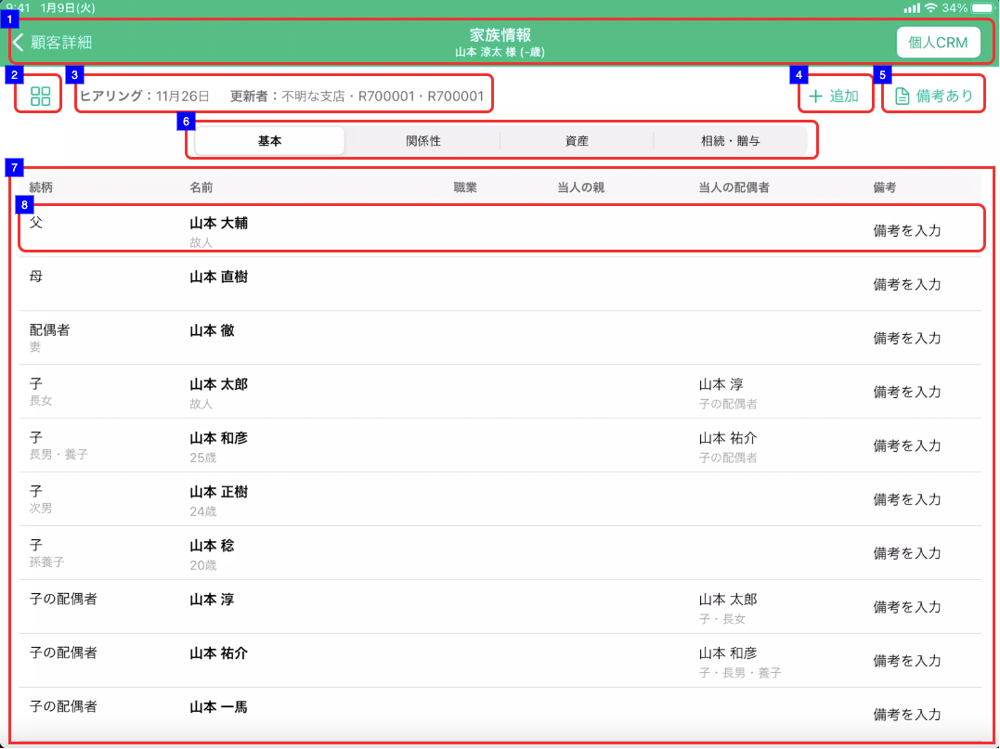

# 画面設計: 家族情報リストView

## 概要

家族情報の全体像を把握するための画面

## 画面遷移

N/A

## 画面レイアウト図

- 家族情報リストView  


## 画面項目

> :point_up: 麻布支店ユーザーでログインし、顧客ID「13001003000」(家族情報カードViewのサンプル)の家族カードを表示することで確認できる
> 選択項目について確認したい場合は、顧客ID「13001003001」（各選択項目を網羅）の家族カードを表示することで確認できる。
> 上記２顧客で確認できない項目については、都度注釈にて顧客を指定する。

1. ヘッダー
    - 顧客詳細リンク
        - [x] タップすると、[顧客詳細画面への遷移イベント](#顧客詳細画面への遷移)が実行される。
    - 画面名
        - [x] 「家族情報」が表示される
    - 顧客情報
        - [x] 顧客詳細画面にて表示されている対象顧客の氏名と年齢が表示される。
        - [x] 顧客詳細画面にて年齢が表示されていない場合、年齢が（-歳）で表示される。
    - 個人CRMリンク
        - [x]  タップすると[個人CRMへの遷移イベント](#個人CRMへの遷移)を実効する。
2. 家族情報View切替
    - [x]  タップすると[家族情報カードView](家族情報カードView.md)に遷移する。 TODO:実装
3. ヒアリング・更新者
    - [x] ヒアリングを年内に行った場合、 `MM月dd日` の形式で更新日が表示される
    - [x] 更新日は登録明細ごとの更新日付及び備考更新日付のうち最も大きい日付を表示する。
    - [x] 明細を削除した場合、更新日は削除した日付が表示される。

    ```md
        存在するデータの中で最も大きい日付を表示するので、最も大きい日付が削除された場合、次に大きい日付が表示されることとなる。
        例: 1明細のみ登録されたデータを削除した場合、
        ①何も登録していない状態（更新日「まだヒアリングしていません」と表示される状態）
        ②1/31　1明細を登録
        ③2/1　  ②で登録した1明細を削除
        → ヒアリングには「まだヒアリングしていません」が表示される。
    ```
    - [x] ヒアリングを去年より過去に行った場合、 `yyyy.mm.dd` の形式で更新日が表示される。
    - [x] ヒアリングを行った場合、更新者の所属店名、R2ID、更新者氏名が表示される。
        - [x] 更新者が退職済みの場合、所属店名、R2ID、更新者氏名が表示される。
        - [x] 所属店名が不明な場合、「不明な支店」を表示する
    - [x]  ヒアリングが行われていない場合、「まだヒアリングしていません」が表示される。
4. 追加ボタン
    - [x] タップすると、[追加ボタンをタップ](#追加ボタンをタップ)を実行する。
5. 備考作成 / 備考詳細へのリンクボタン
    - タップすると、[備考リンクボタンをタップ](#備考リンクボタンをタップ)を実行する。
6. タブ
    - 基本タブ
        - [x]  タップした場合、続柄、名前、職業、当人の親、当人の配偶者、備考の項目について一覧表示する。
    - 関係性タブ
        - [x]  タップした場合、続柄、名前、居住の近さ、実権者、仲の良さ、備考の項目について一覧表示する。
        - フィルターは2022年4月時点未実装。
    - 資産タブ
        - [x] タップした場合、続柄・名前・保有資産（千円）・りそな保有資産（千円）・備考の項目について一覧表示する。
    - 相続・贈与タブ
        - [x]  タップした場合、続柄・名前・法定相続人・年間贈与金額（円）・相続、贈与の思い・備考の項目について一覧表示する。
        - フィルターは2022年4月時点未実装。
7. 一覧エリア
    - [x] 登録されていない場合、"ヒアリングして+ボタンから更新しましょう"が表示される。
    - 基本
        - 続柄
            - [x]  登録されている場合、登録されている続柄、続柄詳細、続柄補足を表示する。
            - [x]  登録されていない項目がある場合、その項目をブランクを表示する。
            - [x] 続柄で評価し、ソートする。
                - 続柄
                    - [x] 「父」、「母」、「配偶者」、「子」、「子の配偶者」、「孫」、「きょうだい」、「きょうだいの配偶者」、「甥姪」、「他パートナー」、「その他」の順で評価する。
                - [x] 続柄が「子」、「きょうだい」、「孫」、「甥姪」、「他パートナー」、「その他」の場合、生年月日>年齢>続柄詳細>明細IDの順で評価し、ソートする。
                    - 生年月日
                        - [x]  昇順で評価する
                        - [x]  年月日のいずれかが不明で、`yyyymm--`,`yyyy--dd`,`yyyy----`の形式で登録されている生年月日の`--`は01として評価する
                        - [x]  年月日のいずれかが不明で、`----mmdd`,`----mm--`,`------dd`の形式で登録されている生年月日は入力なしとして評価する
                    - 年齢
                        - [x]  降順で評価する
                    - 続柄詳細
                        - [x] 続柄が「子」の場合、長男,長女、次男、次女...九男、九女、十男、十女の順で評価する
                        - [x] 続柄が「きょうだい」の場合、兄、姉、弟、妹の順で評価する。
                        - [x] 続柄が「甥姪」の場合、甥、姪の順で評価する。
                        - [x] 続柄が「他パートナー」の場合夫（内縁）、妻（内縁）、前夫、前妻の順で評価する。
                        - [x] 続柄が「その他」の場合、祖父、祖母、養父、養母、義父、義母、おじ、おば、甥姪の夫、甥姪の妻、孫の夫、孫の妻、ひ孫、その他の順で評価する。
                    - 明細ID
                        - [x] 昇順で評価する

                > :point_up: 続柄、続柄詳細については、顧客ID「13001003001」にて確認
                > 他のソートに関しては以下の顧客を用いて確認できる。
                >・13001003013 「子」のソート
                >・13001003014 「きょうだい」のソート
                >・13001003015 「孫」のソート
                >・13001003016 「甥姪」のソート
                >・13001003017 「他パートナー」のソート
                >・13001003018 「その他」のソート

        - 名前
            - [x] 登録されている名前、年齢、性別、店番-CIFを表示する。
                - [x] 故人として登録されている場合、`年齢`が表示されず、 年齢の箇所に`故人`を表示する。
                - [x] 故人として登録されておらず、年齢が登録されている場合、 年齢の箇所に`<年齢>歳`を表示する。
            - [x] 登録されていない場合、ブランクを表示する。
                - [x] 名前が登録されていない場合、名前を表示しない。
                - [x] 故人として登録されておらず、年齢が登録されていない場合、年齢を表示しない。
                - [x] 性別が登録されていない場合、性別を表示しない。
                - [x] 店-CIFが登録されて居ない場合、店-CIFを表示しない
        - 職業
            - [x] 登録されている場合、登録内容を表示する。
              「公務員」/「会社員・団体職員」/「その他給与所得者」/「団体役員」/「会社役員」/「個人事業者」/「主婦」/「任意団体」/「無職の方」/「その他」
            - [x] 登録されていない場合、ブランクを表示する。
            - [x] 表示領域を超える文字数が登録されている場合、三点リードを表示する。
        - 当人の親
            - [x] 登録されている場合、当人の親の名前、続柄、続柄詳細、続柄補足を表示する。
            - [x] 登録されていない場合、ブランクを表示する。
            - [x] 表示領域を超える文字数が登録されている場合、三点リードを表示する。
        - 当人の配偶者
            - [x] 登録されている場合、当人の配偶者の名前、続柄、続柄詳細、続柄補足を表示する。
            - [x] 登録されていない場合、ブランクを表示する。
            - [x] 表示領域を超える文字数が登録されている場合、三点リードを表示する。
        - 備考
            - [x] 登録されている場合、登録内容を表示する。
            - [x] 登録されていない場合、ブランクを表示する。
            - [x] 表示領域を超える文字数が登録されている場合、三点リードを表示する。
    - 関係性
        - [x] 続柄（基本タブと同様）
        - [x] 名前（基本タブと同様）
        - 居住の近さ
            - [x] 登録されている場合、登録内容を表示する。
              「同居」/「別居」/「別居（近隣）」/「別居（遠方）」
            - [x] 登録されていない場合、ブランクを表示する。
        - 実権者
            - [x] 実権者として登録されている場合、「○」を表示する。
            - [x] 登録されていない場合、ブランクを表示する。
        - 仲の良さ
            - [x] 登録されている場合、登録内容を表示する。
              「良い」/「悪い」
            - [x] 登録されていない場合、ブランクを表示する。
        - [x] 備考（基本タブと同様）
    - 資産
        - [x] 続柄（基本タブと同様）
        - [x] 名前（基本タブと同様）
        - 保有資産（千円）
            - [x] 登録されている場合、登録内容を表示する。
            - [x] 登録されていない場合、ブランクを表示する。
        - りそな保有資産（千円）
            - [x] 登録されている場合、登録内容を表示する。
            - [x] 登録されていない場合、ブランクを表示する。
        - [x] 備考（基本タブと同様）
    - 相続・贈与
        - [x] 続柄（基本タブと同様）
        - [x] 名前（基本タブと同様）
        - 法定相続人
            - [x] 法定相続人に該当する場合、「該当」を表示する。
            - [x] 代襲相続人に該当する場合、「該当（代襲）」を表示する。
            - [x] 法定相続人、代襲相続人に該当しない場合、ブランクを表示する。
        - 年間贈与金額（円）
            - [x] 登録されている場合、登録内容を表示する。
            - [x] 登録されていない場合、ブランクを表示する。
        - 相続、贈与の思い
            - [x] 登録されている場合、「相続、贈与の思い」、「相続、贈与の思い補足」の登録内容を表示する。
            - [x] 登録されていない場合、ブランクを表示する。
            - [x] 表示領域を超える文字数が登録されている場合、三点リードを表示する。
        - [x] 備考(基本タブと同様)
8. 家族情報レコード
    - [x] タップした場合、[家族情報レコードをタップイベント](#家族情報レコードをタップ)を実行する。
9. 相続税計算
    - [x] タップすると、[相続税計算](#相続税計算ボタンをタップ) を実行する。

## イベント

この項では、当画面にて実行されるイベント一覧を記述する。

### 顧客詳細画面への遷移

顧客情報詳細画面に遷移する。

### 個人CRMへの遷移

個人CRM（他システム）に遷移する。

### 家族情報カードViewへの遷移

[家族情報カードView画面](家族情報カードView.md)に遷移する。

### 家族情報詳細画面の表示

[家族情報詳細画面](家族情報詳細.md)を表示する。

#### 家族情報レコードをタップ

- [x] 家族情報詳細画面を表示する。

#### 追加ボタンをタップ

- [x] 家族情報詳細画面を表示する。

### 　備考リンクボタンをタップ

- [x] 家族情報備考がまだ作成されていない、もしくは空文字で登録されている場合
  - [x] ボタンのラベルが「備考を作成」
  - [x] タップすると[家族情報備考編集](家族情報備考編集.md) に遷移する。
- [x] 家族情報備考がある場合
  - [x] ボタンのラベルが「備考あり」
  - [x] タップすると[家族情報備考詳細](家族情報備考詳細.md) に遷移する。

### 相続税計算ボタンをタップ

[相続税簡易シミュレーション入力](../相続税簡易シミュレーション/相続税簡易シミュレーション入力.md)を表示する。
