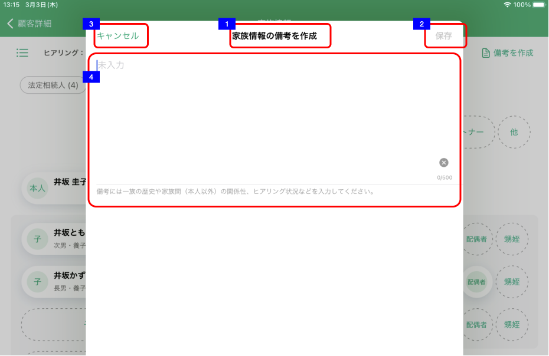
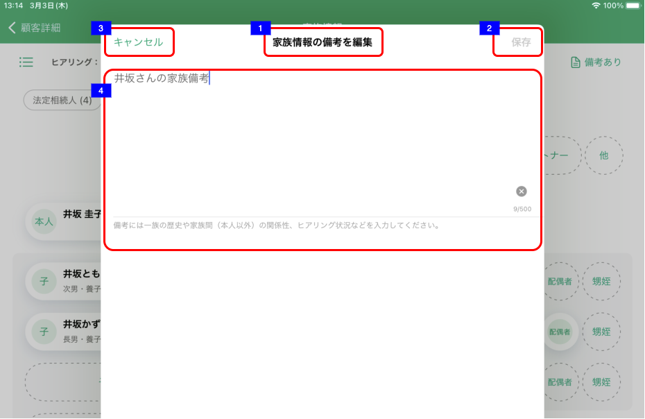

# 家族情報備考編集

## 概要

家族情報備考がまだ作成されていない、もしくは空文字で作成されている場合、家族情報カードView/リストView上でのイベントにより表示する。  
家族情報備考がある場合、家族情報詳細でのイベントにより表示する。

- 家族情報備考の作成、編集

## 画面遷移

N/A

## 画面レイアウト図

- 家族情報備考（備考がまだ登録されていない、もしくは空文字で作成されている場合）

- 家族情報備考（備考がある場合）

## 画面項目

家族情報備考には、以下の情報が上から順に表示する。

1. 画面名
    - [x] 家族情報カードもしくは家族情報リストの「備考を作成」から遷移してきた場合「家族情報の備考を作成」
    - [x] 家族情報詳細から遷移してきた場合「家族情報の備考を編集」
2. 保存ボタン
    - [x] 新規作成、編集ともに初期状態では非活性。
    - [x] 入力内容が変更されると活性になる。
    - [x] タップすると、[保存ボタンをタップ](#保存ボタンをタップ)を実行する。
3. キャンセルボタン
    - [x] タップすると、[キャンセルボタンをタップ](#キャンセルボタンをタップ)を実行する。
4. 備考入力エリア
    - [x] 備考がすでにある場合は備考の内容が入力された状態で表示される。
    - [x] 表示された時点カーソルが備考入力エリアにフォーカスされておりキーボードが出現する。
    - [x] 表示エリアの下に注釈が表示される。
    - [x] 入力方法が自由入力である。
    - [x] 入力可能文字が500文字である。
    - [x] 現在入力している文字数を表示する。
    - [x] ×をタップすると入力内容を削除する。

## イベント

この項では、当画面にて実行されるイベント一覧を記述する。

### 保存ボタンをタップ

- [x] 家族情報の取得後に対象の顧客の家族に対して更新があった場合、エラーメッセージを表示する。(排他制御)
- [x] 新規作成操作で表示した場合、登録処理を行う。
  - [x] 当画面を閉じ、保存した旨のトーストを表示する。
  - [x] 家族情報カードView/リストView上部の備考へのリンクボタンのラベルが「備考あり」になる。
  - [x] ヒアリング情報が更新される。
- [x] 編集操作で表示した場合、更新処理を行う。
  - [x] 当画面を閉じ、保存した旨のトーストを表示する。
  - [x] ヒアリング情報が更新される。

### キャンセルボタンをタップ

- [x] 入力内容に変更がない場合はそのまま家族情報編集画面を閉じ、遷移元画面（[家族情報カードView](家族情報カードView.md)または[家族情報リストView](家族情報リストView.md)）を表示する。
- [x] 入力内容に変更がある場合は、確認ダイアログを表示する。
  - [x] 「キャンセル」をタップすればそのままダイアログを閉じる。
  - [x] 「破棄」をタップすれば変更内容を反映せずにそのまま家族情報編集画面を閉じる。
