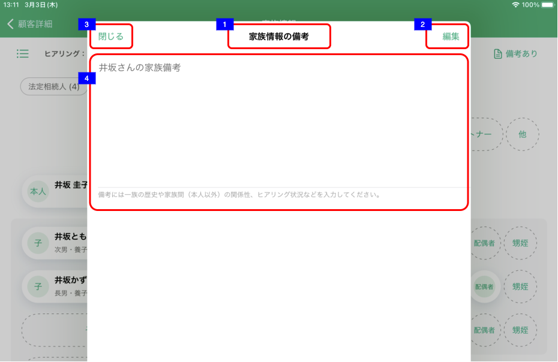

# 家族情報備考詳細

## 概要

家族情報カードView/リストView上でのイベントにより表示する。

- 家族情報備考の参照

## 画面遷移

N/A

## 画面レイアウト図

- 家族情報備考

## 画面項目

家族情報備考には、以下の情報が上から順に表示する。

1. 画面名
2. 編集ボタン
    - [x] タップすると、[編集ボタンをタップ](#編集ボタンをタップ)を実行する。
3. 閉じるボタン
    - [x] タップすると、[閉じるボタンをタップ](#閉じるボタンをタップ)を実行する。
4. 備考
    - [x] 備考の内容が表示される。
    - [x] 表示エリアの下に注釈が表示される。

## イベント

この項では、当画面にて実行されるイベント一覧を記述する。

### 編集ボタンをタップ

- [x] 編集モードとなり、[家族情報備考編集](家族情報備考編集.md)を表示する。

### 閉じるボタンをタップ

- [x] 家族情報詳細画面を閉じ、遷移元画面（[家族情報カードView](家族情報カードView.md)または[家族情報リストView](家族情報リストView.md)）を表示する。
