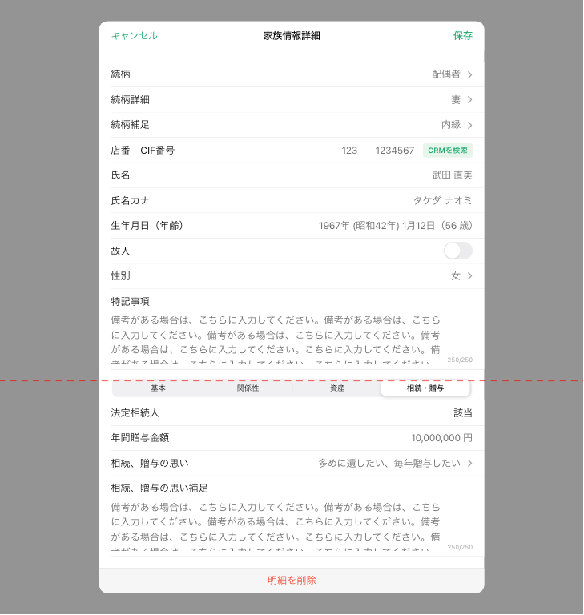
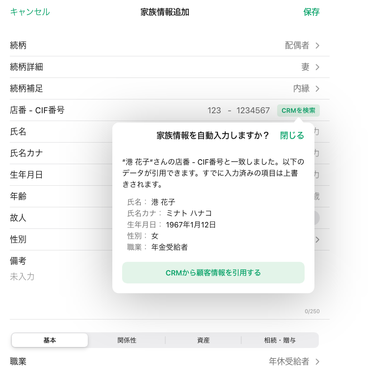

# 家族情報詳細

## 概要

家族情報カードView/リストView上でのイベントにより表示する。
以下の操作ができる。

- 家族情報詳細の新規登録
- 家族情報詳細の参照
- 家族情報詳細の更新

## 画面遷移

N/A

## 画面レイアウト図

- 家族情報詳細

## 画面項目

家族情報詳細には、以下の情報が上から順に表示する。

1. 画面名
2. 保存ボタン
    - [x] 続柄が選択されていない場合、非活性になる。
    - [x] 続柄が選択された場合、活性になる。
    - [x] タップすると、[保存ボタンをタップ](#保存ボタンをタップ)を実行する。
3. キャンセルボタン
    - [x] タップすると、[キャンセルボタンをタップ](#キャンセルボタンをタップ)を実行する。
4. 続柄
    - [x] 白丸の枠をタップして表示した場合、タップした構成員の登録情報をプリセットする。
    - [x] 点線の枠をタップして表示した場合、タップした箇所の続柄をプリセットする。
    - [x] 「追加」ボタンをタップして表示した場合、値をプリセットしない。
    - [x] 家族情報リストViewにて家族レコードをタップ表示したをタップ表示した場合、タップした構成員の登録情報をプリセットする。
    - [x] 登録情報が登録されていない場合、「必須」を表示する。
    - [x] 項目をタップした場合、以下の選択項目を表示する。
      「父」/「母」/「配偶者」/「他パートナー」/「子」/「子の配偶者」/「孫」/「きょうだい」/「きょうだいの配偶者」/「甥姪」/「その他」
    - [x] 値が入力されている場合、入力されている値が選択された状態で選択項目を表示する。
    - [x] 選択項目をタップした場合、その項目を入力する。
    - [x] 入力を行うたびに、[項目のリセット](#項目のリセット)を実行する。

    > :point_up: R800001でログインし、顧客ID「13001003001」の家族カードを表示する。
5. 続柄詳細
    - [x] 続柄にて「父」/「母」を選択している場合、表示しない。
    - [x] 続柄にて「配偶者」/「「子」/「きょうだい」/「子の配偶者」/「きょうだいの配偶者」/「甥姪」/「他パートナー」/「その他」を選択している場合、表示する。
    - [x] 白丸の枠をタップして表示した場合、タップした構成員の登録情報をプリセットする。
    - [x] 点線の枠をタップして表示した場合、値をプリセットしない。
    - [x] 「追加」ボタンをタップして表示した場合、表示しない。
    - [x] 家族情報リストViewにて家族レコードをタップ表示したをタップ表示した場合、タップした構成員の登録情報をプリセットする。
    - [x] 値が登録されていない場合、ブランクを表示する。
    - [x] 項目をタップした場合、続柄の選択内容に応じて選択項目を表示する。
        - [x]  続柄が「配偶者」の場合、「未選択」/「夫」/「妻」の選択項目
        - [x]  続柄が「子」の場合、「未選択」/「長男」/「長女」/「次男」/「次女」...「九男」/「九女」/「十男」/「十女」の選択項目を表示する。
        - [x]  続柄が「子の配偶者」の場合、「未選択」/「子の夫」/「子の妻」の選択項目を表示する。
        - [x]  続柄が「きょうだい」の場合、「未選択」/「兄」/「姉」/「弟」/「妹」の選択項目を表示する。
        - [x]  続柄が「きょうだいの配偶者」の場合、「未選択」/「きょうだいの夫」/「きょうだいの妻」の選択項目を表示する。
        - [x]  続柄が「甥姪」の場合、「未選択」/「甥」/「姪」の選択項目を表示する。
        - [x]  続柄が「他パートナー」の場合、「未選択」/「夫（内縁）」/「妻（内縁）」/「前夫」/「前妻」の選択項目を表示する。
        - [x]  続柄が「その他」の場合、「未選択」/「祖父」/「祖母」/「養父」/「養母」/「義父」/「義母」/「おじ」/「おば」/「甥姪の夫」/「甥姪の妻」/「孫の夫」/「孫の妻」/「ひ孫」の選択項目を表示する。
    - [x] 値が入力されている場合、入力されている値が選択された状態で選択項目を表示する。
6. 続柄補足
    - [x] 続柄にて「父」/「母」/「配偶者」/「子の配偶者」/「孫」/「甥姪」/「その他」を選択している場合、表示しない。
    - [x] 続柄にて「子」/「他パートナー」を選択している場合、表示する。
    - [x] 白丸の枠をタップして表示した場合、タップした構成員の登録情報をプリセットする。
    - [x] 点線の枠をタップして表示した場合、値をプリセットしない。
    - [x] 「追加」ボタンをタップして表示した場合、表示しない。
    - [x] 家族情報リストViewにて家族レコードをタップ表示したをタップ表示した場合、タップした構成員の登録情報をプリセットする。
    - [x] 値が登録されていない場合、ブランクを表示する。
    - [x] 項目をタップした場合、続柄の選択内容に応じて選択項目を表示する。
        - [x]  続柄が「子」の場合、「未選択」/「孫養子」/「養子」/「前夫の子」/「前妻の子」/「非嫡出子」/「連れ子」の選択項目を表示する。
        - [x]  続柄が「他パートナー」の場合、「未選択」/「離別」/「死別」の選択項目を表示する。
    - [x] 値が入力されている場合、入力されている値が選択された状態で選択項目を表示する。
7. 店番-CIF番号
    - [x] 白丸の枠をタップして表示した場合、タップした構成員の登録情報をプリセットする。
    - [x] 点線の枠をタップして表示した場合、値をプリセットしない。
    - [x] 「追加」ボタンをタップして表示した場合、値をプリセットしない。
    - [x] 家族情報リストViewにて家族レコードをタップ表示したをタップ表示した場合、タップした構成員の登録情報をプリセットする。
    - [x] 値が登録されていない場合、プレースホルダーとして「000-0000000」が表示される。
    - [ ] 値が登録されていない場合、「CRMを検索」ボタンはグレーアウトされタップしても反応しない。
    - [x] 入力方法が数字の自由入力である。
    - [x] 入力可能文字が3桁-7桁であり、店番、CIF番号がそれぞれ3桁と7桁に満たずにフォーカスを外す、もしくはEnterをタップすると頭0埋めで3桁もしくは7桁に整形される。
    - [x] 店番を3桁入力すると自動でフォーカスがCIFの入力フィールドに移動する。
    - [x] CIF番号が入力されている状態から削除して0桁にすると自動でフォーカスが店番の入力フィールドに移動する。
    - [ ] 店番とCIF番号それぞれ1桁以上入力されると「CRMを検索」ボタンが活性化する。
    - [ ] 活性化された「CRMを検索」ボタンをタップすると[CRM顧客検索](#CRM顧客検索)を実行する。
    - [ ] 店番とCIF番号それぞれ1桁以上入力された状態でフォーカスを外す、もしくはEnterをタップすると[CRM顧客検索](#CRM顧客検索)を実行する。
    - [ ] 店番3桁、CIF番号7桁が入力されると[CRM顧客検索](#CRM顧客検索)を実行する。
8. 氏名
    - [x] 白丸の枠をタップして表示した場合、タップした構成員の登録情報をプリセットする。
    - [x] 点線の枠をタップして表示した場合、値をプリセットしない。
    - [x] 「追加」ボタンをタップして表示した場合、値をプリセットしない。
    - [x] 家族情報リストViewにて家族レコードをタップ表示したをタップ表示した場合、タップした構成員の登録情報をプリセットする。
    - [x] 値が登録されていない場合、「未入力」を表示する。
    - [x] 項目をタップした場合、キーボードが出現する。
    - [x] 入力方法が自由入力である。
    - [x] 入力可能文字が15文字である。
9. 氏名カナ
    - [x] 白丸の枠をタップして表示した場合、タップした構成員の登録情報をプリセットする。
    - [x] 点線の枠をタップして表示した場合、値をプリセットしない。
    - [x] 「追加」ボタンをタップして表示した場合、値をプリセットしない。
    - [x] 家族情報リストViewにて家族レコードをタップ表示したをタップ表示した場合、タップした構成員の登録情報をプリセットする。
    - [x] 値が登録されていない場合、「未入力」を表示する。
    - [x] 項目をタップした場合、キーボードが出現する。
    - [x] 入力方法が自由入力である。
    - [x] 入力可能文字が30文字である。
10. 生年月日（年齢）
    - [x] 白丸の枠をタップして表示した場合、タップした構成員の登録情報をプリセットする。
    - [x] 点線の枠をタップして表示した場合、値をプリセットしない。
    - [x] 「追加」ボタンをタップして表示した場合、値をプリセットしない。
    - [x] 家族情報リストViewにて家族レコードをタップ表示したをタップ表示した場合、タップした構成員の登録情報をプリセットする。
    - [x] 値が登録されていない場合、「未入力」を表示する。
    - [x] 項目をタップした場合、日付入力用のポップアップを表示する。
        - [x] 西暦、和暦選択ボタンがあり、選択によってドラムロールの年の箇所の表示が変わる。
        - [x] 年、月、日についてそれぞれ不明ボタンがあり、不明ボタンをタップするとその項目のドラムロールに「--」を表示する。
        - [x] ドラムロールにて年、月、日が入力可能である。
        - [x] 「完了」ボタンをタップすることで、選択内容を入力する。
        - [x] 「キャンセル」ボタンをタップすることで選択の内容を破棄する。
        - [x] 「入力内容をクリア」をタップすることで、入力されていた内容が消え、未入力と表示する。
    - [x] 値が入力されている場合、入力されている値が選択された状態でポップアップを表示する。
    - [x] 年が「不明」、月が「2月」、日が「29日」を入力可能である
    - [x] デートピッカーで年が「2019年」、月と日が不明を選択し「完了」をタップした場合、「2019年(平成31年)--月--日」を表示する（不明の場合01月01日で補完される）
    - [x] デートピッカーで年が「2019年」、月が「5月」、日が不明を選択し「完了」をタップした場合、「2019年(令和元年)05月--日」と表示する。（不明の場合01日で補完される）
    - [x] デートピッカーで年が「2019年」、月が「2月」の状態で、日に29日以降を選択しようとした場合、28日に移動する.
    - [x] 年月日のいずれも「不明」でない場合、生年月日の表示の後に「（x歳）」と表示される。
11. 故人
    - [x] 白丸の枠をタップして表示した場合、タップした構成員の登録情報をプリセットする。
    - [x] 点線の枠をタップして表示した場合、値をプリセットしない。
    - [x] 「追加」ボタンをタップして表示した場合、値をプリセットしない。
    - [x] 家族情報リストViewにて家族レコードをタップ表示したをタップ表示した場合、タップした構成員の登録情報をプリセットする。
    - [x] 入力方法がトグルである。
    - [x] 続柄が未入力の場合はトグルの切り替えが不可である
12. 性別
    - [x] 白丸の枠をタップして表示した場合、タップした構成員の登録情報をプリセットする。
    - [x] 点線の枠をタップして表示した場合、値をプリセットしない。
    - [x] 「追加」ボタンをタップして表示した場合、値をプリセットしない。
    - [x] 家族情報リストViewにて家族レコードをタップ表示したをタップ表示した場合、タップした構成員の登録情報をプリセットする。
    - [x] 値が登録されていない場合、ブランクを表示する。
    - [x] 項目をタップした場合、「男」/「女」/「その他」/「未選択」の選択項目を表示する。
    - [x] 値が入力されている場合、入力されている値が選択された状態で選択項目を表示する。
13. 備考
    - [x] 白丸の枠をタップして表示した場合、タップした構成員の登録情報をプリセットする。
    - [x] 点線の枠をタップして表示した場合、値をプリセットしない。
    - [x] 「追加」ボタンをタップして表示した場合、値をプリセットしない。
    - [x] 家族情報リストViewにて家族レコードをタップ表示したをタップ表示した場合、タップした構成員の登録情報をプリセットする。
    - [x] 値が登録されていない場合、「未入力」を表示する。
    - [x] 項目をタップした場合、キーボードが出現する。
    - [x] 入力方法が自由入力である。
    - [x] 入力可能文字が250文字である。
    - [x] 現在入力している文字数を表示する。
    - [x] ×をタップすると入力内容を削除する。
14. 基本タブ
    1. 職業
        - [x] 白丸の枠をタップして表示した場合、タップした構成員の登録情報をプリセットする。
        - [x] 点線の枠をタップして表示した場合、値をプリセットしない。
        - [x] 「追加」ボタンをタップして表示した場合、値をプリセットしない。
        - [x] 家族情報リストViewにて家族レコードをタップ表示したをタップ表示した場合、タップした構成員の登録情報をプリセットする。
        - [x] 項目をタップした場合、以下の選択項目を表示する。
          「未選択」/「公務員」/「会社員・団体職員」/「その他給与所得者」/「団体役員」/「会社役員」/「個人事業者」/「主婦」/「任意団体」/「無職の方」/「その他」
    2. 当人の親
        - [x] 続柄が「孫」、「甥姪」でない場合、表示しない。
        - [x] 白丸の枠をタップして表示した場合、タップした構成員の登録情報をプリセットする。
        - [x] 家族情報リストViewにて家族レコードをタップ表示したをタップ表示した場合、タップした構成員の登録情報をプリセットする。
        - [x] 「子」または「きょうだい」に紐付く点線の枠をタップして表示した場合、値をプリセットする。
        - [x] 「子」または「きょうだい」に紐付かない点線の枠をタップして表示した場合、値をプリセットしない。
        - [x] 「追加」ボタンをタップして表示した場合、表示しない。
        - [x] 続柄が「孫」の場合、続柄が子の家族を選択項目に表示する。
        - [x] 続柄が「甥姪」の場合、続柄がきょうだいの家族を選択項目に表示する。
    3. 当人の配偶者
        - [x] 続柄が「子」、「きょうだい」「子の配偶者」、「きょうだいの配偶者」でない場合、表示しない。
        - [x] 白丸の枠をタップして表示した場合、タップした構成員の登録情報をプリセットする。
        - [x] 家族情報リストViewにて家族レコードをタップ表示したをタップ表示した場合、タップした構成員の登録情報をプリセットする。
        - [x] 「子」または「きょうだい」に紐付く点線の枠をタップして表示した場合、値をプリセットする。
        - [x] 「子」または「きょうだい」に紐付かない点線の枠をタップして表示した場合、値をプリセットしない。
        - [x] 「追加」ボタンをタップして表示した場合、表示しない。
        - [x] 続柄が「子」の配偶者の場合、続柄が「子」の家族を選択項目に表示する。
        - [x] 続柄が「きょうだいの配偶者」の場合、続柄が「きょうだい」の家族を選択項目に表示する。
15. 関係性タブ
    1. 居住の近さ
        - [x] 白丸の枠をタップして表示した場合、タップした構成員の登録情報をプリセットする。
        - [x] 点線の枠をタップして表示した場合、値をプリセットしない。
        - [x] 「追加」ボタンをタップして表示した場合、値をプリセットしない。
        - [x] 家族情報リストViewにて家族レコードをタップ表示したをタップ表示した場合、タップした構成員の登録情報をプリセットする。
        - [x] 項目をタップした場合、以下の選択項目を表示する。
          「未選択」/「同居」/「別居」/「別居（近隣）」/「別居（遠方）」
    2. 実権者
        - [x] 白丸の枠をタップして表示した場合、タップした構成員の登録情報をプリセットする。
        - [x] 点線の枠をタップして表示した場合、値をプリセットしない。
        - [x] 「追加」ボタンをタップして表示した場合、値をプリセットしない。
        - [x] 家族情報リストViewにて家族レコードをタップ表示したをタップ表示した場合、タップした構成員の登録情報をプリセットする。
        - [x] 入力方法がトグルである。
        - [x] 続柄が未入力の場合はトグルの切り替えが不可である。
    3. 仲の良さ
        - [x] 白丸の枠をタップして表示した場合、タップした構成員の登録情報をプリセットする。
        - [x] 点線の枠をタップして表示した場合、値をプリセットしない。
        - [x] 「追加」ボタンをタップして表示した場合、値をプリセットしない。
        - [x] 家族情報リストViewにて家族レコードをタップ表示したをタップ表示した場合、タップした構成員の登録情報をプリセットする。
        - [x] 項目をタップした場合、「未選択」/「良い」/「悪い」を選択項目に表示する。
16. 資産タブ
    1. 保有資産（千円）
        - [x] 白丸の枠をタップして表示した場合、タップした構成員の登録情報をプリセットする。
        - [x] 点線の枠をタップして表示した場合、値をプリセットしない。
        - [x] 「追加」ボタンをタップして表示した場合、値をプリセットしない。
        - [x] 家族情報リストViewにて家族レコードをタップ表示したをタップ表示した場合、タップした構成員の登録情報をプリセットする。
        - [x] 値が登録されていない場合、「未入力」を表示する。
        - [x] 入力方法が数字の自由入力である
        - [x] マイナスの金額（5桁）を入力できる
        - [x] プラスの金額（5桁）を入力できる
        **フロントで14桁に対応してから実施（現在17桁）**
    2. りそな保有資産（千円）
        - [x] 白丸の枠をタップして表示した場合、タップした構成員の登録情報をプリセットする。
        - [x] 点線の枠をタップして表示した場合、値をプリセットしない。
        - [x] 「追加」ボタンをタップして表示した場合、値をプリセットしない。
        - [x] 家族情報リストViewにて家族レコードをタップ表示したをタップ表示した場合、タップした構成員の登録情報をプリセットする。
        - [x] 値が登録されていない場合、「未入力」を表示する。
        - [x] 入力方法が数字の自由入力である
        - [x] マイナスの金額（5桁）を入力できる
        - [x] プラスの金額（5桁）を入力できる
        **フロントで14桁に対応してから実施（現在17桁）**
17. 相続・贈与タブ
    1. 相続人
        - [x] 白丸の枠をタップして表示した場合、タップした構成員の登録情報に基づいて「法定相続人算出」の通りにプリセットする。
        - [x] 点線の枠をタップして表示した場合、値をプリセットしない。
        - [x] 「追加」ボタンをタップして表示した場合、値をプリセットしない。
        - [x] 家族情報リストViewにて家族レコードをタップ表示したをタップ表示した場合、タップした構成員の登録情報をプリセットする。
        - [x] 続柄が入力されている場合、法定相続人を算出し、プリセットする。
            - [x] 続柄が配偶者
                - [x] 故人でない場合、該当を表示する。
                - [x] 故人の場合、ブランクを表示する。
            - [x] 続柄が子
                - [x] 故人でないかつ続柄詳細が連れ子でない場合、該当を表示する。
                - [x] 続柄詳細が「連れ子」の場合、表示しない。
                - [x] 故人の場合、ブランクを表示する。
            - [x] 続柄が孫
                - [x] 「子」に紐づいていない場合、ブランクを表示する。
                - [x] 故人の場合、ブランクを表示する。
                - [x] 上記以外かつ、紐づく「子」が故人の場合該当（代襲）を表示する。
            - [x] 続柄が父/母
                - [x] 存命の「子」（続柄詳細が「連れ子」以外）が存在する場合、ブランクを表示する。
                - [x] 「子」（故人）に紐づく孫が存在する場合、ブランクを表示する。
                - [x] 故人の場合、ブランクを表示する。
                - [x] 上記以外の場合、該当を表示する。
            - [x] 続柄がきょうだい
                - [x] 存命の「子」（続柄詳細が「連れ子」以外）が存在する場合、ブランクを表示する。
                - [x] 「子」（故人）に紐づく孫が存在する場合、ブランクを表示する。
                - [x] 存命の「父」または「母」が存在する場合、ブランクを表示する。
                - [x] 故人の場合、ブランクを表示する。
                - [x] 上記以外の場合、該当を表示する。
            - [x] 続柄が甥姪
                - [x] 存命の「子」（続柄詳細が「連れ子」以外）が存在する場合、ブランクを表示する。
                - [x] 「子」（故人）に紐づく「孫」が存在する場合、ブランクを表示する。
                - [x] 存命の「父」または「母」が存在する場合、ブランクを表示する。
                - [x] 「きょうだい」に紐づいていない場合、ブランクを表示する。
                - [x] 故人の場合、ブランクを表示する。
                - [x] 上記以外かつ、紐づく「きょうだい」が故人の場合該当（代襲）を表示する。
            - [x] 続柄が「子の配偶者」、「きょうだいの配偶者」、「その他」、「他パートナー」の場合、ブランクを表示する。

        > :point_up: 麻布支店ユーザーでログインし、顧客ID「13001003019」~「13001003030」（法定相続人確認用顧客）にて確認できる。
        >・13001003019 法定相続人が「子」、「配偶者」
        >・13001003020 法定相続人が「子」（「配偶者」が存在しない）
        >・13001003021 法定相続人が「子」（存命）、「配偶者」。代襲相続人が「子」（故人）に紐づく「孫」
        >・13001003022 法定相続人が「子」（存命）、「配偶者」。代襲相続人が存在しない
        >・13001003023 法定相続人が、「配偶者」。代襲相続人が「子」（故人）に紐づく「孫」
        >・13001003024 法定相続人が「配偶者」、「父母」
        >・13001003025 法定相続人が「配偶者」、「父」
        >・13001003026 法定相続人が「配偶者」、「母」
        >・13001003027 法定相続人が「配偶者」、「きょうだい」（全員）
        >・13001003028 法定相続人が「配偶者」、「きょうだい」（存命）代襲相続人が「きょうだい」（故人）に紐づく「甥姪」
        >・13001003029 法定相続人が「配偶者」、「きょうだい」（存命）代襲相続人が存在しない
        >・13001003030 法定相続人が「配偶者」のみ（法定相続人候補が故人）
        >・13001003031 法定相続人が存在しない（法定相続人候補が登録されていない）
        TODO:孫で連れ子の場合の検討。こども以外（孫、きょうだい、甥姪）が連れ子の場合の続柄上の表現と法定相続人算定ロジックの対応はBack log対応。#17474

    2. 年間贈与金額（円）
        - [x] 白丸の枠をタップして表示した場合、タップした構成員の登録情報をプリセットする。
        - [x] 点線の枠をタップして表示した場合、値をプリセットしない。
        - [x] 「追加」ボタンをタップして表示した場合、値をプリセットしない。
        - [x] 家族情報リストViewにて家族レコードをタップ表示したをタップ表示した場合、タップした構成員の登録情報をプリセットする。
        - [x] 値が登録されていない場合、「未入力」を表示する。
        - [x] 入力方法が数字の自由入力である
        - [x] マイナスの金額（7桁）を入力できる
        - [x] プラスの金額（7桁）を入力できる
    3. 相続、贈与の思い
        - [x] 白丸の枠をタップして表示した場合、タップした構成員の登録情報をプリセットする。
        - [x] 点線の枠をタップして表示した場合、値をプリセットしない。
        - [x] 「追加」ボタンをタップして表示した場合、値をプリセットしない。
        - [x] 家族情報リストViewにて家族レコードをタップ表示したをタップ表示した場合、タップした構成員の登録情報をプリセットする。
        - [x] 項目をタップした場合、以下の選択項目を表示する。
          「多めに遺したい」/「あまり遺したくない」/「不動産を渡したい」/「自社株を渡したい」/「投資商品を渡したい」/「毎年贈与をしたい」/「教育資金の援助をしたい」/「住宅資金の援助をしたい」/「結婚資金の援助をしたい」/「その他特別な思い」
        - [x] 複数項目選択できる。
        - [x] 表示領域を超える文字数が登録されている場合、三点リードを表示する。
    4. 相続、贈与の備考
        - [x] 白丸の枠をタップして表示した場合、タップした構成員の登録情報をプリセットする。
        - [x] 点線の枠をタップして表示した場合、値をプリセットしない。
        - [x] 「追加」ボタンをタップして表示した場合、値をプリセットしない。
        - [x] 家族情報リストViewにて家族レコードをタップ表示したをタップ表示した場合、タップした構成員の登録情報をプリセットする。
        - [x] 値が登録されていない場合、「未入力」を表示する。
        - [x] 項目をタップした場合、キーボードが出現する。
        - [x] 入力方法が自由入力である
        - [x] 入力可能文字が250文字である
        - [x] 現在入力している文字数を表示する。
        - [x] ×をタップすると入力内容を削除する。
18. 明細を削除ボタン
    - [x] 家族情報カードViewにて追加ボタンをタップして本画面を表示した場合、表示しない。
    - [x] 家族情報カードViewにて点線の枠をタップして本画面を表示した場合、表示しない。
    - [x] 家族情報カードViewにて白色の枠をタップして本画面を表示した場合、表示する。
    - [x] 家族情報リストViewにて家族レコードをタップして本画面を表示した場合、表示する。
    - [x] タップすると、[明細を削除ボタンをタップ](#明細を削除ボタンをタップ)を実行する。

## イベント

この項では、当画面にて実行されるイベント一覧を記述する。

### 家族情報カードViewの表示

家族情報詳細画面を閉じ、[家族情報カードView](家族情報カードView.md)または[家族情報リストView](家族情報リストView.md)を表示する。

### CRM顧客検索

- [ ] ユーザーの所属銀行の銀行識別子と入力された店番・CIF番番号から個人顧客属性APIを実行する。
- [ ] 顧客情報の読み込み中はCRM検索のボタンラベルが「検索中」に変わり、ボタン内にローディングアイコンが表示される。また、読み込み中にボタンをタップしても反応しない。
- 個人顧客属性APIから顧客情報が取得できた場合
  - [ ] ポップオーバーを表示して顧客の情報を表示する。
  - 「CRMから顧客情報を引用する」ボタンをタップ
    - [ ] `氏名`が家族情報詳細画面の氏名に反映される。
    - [ ] `氏名カナ`が家族情報詳細画面の氏名カナに反映される。
    - [ ] `生年月日`が家族情報詳細画面の生年月日に反映され、生年月日から年齢も表示される。
    - [ ] `性別`が家族情報詳細画面の性別に反映される。性別が家族情報の定義に当てはまらない場合は未選択となる。
    - [ ] `職業`が家族詳細画面の職業に反映される。職業が家族情報の定義に当てはまらない場合は未選択となる。  
  
- 個人顧客属性APIから顧客情報が取得できなかった場合
  - [ ] CRM検索のボタンラベルが「該当なし」に変わり、背景がグレーアウトされ非活性となる。

### 保存ボタンをタップ

- [x] 家族情報の取得後に対象の顧客の家族に対して更新があった場合、エラーメッセージを表示する。(排他制御)
  - [x] 「子」に紐づく「孫」の情報を更新する場合、かつ、家族情報の取得後に別ユーザーによって「子」の続柄が「子」以外に変更された場合、エラーメッセージを表示する。
  - [x] 「子」に紐づく「孫」の情報を更新する場合、かつ、家族情報の取得後に別ユーザーによって「子」が削除された場合、エラーメッセージを表示する。
  - [x] 「きょうだい」に紐づく「甥姪」の情報を更新する場合、かつ、家族情報の取得後に別ユーザーによって「きょうだい」の続柄が「きょうだい」以外に変更された場合、エラーメッセージを表示する。
  - [x] 「きょうだい」に紐づく「甥姪」の情報を更新する場合、かつ、家族情報の取得後に別ユーザーによって「きょうだい」が削除された場合、エラーメッセージを表示する。
- [x] 白丸の枠をタップし、本イベントが実行された場合、更新処理を行う。
  - [x] 続柄に「父」、「母」、「配偶者」を入力し、かつ既にその顧客に同一の続柄が登録されていた場合、エラーメッセージを表示する。
  - [x] 登録が完了した旨のトーストを表示する。
  - [x] 家族情報詳細を閉じ、更新内容を反映して家族情報カードViewを表示する。
    - [x] 「子」の続柄を「子」以外の続柄に更新し、かつ、その「子」に紐づく「子の配偶者」、「孫」が存在していた場合、それらの「当人の親」、「当人の配偶者」は削除され、「子」に紐づかない行に表示する。
    - [x] 「きょうだい」の続柄を「きょうだい」以外の続柄に更新し、かつ、その「きょうだい」に紐づく「きょうだいの配偶者」、「甥姪」が存在していた場合、それらの「当人の親」、「当人の配偶者」は削除され、「きょうだい」に紐づかない行に表示する。
- [x] 点線の枠をタップし、本イベントが実行された場合、登録処理を行う。
  - [x] 続柄に「父」、「母」、「配偶者」を入力し、かつ既にその顧客に同一の続柄が登録されていた場合、エラーメッセージを表示する。
  - [x] 登録が完了した旨のトーストを表示する。
  - [x] 家族情報詳細を閉じ、登録内容を反映して家族情報カードViewを表示する。
- [x] 「追加」ボタンをタップして表示し、本イベントが実行された場合、登録処理を行う。
  - [x] 家族情報カードViewの「追加」ボタンをタップし、本画面を表示した場合、登録処理を行う。
    - [x] 続柄に「父」、「母」、「配偶者」を入力し、かつ既にその顧客に同一の続柄が登録されていた場合、エラーメッセージを表示する。
    - [x] 登録が完了した旨のトーストを表示する。
    - [x] 家族情報詳細を閉じ、登録内容を反映して家族情報カードViewを表示する。
  - [x] 家族情報リストViewの「追加」ボタンをタップし、本イベントが実行された場合、登録処理を行う。
    - [x] 続柄に「父」、「母」、「配偶者」を入力し、かつ既にその顧客に同一の続柄が登録されていた場合、エラーメッセージを表示する。
    - [x] 登録が完了した旨のトーストを表示する。
    - [x] 家族情報詳細を閉じ、登録内容を反映して家族情報リストViewを表示する。
- [x] 家族情報リストViewにて家族レコードをタップして表示し、本イベントが実行された場合、更新処理を行う。
  - [x] 続柄に「父」、「母」、「配偶者」を入力し、かつ既にその顧客に同一の続柄が登録されていた場合、エラーメッセージを表示する。
  - [x] 登録が完了した旨のトーストを表示する。
  - [x] 家族情報詳細を閉じ、更新内容を反映して家族情報リストViewを表示する。
    - [x] 「子」の続柄を「子」以外の続柄に更新し、かつ、その「子」に紐づく「子の配偶者」、「孫」が存在していた場合、それらの「当人の親」、「当人の配偶者」は削除して表示する。
    - [x] 「きょうだい」の続柄を「きょうだい」以外の続柄に更新し、かつ、その「きょうだい」に紐づく「きょうだいの配偶者」、「甥姪」が存在していた場合、それらの「当人の親」、「当人の配偶者」は削除して表示する。
- [x] 以下のケースはフロントにて制御されているため、確認できない。
  - [x] 続柄が「子の配偶者」について当人の配偶者を入力し、かつ当人の配偶者指定された家族の続柄が「子」以外の場合、エラーメッセージを表示する。
  - [x] 続柄が「きょうだいの配偶者」について当人の配偶者を入力し、かつ当人の配偶者にて指定された家族の続柄が「きょうだい」以外の場合、エラーメッセージを表示する。
  - [x] 続柄が「孫」について当人の親を入力し、かつ当人の親にて指定された家族の続柄が「子」以外の場合、エラーメッセージを表示する。
  - [x] 続柄が「甥姪」について当人の親を入力し、かつ当人の親にて指定された家族の続柄が「きょうだい」以外の場合、エラーメッセージを表示する。

### 明細を削除ボタンをタップ

- [x] 家族情報の取得後に対象の顧客の家族に対して更新があった場合、エラーメッセージを表示する。(排他制御)
- [x] 削除ポップアップを表示する。
  - [x] 削除をタップした場合、削除処理を実行する。
    - [x] 家族情報詳細を閉じ、削除内容を反映して家族情報カードViewまたは家族情報リストViewを表示する。
      - [x] 「子」を削除し、かつ、その「子」に紐づく「子の配偶者」、「孫」が存在していた場合、それらの「当人の親」、「当人の配偶者」は削除され、「子」に紐づかない行に表示する。
      - [x] 「きょうだい」を削除し、かつ、その「きょうだい」に紐づく「きょうだいの配偶者」、「甥姪」が存在していた場合、それらの「当人の親」、「当人の配偶者」は削除され、「きょうだい」に紐づかない行に表示する。
  - [x] キャンセルボタンをタップした場合、削除処理を実行せずにポップアップを閉じ、顧客情報詳細画面を表示する。

### キャンセルボタンをタップ

- [x] 入力がない場合は、家族情報詳細を閉じ、遷移元画面（家族情報カードViewまたは家族情報リストView）を表示する。
- [x] 入力がある場合は、確認ダイアログを表示する。
  - [x] 確認ダイアログでキャンセルを選択すると、顧客情報詳細画面に戻る。
  - [x] 確認ダイアログで破棄を選択すると、家族情報詳細を閉じ、家族情報カードViewまたは家族情報リストViewを表示する。
- [x] 登録済みの場合は、家族情報詳細を閉じ、家族情報カードViewまたは家族情報リストViewを表示する。
- [x] 入力内容を破棄し、登録、更新を行わない。

### 項目のリセット

- [x] 続柄が選択された場合、続柄詳細、続柄補足、基本タブ-当人の親、基本タブ-当人の配偶者をリセットする。
