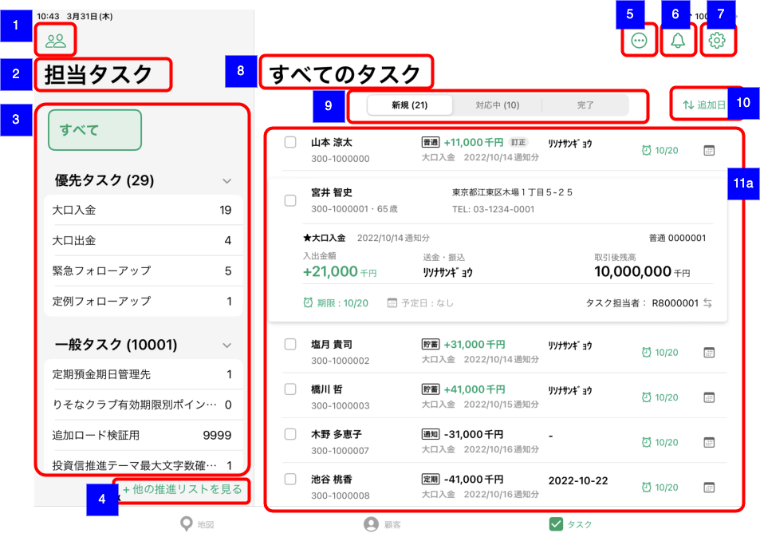
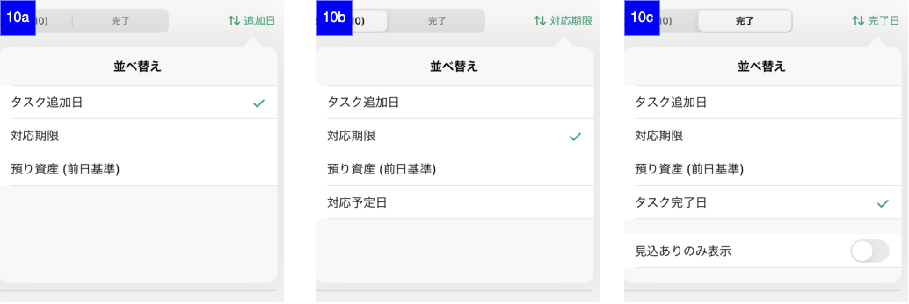
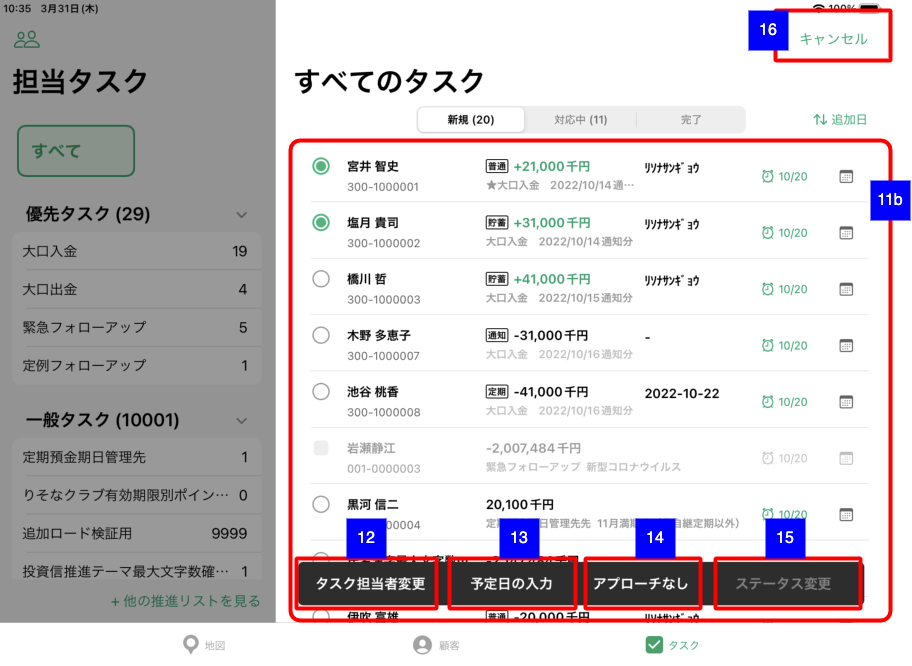
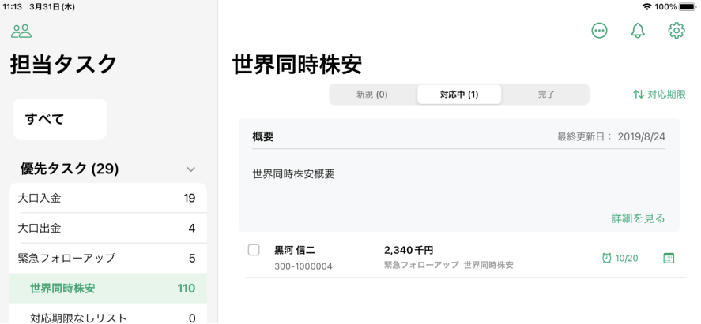
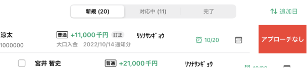
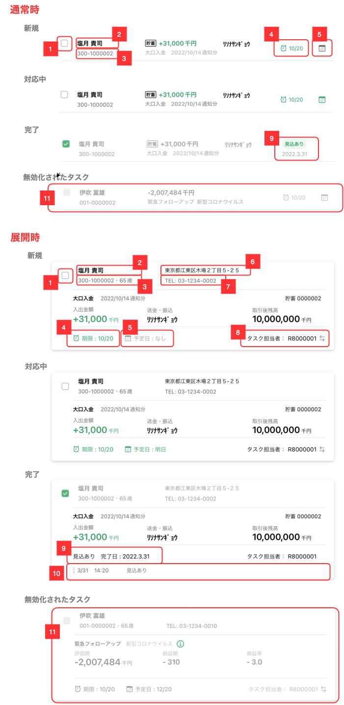
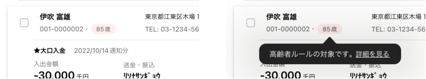
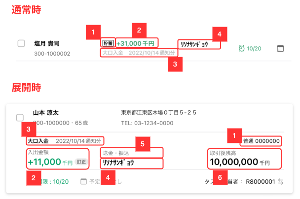
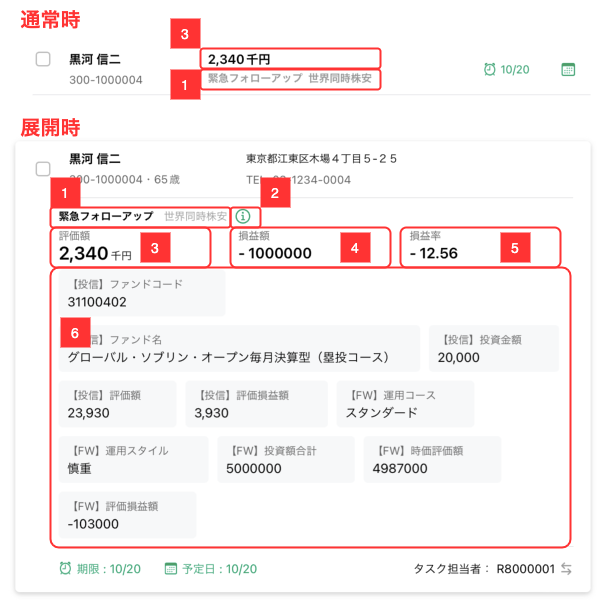
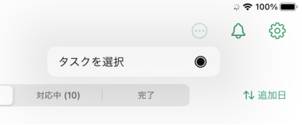

# 推進タスク一覧（担当顧客）

## 概要

担当顧客の推進タスク一覧を確認するための画面。
以下の推進タスク関連の操作を実施する。

- 担当者変更
- 対応予定日変更
- 完了報告
- ステータス変更

## 画面遷移

N/A

## 画面レイアウト図

- 推進タスク一覧（担当顧客）



- 推進タスク並び替えポップオーバー



- 推進タスク選択モード



## 画面項目

1. 推進タスク担当支店選択ボタン
    - [ ] タップすると、[推進タスク担当支店選択ボタンをタップ](#推進タスク担当支店選択ボタンをタップ)を実行する。
2. 推進テーマ選択表示タイトル
    - [ ] 「担当タスク」が表示される。
3. 推進テーマ選択エリア
    - [ ] 「すべて」ボタンと優先タスクエリア、一般タスクエリアが表示される。
    - [ ] 優先タスクエリア、一般タスクエリアにはそれぞれ1件以上のタスクが存在する推進テーマとそのタスク件数が表示される。
    - [ ] 優先タスクエリアと一般タスクエリのそれぞれのタスクの合計件数が「優先タスク」「一般タスク」のヘッダーラベルの横に表示される。  
    **※ 推進テーマ（推進リスト）ごとの件数集計はバッチ処理で実行されるため最大5分のタイムラグが発生する。**
    - [ ] 「優先タスク」「一般タスク」のヘッダーをタップするとそれぞれのエリアが開閉する。
    - [ ] 「すべて」をタップした場合、右ペインのタスク一覧に担当するタスクが推進テーマ・推進リストで絞り込まれずに表示される。
    - [ ] 推進テーマをタップした場合、右ペインのタスク一覧に担当するタスクのうち選択した推進テーマに絞り込まれて表示される。
    - 優先タスクエリアの「緊急フォローアップ」「定例フォローアップ」をタップした場合
        - [ ] 「緊急フォローアップ」「定例フォローアップ」に紐づく推進リストのうち担当タスクが1件以上あるものが推進テーマの下に追加で表示される。
        - 「緊急フォローアップ」「定例フォローアップ」に紐づく推進リストをタップした場合
            - [ ] 右ペインのタスク一覧に担当するタスクのうち選択した推進リストに絞り込まれて表示される。
            - [ ] 右ペインのタスク一覧上部に推進リストの概要説明が表示される。  
            
    - 一般タスクエリアの推進テーマをタップした場合
        - [ ] 右ペインのタスク一覧上部に推進テーマの概要説明が表示される。
4. 他の推進リストを見るボタン
    - [ ] タップすると、[他の推進リストを見るボタンをタップ](#他の推進リストを見るボタンをタップ)を実行する。
5. メニューボタン
    - [ ] タップすると、[メニューボタンをタップ](#メニューボタンをタップ)を実行する。
6. お知らせボタン
    - [ ] タップすると、[お知らせボタンをタップ](#お知らせボタンをタップ)を実行する。
7. 設定ボタン
    - [ ] タップすると、[設定ボタンをタップ](#設定ボタンをタップ)を実行する。
8. 推進タスク一覧表示タイトル
    - [ ] 推進テーマ選択エリアで「すべて」を選択した場合は「すべてのタスク」が表示される。
    - [ ] 推進テーマ選択エリアで推進テーマ（推進リスト）を選択した場合はその推進テーマ名（推進リスト名）が表示される。
9. セグメントコントロール
    - [ ] セグメントコントロールは「新規」「対応中」「完了」の3つのステータスで構成され、「新規」と「対応中」は該当する条件でのタスク件数が表示される。
    - [ ] セグメントコントロール内をタップもしくはドラッグすることでステータスを切り替えることができる。
10. 並び替えボタン
    - [ ] 現在の並び替え条件がボタンのラベルに表示される。並び替え条件ごとのボタンラベルは以下の通り。

        | 並び替え条件         | ボタンラベル |
        | -------------------- | ------------ |
        | タスク追加日         | 追加日       |
        | 対応期限             | 対応期限     |
        | 預り資産（前日基準） | 預り資産     |
        | 対応予定日           | 対応予定日   |
        | タスク完了日         | 完了日       |
    - セグメントコントロールが「新規」でタップした場合（**10a**）
        - [ ] ポップオーバーが表示され、選択項目に「`タスク追加日`」「`対応期限`」「`預り資産（前日基準）`」が表示される。
        - [ ] 選択項目のデフォルトは「`タスク追加日`」
        - [ ] 選択項目をタップするとポップオーバーを閉じ、選択した条件でタスク一覧の並べ替えを実行する。
    - セグメントコントロールが「対応中」でタップした場合（**10b**）
        - [ ] ポップオーバーが表示され、選択項目に「`タスク追加日`」「`対応期限`」「`預り資産（前日基準）`」「`対応予定日`」が表示される。
        - [ ] 選択項目のデフォルトは「`対応期限`」
        - [ ] 選択項目をタップするとポップオーバーを閉じ、選択した条件でタスク一覧の並べ替えを実行する。
    - セグメントコントロールが「完了」でタップした場合（**10c**）
        - [ ] ポップオーバーが表示され、選択項目に「`タスク追加日`」「`対応期限`」「`預り資産（前日基準）`」「`タスク完了日`」が表示される。選択項目の下に「`見込ありのみ`」のラベルとトグルスイッチが表示される。
        - [ ] 選択項目のデフォルトは「`タスク完了日`」
        - [ ] 選択項目をタップするとポップオーバーを閉じ、選択した条件でタスク一覧の並べ替えを実行する。
        - [ ] 「`見込ありのみ`」のトグルスイッチをオンにすると見込ありのタスクのみに絞り込まれる。（ポップオーバーは閉じない）
  
    ```markdown
    並び替え条件の名前と降順・昇順の対応は以下の通り。
    タスク追加日：降順
    対応期限：昇順
    預り資産：降順
    対応予定日：昇順
    タスク完了日：降順
    ```

11. タスク一覧エリア
    - [ ] タスクの一覧が表示される。
    - [ ] セグメントコントロールが「新規」の場合はタスクのステータスが「新規」のものが表示される。
    - [ ] セグメントコントロールが「対応中」の場合はタスクのステータスが「対応中」のものが表示される。
    - [ ] セグメントコントロールが「完了」の場合はタスクのステータスが「見込あり」「見込なし」「完了」「対応不要」のものが表示される。
    - [ ] 初期状態ではセグメントコントロールの各ステータスで25件ずつ取得する。該当の条件（ステータス、推進テーマ/推進リスト）で25件以上ある場合は一覧を下にスクロールすることで追加読み込みできる。
    - [ ] Pull to Refresh（一覧を下に引っ張ったのち離すこと）で再読み込みできる。
    - [ ] 該当条件でタスクが存在しない場合、画像と「タスクはありません」が表示される。

    11a. タスク一覧（通常時）
    - タップ
        - [ ] タスク一覧内の明細をタップすると明細が展開し詳細な情報が表示される。同時に展開する明細は常時1つで、展開している明細とは別の明細をタップするとそれまで展開していた明細は閉じる。
    - スワイプ
        - [ ] タスク一覧内の明細を左にスワイプすると「アプローチなし」ボタンが出現する。
        - [ ] 「アプローチなし」ボタンをタップすると[アプローチなしボタンをタップ（明細スワイプ実行時）](#アプローチなしボタンをタップ（明細スワイプ実行時）)を実行する。  
        - [ ] 無効化されたタスクの場合はスワイプできない。
        
    - タスク明細共通仕様  
    
        1. チェックボックス
            - [ ] ステータスが「新規」「対応中」の場合、白抜きのチェックボックスが表示される。
            - [ ] ステータスが「完了」の場合、緑背景のチェックマークアイコンが表示される。
            - [ ] タップすると[推進タスクのチェックボックスをタップ](#推進タスクのチェックボックスをタップ)を実行する。
        2. 顧客氏名
            - [ ] 顧客の氏名が表示される。
            - [ ] 顧客の氏名をタップすると、[顧客氏名をタップ](#顧客氏名をタップ)を実行する。
        3. 店CIF・顧客年齢
            - [ ] 通常時は顧客の勘定店番とCIF番号が表示される。
            - 展開時
                - [ ] 法人顧客の場合、勘定店番とCIF番号が表示される。
                - [ ] 個人顧客の場合、勘定店番とCIF番号と年齢が表示される。
                - [ ] 個人顧客の年齢が75歳以上の場合は年齢がピンク色の背景で強調表示され、タップするとツールチップが表示される。
                - [ ] ツールチップ内の「詳細を見る」をタップすると[高齢者ツールチップの詳細を見るをタップ](#高齢者ツールチップの詳細を見るをタップ)を実行する。  
                
        4. 対応期限（新規と対応中のみ）
            - [ ] 対応期限が明日以降の場合は緑色で表示される。
            - [ ] 対応期限が当日の場合はオレンジ色で表示される。
            - [ ] 対応期限を超過している場合は赤色で表示される。
            - [ ] 対応期限のテキストは、対応期限が当日の場合は「今日」、翌日の場合は「明日」、翌々日の場合は「明後日」と表示される。
        5. 対応予定日（新規と対応中のみ）
            - [ ] 通常時はアイコンのみ、展開時はアイコンと対応予定日のテキストが表示される。
            - [ ] アイコンと対応予定日のテキストは対応予定日がセットされている場合は緑色で表示される。
            - [ ] アイコンと対応予定日のテキストは対応予定日がセットされていない場合はグレーで表示される。
            - [ ] 対応予定日のテキストは、対応予定日が当日の場合は「今日」、翌日の場合は「明日」、翌々日の場合は「明後日」と表示される。
            - [ ] タップすると[対応予定日をタップ](#対応予定日をタップ)を実行する。
        6. 顧客住所
            - [ ] 顧客の住所が表示される。
        7. 顧客連絡先
            - [ ] 顧客の電話番号が表示される。
        8. タスク担当者
            - [ ] タスク担当者が表示される。
            - [ ] タップすると[タスク担当者をタップ](#タスク担当者をタップ)を実行する。
        9. 完了ステータスと完了日（完了のみ）
            - [ ] 完了ステータスと完了日が表示される。
            - [ ] 通常時の完了ステータスは「見込あり」の場合のみ緑色で強調表示される。
        10. 活動履歴
            - [ ] タスクの活動履歴が表示される。
            - 完了報告を実施した場合
                - [ ] CRM連携した場合、完了報告時に登録した応対日時とステータス、メモが表示される。
                - [ ] CRM連携しなかった場合、完了報告実施日時とステータス、メモが表示される。
            - 担当者変更を実施した場合
                - [ ] 担当者変更実施日時、「担当者変更」、担当者変更詳細（変更前担当者と変更後担当者）が表示される。
            - タスクステータス変更を実施した場合
                - [ ] ステータス変更実施日時、「ステータス変更」、ステータス変更詳細（変更前ステータスと変更後ステータス）が表示される。
        11. 無効化されたタスク
            - [ ] チェックボックスはグレーアウトされタップしても反応しない。
            - [ ] 担当者変更、対応予定日も同様にタップしても反応しない。
            - [ ] テキスト表示は全体的にグレーアウトされる。
    - 大口入金 / 大口出金のタスク明細  
    
        1. 科目・口座番号
            - [ ] 科目として「`普通`」「`貯蓄`」「`当座`」「`通知`」「`定期`」のいずれかが表示される。
            - [ ] 展開時のみ口座番号が表示される。
        2. 入出金額
            - [ ] 入出金額が千円単位で表示される。
            - [ ] 入金の場合は緑色のテキストで表示され、金額の先頭に「`+`」が付与される。
            - [ ] 出金の場合は黒色のテキストでマイナス表示される。
            - [ ] 取引が訂正（API応答項目correction）の場合、`訂正`ラベルが右側に表示される。
        3. 推進テーマ名・推進リスト名
            - [ ] 推進テーマ名・推進リスト名が表示される。`<大口入金 or 大口出金> <yyyy/MM/dd通知分>`の形式。
        4. 摘要コメント
            - [ ] 普通・貯蓄・当座の場合は摘要コメントが表示される。
            - [ ] 定期の場合は満期日が`yyyy/MM/dd`形式で表示される、もしくは何も表示されない。
            - [ ] 通知の場合は何も表示されない。
        5. 摘要
            - [ ] 普通・貯蓄・当座の場合は摘要が表示される。
            - [ ] 定期・通知の場合は何も表示されない。
        6. 取引後残高
            - [ ] 取引後残高が千円単位で表示される。
    - 上記以外の推進テーマのタスク明細  
    
        1. 推進テーマ名・推進リスト名
            - [ ] 推進テーマ名・推進リスト名が表示される。`<推進テーマ名> <推進リスト名>`の形式。
        2. 推進テーマ名・推進リスト名の概要リンクアイコン
            - [ ] タップすると[推進テーマ名・推進リスト名の概要リンクアイコンをタップ](#推進テーマ名・推進リスト名の概要リンクアイコンをタップ)を実行する。
        3. 主情報1
            - [ ] 主情報1のラベルと値が表示される。（展開していない通常時は値のみが表示される。）
            - [ ] 主情報1の値は千円単位の金額固定で表示される。
        4. 主情報2
            - [ ] 主情報2のラベルと値が表示される。
        5. 主情報3
            - [ ] 主情報3のラベルと値が表示される。
        6. 補足情報エリア
            - [ ] 補足情報のラベルと値が表示される。
            - [ ] 補足情報は最大30項目表示される。

    11b. タスク一覧（選択モード）
    - [ ] 選択モードではすべてのタスクが展開しない（畳まれた）表示となる。
    - [ ] タスク一覧内左端のチェックボックスが○で表示される。
    - タップ
        - [ ] タスク一覧内の明細をタップするとチェックボックスの○が選択状態となる（○の中に緑色の●が表示）。
        - [ ] 1件以上タスクが選択される場合12.-15.のボタングループが表示される。
        - [ ] 1件も選択されていない場合12.-15.のボタングループは表示されない。
    - スワイプ
        - [ ] 選択モードではスワイプできない。
12. タスク担当者変更（選択モードでタスク選択時）  
    - [ ] セグメントコントロールが「新規」もしくは「対応中」の場合にボタンが活性となる。
    - [ ] タップすると、[タスク担当者変更ボタンをタップ（選択モードでタスク選択時）](#タスク担当者変更ボタンをタップ（選択モードでタスク選択時）)を実行する。
13. 予定日の入力（選択モードでタスク選択時）
    - [ ] セグメントコントロールが「新規」もしくは「対応中」の場合にボタンが活性となる。
    - [ ] タップすると、[予定日の入力ボタンをタップ（選択モードでタスク選択時）](#予定日の入力ボタンをタップ（選択モードでタスク選択時）)を実行する。
14. アプローチなし（選択モードでタスク選択時）
    - [ ] セグメントコントロールが「新規」もしくは「対応中」の場合にボタンが活性となる。
    - [ ] タップすると、[アプローチなしボタンをタップ（選択モードでタスク選択時）](#アプローチなしボタンをタップ（選択モードでタスク選択時）)を実行する。
15. ステータス変更（選択モードでタスク選択時）
    - [ ] セグメントコントロールが「完了」の場合にボタンが活性となる。
    - [ ] タップすると、[ステータス変更ボタンをタップ（選択モードでタスク選択時）](#ステータス変更ボタンをタップ（選択モードでタスク選択時）)を実行する。
16. キャンセルボタン（選択モードでタスク選択時）
    - [ ] タップすると[キャンセルボタンをタップ（選択モードでタスク選択時）](#キャンセルボタンをタップ（選択モードでタスク選択時）)を実行する。

## イベント

### 推進タスク担当支店選択ボタンをタップ

- [ ] 左ペインに[推進タスク担当支店選択](推進タスク担当支店選択.md)を表示する。

### 他の推進リストを見るボタンをタップ

- [ ] 推進リスト一覧画面が全画面モーダル表示される。

### メニューボタンをタップ

- [ ] タスク一覧のメニューが表示される。
- [ ] 「タスクを選択」をタップすると左ペインがグレーアウト、右ペインが選択モード（**11b**）になる。
- [ ] 画面上部の5.-7.のボタンは非表示となり、「16. キャンセルボタン（選択モードでタスク選択時）」が表示される。



### お知らせボタンをタップ

- [ ] お知らせ一覧のポップオーバーが表示される。

### 設定ボタンをタップ

- [ ] 設定メニューが表示される。

### 推進タスクのチェックボックスをタップ

- 該当タスクのステータスが「新規」「対応中」の場合
  - [ ] 個人顧客のタスクの場合、[推進タスク完了報告（個人顧客）.md](./推進タスク完了報告（個人顧客）.md)がモーダル表示される。
  - [ ] 法人顧客のタスクの場合、[推進タスク完了報告（法人顧客）.md](./推進タスク完了報告（法人顧客）.md)がモーダル表示される。
- 該当タスクのステータスが「完了」の場合
  - [ ] タイトル「タスクを新規に戻しますか？」、メッセージ「タスクを新規に戻します。対応予定日は未定にセットされ、対応履歴は残ります。」でアラートダイアログが表示される。
  - [ ] 「キャンセル」をタップするとアラートダイアログを閉じる。
  - [ ] 「新規に戻す」をタップすると、選択したタスクのステータス変更を実行し、完了後に選択モードを終了する。
  - [ ] 該当のタスクは新規のセクション内に表示され、対応予定日が「なし」で更新される。

### 顧客氏名をタップ

- [ ] 該当顧客の顧客詳細画面が全画面表示される。

### 高齢者ツールチップの詳細を見るをタップ

- [ ] アットりそなの高齢者ルールページがモーダル表示される。

### タスク担当者をタップ

- [ ] タスク担当者変更画面がモーダル表示される。

### 対応予定日をタップ

- [ ] 対応予定日設定画面がモーダル表示される。

### 推進テーマ名・推進リスト名の概要リンクアイコンをタップ

- [ ] 該当タスクが優先リストのタスクの場合、推進リストの概要説明画面がモーダル表示される。
- [ ] 該当タスクが一般リストのタスクの場合、推進テーマの概要説明画面がモーダル表示される。

### アプローチなしボタンをタップ（明細スワイプ実行時）

- [ ] 該当タスクの完了報告処理を実行し、完了後に選択モードを終了する。
- [ ] 該当のタスクは完了のセクション内で再読み込みを実施すると表示され完了後のスタータス、完了日が表示される。

### タスク担当者変更ボタンをタップ（選択モードでタスク選択時）

- [ ] タスク担当者変更画面がモーダル表示される。

### 予定日の入力ボタンをタップ（選択モードでタスク選択時）

- [ ] 対応予定日設定画面がモーダル表示される。

### アプローチなしボタンをタップ（選択モードでタスク選択時）

- [ ] タイトル「タスクを完了します」、メッセージ「x件のタスクをアプローチなしで完了します。」でアラートダイアログが表示される。
- [ ] キャンセルをタップするとアラートダイアログを閉じる。
- [ ] 「OK」をタップすると、選択したタスクの完了報告処理を実行し、完了後に選択モードを終了する。
- [ ] 該当のタスクは完了のセクション内で再読み込みを実施すると表示され完了後のスタータス、完了日が表示される。

### ステータス変更ボタンをタップ（選択モードでタスク選択時）

- [ ] タイトル「タスクを新規に戻しますか？」、メッセージ「x件のタスクを新規に戻します。対応予定日は未定にセットされ、対応履歴は残ります。」でアラートダイアログが表示される。
- [ ] 「キャンセル」をタップするとアラートダイアログを閉じる。
- [ ] 「新規に戻す」をタップすると、選択したタスクのステータス変更を実行し、完了後に選択モードを終了する。
- [ ] 該当のタスクは新規のセクション内に表示され、対応予定日が「なし」で更新される。

### キャンセルボタンをタップ（選択モードでタスク選択時）

- [ ] 選択モードを終了する。
