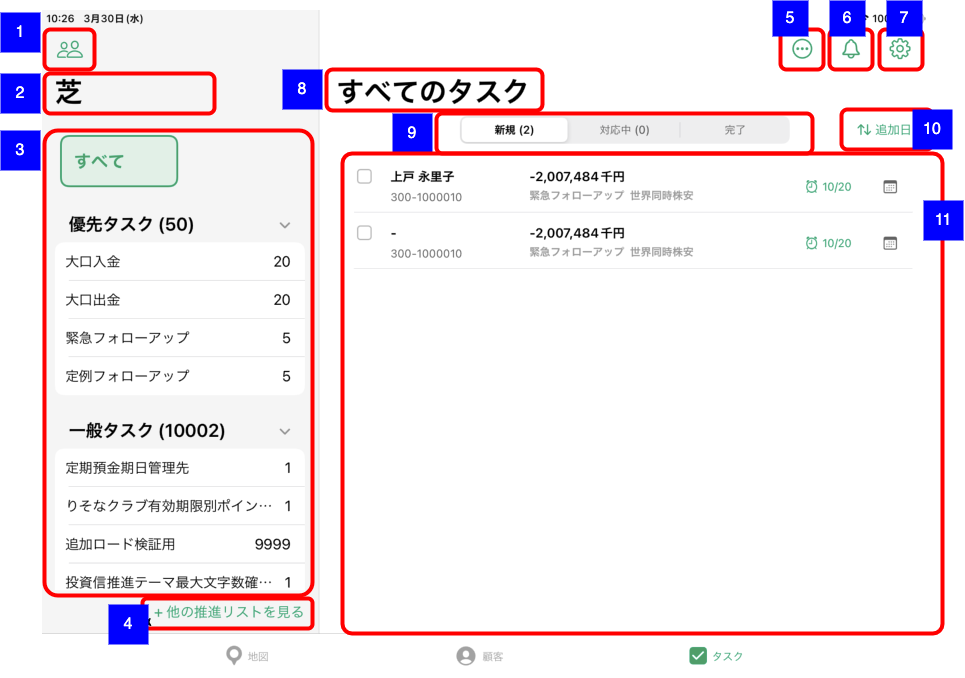

# 推進タスク一覧（支店別担当なし）

## 概要

支店別担当なしの推進タスク一覧を確認するための画面。
以下の推進タスク関連の操作を実施する。

- 担当者変更
- 対応予定日変更
- 完了報告
- ステータス変更

## 画面遷移

N/A

## 画面レイアウト図

- 推進タスク一覧（支店別担当なし）

## 画面項目

1. 推進タスク担当支店選択ボタン
    - [ ] [推進タスク一覧（担当顧客）](./推進タスク一覧（担当顧客）.md)と同様。
2. 推進テーマ選択表示タイトル
    - [ ] 支店名が表示される。
3. 推進テーマ選択エリア
    - [ ] [推進タスク一覧（担当顧客）](./推進タスク一覧（担当顧客）.md)と同様。
    - [ ] ただし、表示される件数は該当支店の担当なしタスクの件数となる。
4. 他の推進リストを見るボタン
    - [ ] [推進タスク一覧（担当顧客）](./推進タスク一覧（担当顧客）.md)と同様。
5. メニューボタン
    - [ ] [推進タスク一覧（担当顧客）](./推進タスク一覧（担当顧客）.md)と同様。
6. お知らせボタン
    - [ ] [推進タスク一覧（担当顧客）](./推進タスク一覧（担当顧客）.md)と同様。
7. 設定ボタン
    - [ ] [推進タスク一覧（担当顧客）](./推進タスク一覧（担当顧客）.md)と同様。
8. 推進タスク一覧表示タイトル
    - [ ] [推進タスク一覧（担当顧客）](./推進タスク一覧（担当顧客）.md)と同様。
9. セグメントコントロール
    - [ ] [推進タスク一覧（担当顧客）](./推進タスク一覧（担当顧客）.md)と同様。
    - [ ] ただし、表示される件数は該当支店の担当なしタスクの件数となる。
10. 並び替えボタン
    - [ ] [推進タスク一覧（担当顧客）](./推進タスク一覧（担当顧客）.md)と同様。
11. タスク一覧エリア
    - [ ] [推進タスク一覧（担当顧客）](./推進タスク一覧（担当顧客）.md)と同様。
    - [ ] ただし、表示されるタスクは該当支店の担当なしタスクとなる。
    - [ ] 編集モードでの「タスク担当者変更」「予定日の入力」「アプローチなし」「ステータス変更」「キャンセル」の挙動も[推進タスク一覧（担当顧客）](./推進タスク一覧（担当顧客）.md)と同様。

## イベント

[推進タスク一覧（担当顧客）](./推進タスク一覧（担当顧客）.md)参照。
