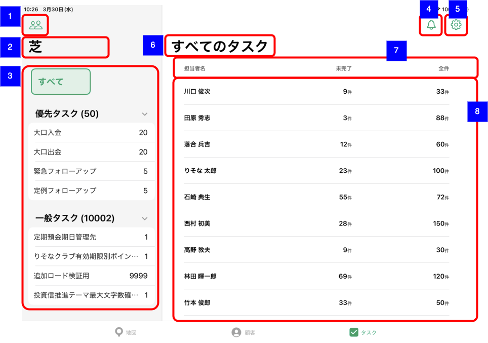

# 推進タスク一覧（支店担当者別統計情報）

## 概要

支店担当者別の推進タスク統計情報一覧を確認するための画面。
統計情報では担当者名と未完了のタスク件数、全件数が確認できる。

## 画面遷移

N/A

## 画面レイアウト図

- 推進タスク一覧（支店担当者別統計情報）

## 画面項目

1. 推進タスク担当支店選択ボタン
    - [ ] タップすると、[推進タスク担当支店選択ボタンをタップ](#推進タスク担当支店選択ボタンをタップ)を実行する。
2. 推進テーマ選択表示タイトル
    - [ ] 支店名が表示される。
3. 推進テーマ選択エリア
    - [ ] 「すべて」ボタンと優先タスクエリア、一般タスクエリアが表示される。
    - [ ] 優先タスクエリア、一般タスクエリアにはそれぞれ該当支店が担当支店となっているタスクが1件以上存在する推進テーマとそのタスク件数が表示される。
    - [ ] 優先タスクエリアと一般タスクエリアのそれぞれのタスクの合計件数が「優先タスク」「一般タスク」のヘッダーラベルの横に表示される。  
     **※ 左ペインの支店が担当する推進テーマごとのタスク件数合計とと右ペインの支店担当者のタスク件数合計は必ずしも一致しない。（担当支店タスクには担当なしや別支店の担当者のタスクが含まれることがある）**  
     **※ 推進テーマ（推進リスト）ごとの件数集計はバッチ処理で実行されるため最大5分のタイムラグが発生する。**
    - [ ] 「優先タスク」「一般タスク」のヘッダーをタップするとそれぞれのエリアが開閉する。
    - [ ] 「すべて」をタップした場合、右ペインの担当者一覧に推進テーマに依らずタスクを1件以上担当する担当者が表示される。
    - [ ] 推進テーマをタップした場合、右ペインの担当者一覧に選択した推進テーマのタスクを1件以上担当する担当者が表示される。
    - 優先タスクエリアの「緊急フォローアップ」「定例フォローアップ」をタップした場合
        - [ ] 「緊急フォローアップ」「定例フォローアップ」に紐づく推進リストのうち該当支店が担当支店となっているタスクが1件以上あるものが推進テーマの下に追加で表示される。
        - 「緊急フォローアップ」「定例フォローアップ」に紐づく推進リストをタップした場合
            - [ ] 右ペインの担当者一覧に選択した推進リストのタスクを1件以上担当する担当者が表示される。
4. お知らせボタン
    - [ ] [推進タスク一覧（担当顧客）](./推進タスク一覧（担当顧客）.md)と同様。
5. 設定ボタン
    - [ ] [推進タスク一覧（担当顧客）](./推進タスク一覧（担当顧客）.md)と同様。
6. 推進タスク一覧表示タイトル
    - [ ] [推進タスク一覧（担当顧客）](./推進タスク一覧（担当顧客）.md)と同様。
7. 担当者統計情報一覧テーブルヘッダー
    - [ ] 「担当者名」「未完了」「全件」が表示される。
8. 担当者統計情報一覧
    - [ ] 該当の推進テーマ・推進リストのタスクを1件以上担当する担当者統計情報の一覧が表示される。  
    **※ 担当者別統計情報の集計はバッチ処理で実行されるため最大5分のタイムラグが発生する。**
    - [ ] タップすると[担当者別統計情報をタップ](#担当者別統計情報をタップ)を実行

## イベント

### 推進タスク担当支店選択ボタンをタップ

- [ ] 左ペインに[推進タスク担当支店選択](推進タスク担当支店選択.md)を表示する。

### 担当者別統計情報をタップ

- [ ] [推進タスク一覧（支店担当者別）](./推進タスク一覧（支店担当者別）.md)に遷移する。
