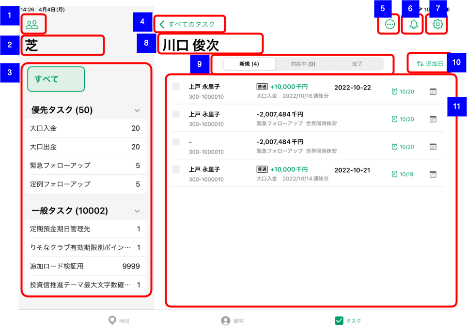

# 推進タスク一覧（支店担当者別）

## 概要

支店担当者別の推進タスク一覧を確認するための画面。
以下の推進タスク関連の操作を実施する。

- 担当者変更
- 対応予定日変更（アプリユーザーと担当者が一致する場合のみ）
- 完了報告（アプリユーザーと担当者が一致する場合のみ）
- ステータス変更（アプリユーザーと担当者が一致する場合のみ）

## 画面遷移

N/A

## 画面レイアウト図

- 推進タスク一覧（支店担当者別）

## 画面項目

1. 推進タスク担当支店選択ボタン
    - [ ] [推進タスク一覧（担当顧客）](./推進タスク一覧（担当顧客）.md)と同様。
2. 推進テーマ選択表示タイトル
    - [ ] 支店名が表示される。
3. 推進テーマ選択エリア
    - [ ] [推進タスク一覧（支店担当者別統計情報）](#推進タスク一覧（支店担当者別統計情報）)と同様。
    - [ ] タップすると、右ペインが[推進タスク一覧（支店担当者別統計情報）](#推進タスク一覧（支店担当者別統計情報）)の担当者統計情報に遷移する（戻る）。
4. 戻るボタン
    - [ ] ラベルに[推進タスク一覧（支店担当者別統計情報）](推進タスク一覧（支店担当者別統計情報）)画面で選択された推進テーマ/推進リスト名、もしくはすべてが選択された場合「`すべてのタスク`」が表示される。
    - [ ] タップすると、右ペインが[推進タスク一覧（支店担当者別統計情報）](#推進タスク一覧（支店担当者別統計情報）)の担当者統計情報に遷移する（戻る）。
5. メニューボタン
    - [ ] [推進タスク一覧（担当顧客）](./推進タスク一覧（担当顧客）.md)と同様。
6. お知らせボタン
    - [ ] [推進タスク一覧（担当顧客）](./推進タスク一覧（担当顧客）.md)と同様。
7. 設定ボタン
    - [ ] [推進タスク一覧（担当顧客）](./推進タスク一覧（担当顧客）.md)と同様。
8. 推進タスク一覧表示タイトル
    - [ ] [推進タスク一覧（支店担当者別統計情報）](#推進タスク一覧（支店担当者別統計情報）)で選択した担当者名が表示される。
9. セグメントコントロール
    - [ ] [推進タスク一覧（担当顧客）](./推進タスク一覧（担当顧客）.md)と同様。
    - [ ] ただし、表示される件数は該当の担当者のタスクの件数となる。
10. 並び替えボタン
    - [ ] [推進タスク一覧（担当顧客）](./推進タスク一覧（担当顧客）.md)と同様。
11. タスク一覧エリア
    - アプリユーザーと担当者が一致する場合
        - [ ] [推進タスク一覧（担当顧客）](./推進タスク一覧（担当顧客）.md)と同様。
    - アプリユーザーと担当者が一致しない場合
        - [推進タスク一覧（担当顧客）](./推進タスク一覧（担当顧客）.md)との差分は以下の通り。
        - [ ] チェックボックスがグレーアウトされタップしても完了報告画面が表示されない（セルが開閉するのみ）。
        - [ ] 対応予定日のアイコン（カレンダーアイコン）をタップしても対応予定日変更画面が表示されない（セルが開閉するのみ）。
        - [ ] 編集モードでは「タスク担当者変更」のみ活性で、「予定日の入力」「アプローチなし」「ステータス変更」は不活性となり選択できない。

## イベント

[推進タスク一覧（担当顧客）](./推進タスク一覧（担当顧客）.md)参照。
