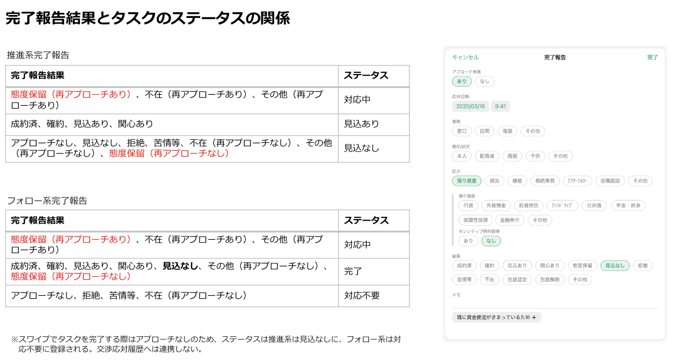

# 推進タスク完了報告（個人顧客）

## 概要

個人顧客の推進タスクの完了報告を実施するための画面。
アプローチした個人顧客のタスクはCRM交渉応対履歴に連携する。

※ 法人顧客のタスクは[推進タスク完了報告（法人顧客）](./推進タスク完了報告（法人顧客）.md)参照

## 画面遷移

N/A

## 画面レイアウト図

- 推進タスク完了報告（個人顧客）


## 画面項目

1. 画面名
    - [ ] タイトルに「完了報告」が表示される。
2. 完了ボタン
    - [ ] 初期表示時点では非活性。以下いずれかの条件を満たす場合にボタンが活性になる。
        - [ ] アプローチ有無/応対有無が「なし」の場合
        - [ ] アプローチ有無/応対有無が「あり」かつ以下をすべて満たす場合
            - 「業務」が選択されている。
            - 「相手/状況」が選択されている。
            - 「区分」が選択されている。
            - 「結果」が選択されている。
            - 「再アプローチ有無」が表示されている場合は、「あり」「なし」のいずれかが選択されている。
    - [ ] タップすると、[完了ボタンをタップ](#完了ボタンをタップ)を実行する。
3. キャンセルボタン
    - [ ] タップすると、[キャンセルボタンをタップ](#キャンセルボタンをタップ)を実行する。
4. アプローチ有無/応対有無
    - [ ] 推進系タスクの場合はラベルに「アプローチ有無」が表示される。
    - [ ] フォロー系タスクの場合はラベルに「応対有無」が表示される。
    - [ ] 「あり」を選択すると、「応対日時」「業務」「相手/状況」「区分」「結果」が表示される。
    - [ ] 「なし」を選択すると、「事由」が表示される。
5. 応対日時
    - [ ] 初期状態で現在日時が表示される。
    - [ ] 日付のラベルをタップすると日付ピッカーが表示され、当日までの日付を選択できる。翌日以降はグレーアウトされ選択できない。
    - [ ] 時刻のラベルをタップすると時刻ピッカーが表示され、時刻を選択できる。
6. 業務
    - [ ] 「窓口」「訪問」「電話」「その他」が表示され単一項目を選択できる。
7. 相手/状況
    - [ ] 「本人」「配偶者」「両親」「子供」「その他」が表示され単一項目を選択できる。
8. 区分
    - [ ] 「預り資産」「貸出」「機能」「相続業務」「アフターフォロー」「役職面談」「その他」が表示され単一項目を選択できる。
    - [ ] 「預り資産」「貸出」「相続業務」「アフターフォロー」「その他」を選択した場合、「区分内訳」が表示される。
    - [ ] 「機能」「役職面談」を選択した場合、「区分内訳」は表示されない。
9. 区分内訳
    - 区分で「預り資産」を選択した場合
        - ラベルに「預り資産」、選択項目に「円貨」「外貨預金」「投資信託」「ファンドラップ」「公共債」「年金・終身」「保障性保険」「金融仲介」「その他」が表示され、複数項目を選択できる。
        - ラベルに「センシティブ例外取得」、選択項目に「あり」「なし」が表示、初期値として「なし」が選択されており、単一項目を選択できる。
    - 区分で「貸出」を選択した場合
        - ラベルに「センシティブ例外取得」、選択項目に「あり」「なし」が表示、初期値として「なし」が選択されており、単一項目を選択できる。
    - 区分で「相続業務」を選択した場合
        - ラベルに「相続業務」、選択項目に「遺言信託」「遺産整理」「その他（特贈等）」が表示され、複数項目を選択できる。
    - 区分で「アフターフォロー」を選択した場合
        - ラベルに「アフターフォロー」、選択項目に「円貨」「外貨預金」「投資信託」「ファンドラップ」「公共債」「年金・終身」「保障性保険」「金融仲介」「その他」が表示され、複数項目を選択できる。
        - ラベルに「センシティブ例外取得」、選択項目に「あり」「なし」が表示、初期値として「なし」が選択されており、単一項目を選択できる。
    - 区分で「その他」を選択した場合
        - ラベルに「センシティブ例外取得」、選択項目に「あり」「なし」が表示、初期値として「なし」が選択されており、単一項目を選択できる。
10. 結果
    - [ ] 「成約済」「確約」「見込あり」「関心あり」「態度保留」「見込なし」「拒絶」「苦情等」「不在」「その他」が表示され単一項目を選択できる。
    - [ ] 「成約済」「確約」「見込あり」「関心あり」「見込なし」「拒絶」「苦情等」を選択した場合、「メモ」が表示される。
    - [ ] 「態度保留」「不在」「その他」を選択した場合、「再アプローチ有無」が表示される。
11. 再アプローチ有無
    - 「結果」で「態度保留」「その他」を選択した場合
        - [ ] 「あり」を選択すると、「再アプローチ実施予定日」および「メモ」が表示される。
        - [ ] 「なし」を選択すると、「メモ」が表示される。
    - 「結果」で「不在」を選択した場合
        - [ ] 「あり」を選択すると、「再アプローチ実施予定日」および「メモ」が表示される。
        - [ ] 「なし」を選択すると、「事由」が表示される。
12. 再アプローチ実施予定日
    - [ ] 初期状態で現在日付が表示される。
    - [ ] 日付のラベルをタップすると日付ピッカーが表示され、日付を選択できる。
13. メモ
    - [ ] 項目をタップした場合、キーボードが出現する。
    - [ ] 入力方法が自由入力である。
    - [ ] ×をタップすると入力内容を削除する。
    - [ ] 入力エリアの下部に`［渉外アプリから入力］［<推進テーマ名> <推進リスト名>］`が表示される。このテキストはユーザーが入力したメモの文字列に追加され、交渉応対履歴に記録される。
    - [ ] CRMに登録できない文字（ShiftJISに変換できない文字）が含まれる場合、メモの下部に`CRMに登録できない文字が含まれています。<登録できない文字>` というメッセージが赤字で表示される。CRMに登録できない文字を含む場合でも登録は可能だが、代替文字に変換され交渉応対履歴に記録される。
    - [ ] メモ欄の右下に文字数カウンターが表示される。分母は1000文字から`［渉外アプリから入力］［<推進テーマ名> <推進リスト名>］`と改行分を引いた文字数、分子が現在入力中の文字数となる。  
    （絵文字などのCRMに登録できない文字が含まれる場合、渉外アプリ上1文字に見えてもCRM連携時にShiftJIS変換する際に2文字もしくは3文字に変換されるケースがあるため1000文字未満でも入力できなくなる可能性がある。iOSアプリではutf16相当で1000文字以下になるようにチェックする。）
    - [ ] 最大文字数を超えて入力可能だが、その場合入力中の文字と文字数カウンターが赤色となる。
    - 推進リスト作成時に定型文言を登録している場合
        - [ ] 定型文言が入力補助のボタンとしてメモの下に表示される。（結果が「見込あり」「見込なし」「態度保留」「不在」の場合のみ）
        - [ ] ボタンをタップするとボタンのラベルの文言がメモに追加される。
    - りそな銀行の定例フォローアップの推進タスクの場合
        - [ ] 結果が「不在」以外の場合、定例フォローアップ報告用の定型文言がメモにプリセットされた状態で表示される。  
        （結果を選択してプリセットされるのは完了報告画面を開いてから1回のみ。例えば、結果で「不在」→「見込あり」→「関心あり」の順に選択すると「見込あり」を選択した時点で定型文言がセットされる。）
        - [ ] メモの下部に「`【入力支援】フォローアップ実施内容`」ボタンが表示される。
        - [ ] ボタンをタップすると定例フォローアップ報告用の定型文言がメモに追加される。
    - 埼玉りそな銀行の定例フォローアップの推進タスクの場合
        - [ ] メモの下部に「`アフターフォロー実施済み`」「`本人以外の実権者へアフターフォロー実施済`」「`アフターフォロー用ＤＭ送付`」「`フォロー不可（顧客理由）`」「`フォロー不可（相続）`」「`フォロー不可（不要申出有）`」「`フォロー不可（連絡先不明）`」「`フォロー不可（対応要注意先）`」「`フォロー不可（当社関連）`」「`フォロー不可（その他）`」ボタンが表示される。
        - [ ] ボタンをタップするとボタンのラベルの文言がメモに追加される。
    - [ ] メモの下部に「`【入力支援】投信保有商品損益情報`」ボタンが表示される。
    - [ ] 「`【入力支援】投信保有商品損益情報`」ボタンをタップすると[投信保有商品損益情報を取得](#投信保有商品損益情報を取得)を実行する。
14. 事由
    - 大口入金/大口出金の推進タスクの場合
        - [ ] 選択項目に「`確認不要（定例入出金先）`」「`確認不要（事業性資金）`」「`確認不要（振替等）`」「`連絡不可（クレーム先）`」「`連絡不可（要注意先）`」「`連絡不可（顧客要望）`」「`その他`」が表示され、単一項目を選択できる。
        - [ ] 「`その他`」ボタンを選択すると、自由入力のテキスト入力エリアが表示される。
    - 推進リスト作成時に定型文言を登録している場合
        - [ ] 選択項目に登録した定型文言の一覧と「`その他`」が表示され、単一項目を選択できる。
        - [ ] 「`その他`」ボタンを選択すると、自由入力のテキスト入力エリアが表示される。
    - 上記以外
        - [ ] 選択項目に「`その他`」が表示される。
        - [ ] 「`その他`」ボタンを選択すると、自由入力のテキスト入力エリアが表示される。

## イベント

この項では、当画面にて実行されるイベント一覧を記述する。

### 完了ボタンをタップ

- 完了報告後のタスクのステータスに応じて完了報告処理を実行する。

  

  - [ ] スタータスが完了（「見込あり」「見込なし」「完了」「対応不要」）となる場合
    - [ ] 完了報告処理を実施し、当画面を閉じる。
    - [ ] 該当のタスクは完了のセクション内で再読み込みを実施すると表示され完了後のスタータス、完了日が表示される。
    - [ ] 該当顧客の交渉応対履歴に完了報告で入力した内容が登録・表示される。
  - [ ] スタータスが「対応中」となる場合
    - [ ] タイトル「未完了のタスクです」、メッセージ「スタータスが対応中で登録されます。」でアラートダイアログが表示される。
    - [ ] 完了報告処理および対応予定日更新処理を実施し、当画面を閉じる。該当のタスクは対応中のセクション内に表示され、対応予定日が更新される。
    - [ ] 該当顧客の交渉応対履歴に完了報告で入力した内容が登録・表示される。

### キャンセルボタンをタップ

- [ ] 当画面を閉じる。

### 投信保有商品損益情報を取得

- [ ] 投資信託サマリー取得APIと投資信託銘柄一覧APIを実行する。
- [ ] 取得した応答から1,2行目に評価損益額合計を入力する。3行目以降に改行を仕切りとし各銘柄ごとの名称と評価損益額を追加する。銘柄ごとの評価額が0円以上の場合金額の前に`+`を付与する。マイナスの場合は`▲`を付与する。

```text
【投信保有商品損益情報】
評価損益額合計：12,345,678円

アムンディ・りそなワールド・セレクト・ファンド（りそなオールスター）
+123,456円

ニッセイ日本インカムオープン(Ｊボンド)
▲23,456円
```

- [ ] メモ欄に既に文字が入力されている場合、改行と`--------`を仕切り線として評価損益合計額の前に追加する。
- [ ] 投信口座が存在しない場合（APIの応答がE404-008の場合）や投資信託銘柄一覧APIの応答のうち、現保有分の銘柄が存在しない場合はメッセージ「保有している投資信託は存在しません」でアラートダイアログが表示される。

## 参考資料

[推進タスク_完了報告書式のパターン_202203.pptx](https://ibm.ent.box.com/file/931851011191?s=2vnx8r55h682c3w7cg4lc92zk45huaxo)
