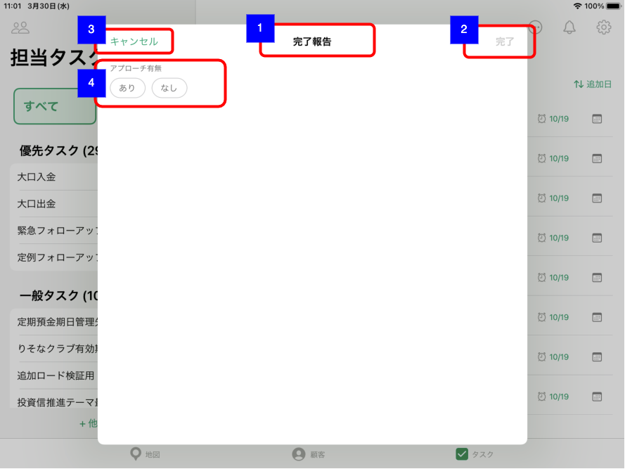
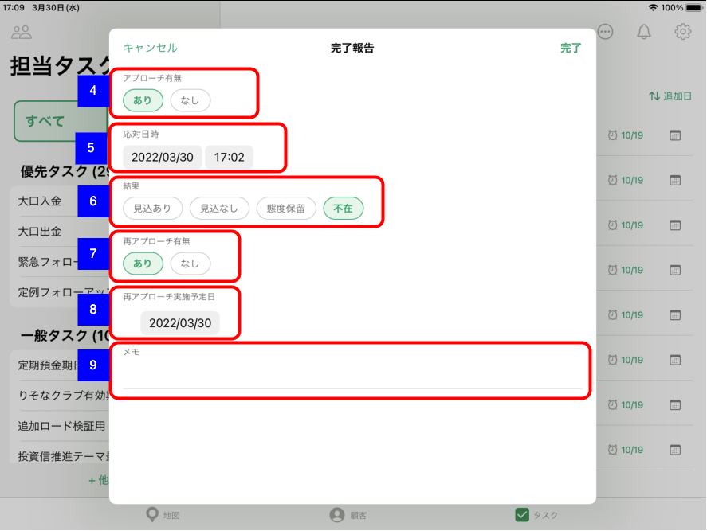
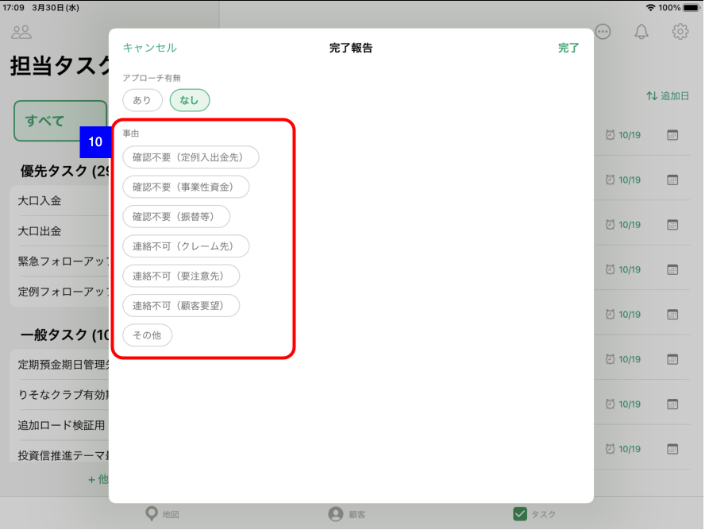
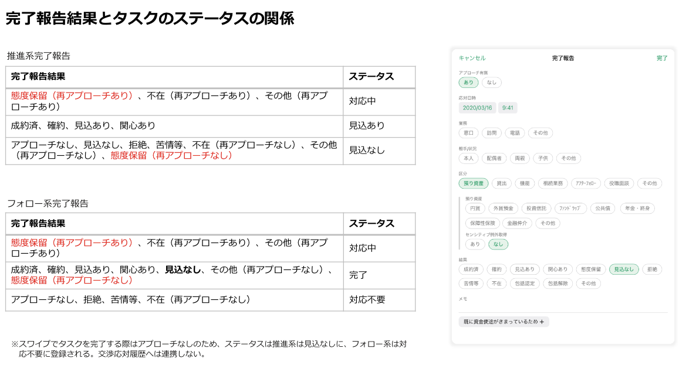

# 推進タスク完了報告（法人顧客）

## 概要

法人顧客の推進タスクの完了報告を実施するための画面。
法人顧客のタスクはCRM交渉応対履歴に連携しない。

※ 個人顧客のタスクは[推進タスク完了報告（個人顧客）](./推進タスク完了報告（個人顧客）.md)参照

## 画面遷移

N/A

## 画面レイアウト図

- 推進タスク完了報告（法人顧客）

## 画面項目

1. 画面名
    - [ ] タイトルに「完了報告」が表示される。
2. 完了ボタン
    - [ ] 初期表示時点では非活性。以下いずれかの条件を満たす場合にボタンが活性になる。
        - [ ] アプローチ有無/応対有無が「なし」の場合
        - [ ] アプローチ有無/応対有無が「あり」かつ以下をすべて満たす場合
            - 「結果」が選択されている。
            - 「再アプローチ有無」が表示されている場合は、「あり」「なし」のいずれかが選択されている。
    - [ ] タップすると、[完了ボタンをタップ](#完了ボタンをタップ)を実行する。
3. キャンセルボタン
    - [ ] タップすると、[キャンセルボタンをタップ](#キャンセルボタンをタップ)を実行する。
4. アプローチ有無/応対有無
    - [ ] 推進系タスクの場合はラベルに「アプローチ有無」が表示される。
    - [ ] フォロー系タスクの場合はラベルに「応対有無」が表示される。
    - [ ] 「あり」を選択すると、「応対日時」「結果」が表示される。
    - [ ] 「なし」を選択すると、「事由」が表示される。
5. 応対日時
    - [ ] 初期状態で現在日時が表示される。
    - [ ] 日付のラベルをタップすると日付ピッカーが表示され、当日までの日付を選択できる。翌日以降はグレーアウトされ選択できない。
    - [ ] 時刻のラベルをタップすると時刻ピッカーが表示され、時刻を選択できる。
6. 結果
    - 推進系タスク
        - [ ] 「見込あり」「見込なし」「態度保留」「不在」が表示され単一項目を選択できる。
        - [ ] 「見込あり」「見込なし」を選択した場合、「メモ」が表示される。
        - [ ] 「態度保留」「不在」を選択した場合、「再アプローチ有無」が表示される。
    - フォロー系タスク
        - [ ] 「完了」「不在」が表示され単一項目を選択できる。
        - [ ] 「完了」を選択した場合、「メモ」が表示される。
        - [ ] 「不在」を選択した場合、「再アプローチ有無」が表示される。
7. 再アプローチ有無
    - 「結果」で「態度保留」を選択した場合
        - [ ] 「あり」を選択すると、「再アプローチ実施予定日」および「メモ」が表示される。
        - [ ] 「なし」を選択すると、「メモ」が表示される。
    - 「結果」で「不在」を選択した場合
        - [ ] 「あり」を選択すると、「再アプローチ実施予定日」および「メモ」が表示される。
        - [ ] 「なし」を選択すると、「事由」が表示される。
8. 再アプローチ実施予定日
    - [ ] 初期状態で現在日付が表示される。
    - [ ] 日付のラベルをタップすると日付ピッカーが表示され、日付を選択できる。
9. メモ
    - [ ] 項目をタップした場合、キーボードが出現する。
    - [ ] 入力方法が自由入力である。
    - [ ] ×をタップすると入力内容を削除する。
    - [ ] 入力可能文字が1000文字である。
    - 推進リスト作成時に定型文言を登録している場合
        - [ ] 定型文言が入力補助のボタンとしてメモの下に表示される。（結果が「見込あり」「見込なし」「態度保留」「不在」の場合のみ）
        - [ ] ボタンをタップするとボタンのラベルの文言がメモに追加される。
    - **TBD 定例フォローアップの定型文入力**
10. 事由
    - 大口入金/大口出金の推進タスクの場合
        - [ ] 選択項目に「`確認不要（定例入出金先）`」「`確認不要（事業性資金）`」「`確認不要（振替等）`」「`連絡不可（クレーム先）`」「`連絡不可（要注意先）`」「`連絡不可（顧客要望）`」「`その他`」が表示され、単一項目を選択できる。
        - [ ] 「`その他`」ボタンを選択すると、自由入力のテキスト入力エリアが表示される。
    - 推進リスト作成時に定型文言を登録している場合
        - [ ] 選択項目に登録した定型文言の一覧と「`その他`」が表示され、単一項目を選択できる。
        - [ ] 「`その他`」ボタンを選択すると、自由入力のテキスト入力エリアが表示される。
    - 上記以外
        - [ ] 選択項目に「`その他`」が表示される。
        - [ ] 「`その他`」ボタンを選択すると、自由入力のテキスト入力エリアが表示される。

## イベント

この項では、当画面にて実行されるイベント一覧を記述する。

### 完了ボタンをタップ

- 完了報告後のタスクのステータスに応じて完了報告処理を実行する。

  

  - [ ] スタータスが完了（「見込あり」「見込なし」「完了」「対応不要」）となる場合
    - [ ] 完了報告処理を実施し、当画面を閉じる。
    - [ ] 該当のタスクは完了のセクション内で再読み込みを実施すると表示され完了後のスタータス、完了日が表示される。
  - [ ] スタータスが「対応中」となる場合
    - [ ] タイトル「未完了のタスクです」、メッセージ「スタータスが対応中で登録されます。」でアラートダイアログが表示される。
    - [ ] 完了報告処理および対応予定日更新処理を実施し、当画面を閉じる。該当のタスクは対応中のセクション内に表示され、対応予定日が更新される。

### キャンセルボタンをタップ

- [ ] 当画面を閉じる。

## 参考資料

[推進タスク_完了報告書式のパターン_202203.pptx](https://ibm.ent.box.com/file/931851011191?s=2vnx8r55h682c3w7cg4lc92zk45huaxo)
