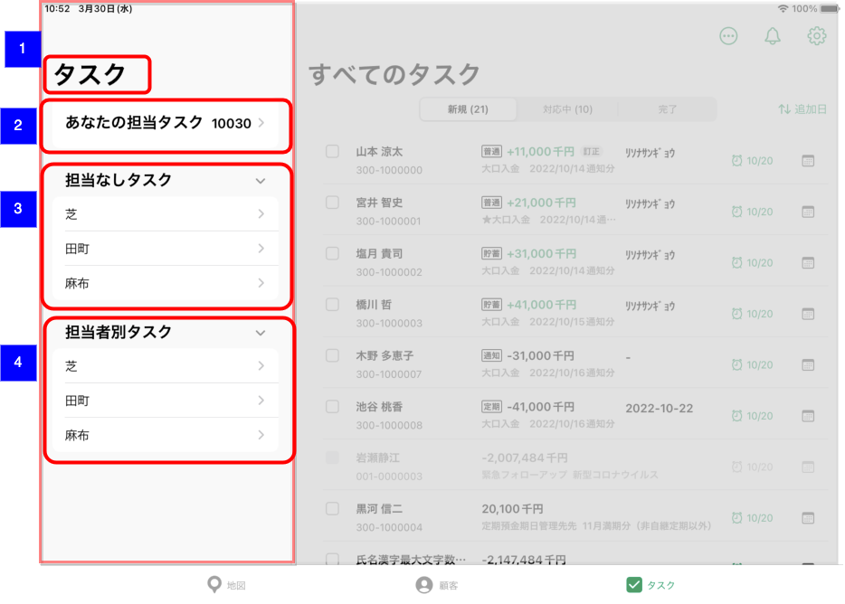

# 推進タスク担当支店選択

## 概要

担当する推進タスク一覧への遷移、もしくは推進タスクを担当するエリア内の支店一覧を確認、遷移するための画面。

## 画面遷移

N/A

## 画面レイアウト図

- 推進タスク担当支店選択

## 画面項目

1. 画面名
    - [ ] 「タスク」が表示される。
2. あなたの担当タスク
    - [ ] 「あなたの担当タスク」が表示される。
    - [ ] 未完了の担当タスク件数が表示される。
    - [ ] タップすると[あなたの担当タスクをタップ](#あなたの担当タスクをタップ)を実行する。
3. 担当なしタスクエリア
    - [ ] エリア店の場合は所属するエリアの支店一覧が表示される。
    - [ ] エリア運営でない支店は所属支店が表示される。
    - [ ] ヘッダーをタップするとエリアが開閉する。
    - [ ] 支店のセルをタップすると[担当なしタスクエリアの支店をタップ](#担当なしタスクエリアの支店をタップ)を実行する。
4. 担当者別タスク
    - [ ] エリア店の場合は所属するエリアの支店一覧が表示される。
    - [ ] エリア運営でない支店は所属支店が表示される。
    - [ ] ヘッダーをタップするとエリアが開閉する。
    - [ ] 支店のセルをタップすると[担当者別タスクエリアの支店をタップ](#担当者別タスクエリアの支店をタップ)を実行する。

## イベント

### あなたの担当タスクをタップ

- [ ] [推進タスク一覧（担当顧客）](./推進タスク一覧（担当顧客）.md)に遷移する。

### 担当なしタスクエリアの支店をタップ

- [ ] [推進タスク一覧（支店別担当なし）](./推進タスク一覧（支店別担当なし）.md)に遷移する。

### 担当者別タスクエリアの支店をタップ

- [ ] [推進タスク一覧（支店担当者別統計情報）](./推進タスク一覧（支店担当者別統計情報）.md)に遷移する。
