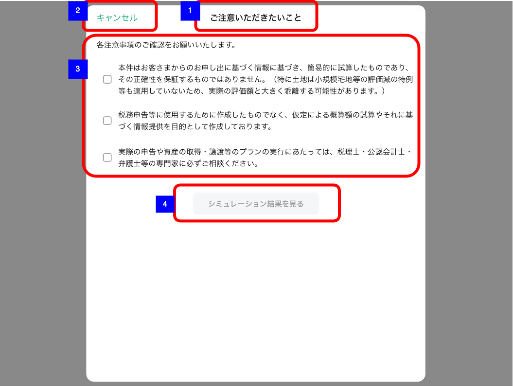

# 相続税簡易シミュレーション免責事項確認

## 概要

相続税簡易シミュレーションを実施するにあたり顧客に免責事項を確認いただき同意を得るための画面。

## 画面遷移

N/A

## 画面レイアウト図

- 相続税簡易シミュレーション免責事項確認未済

- 相続税簡易シミュレーション免責事項確認済み

## 画面項目

1. 画面名
    - [x] タイトルに「ご注意いただきたいこと」が表示される。
2. キャンセルボタン
    - [x] タップすると、[キャンセルボタンをタップ](#キャンセルボタンをタップ)を実行する。
3. 免責事項
    - [x] チェックボックスと免責事項の説明文が表示される。
    - [x] チェックボックスと免責事項の説明文がタップ可能。
    - [x] すべての項目にチェックが入ると「シミュレーション結果を見るボタン」が活性化する。
4. シミュレーション結果を見るボタン
    - [x] タップすると、[シミュレーション結果を見るボタンをタップ](#シミュレーション結果を見るボタンをタップ)を実行する。

## イベント

この項では、当画面にて実行されるイベント一覧を記述する。

### キャンセルボタンをタップ

- [x] 当画面を閉じて、[相続税簡易シミュレーション入力画面](相続税簡易シミュレーション入力.md)を表示する。

### シミュレーション結果を見るボタンをタップ

- [x] 相続税簡易シミュレーション算出APIを実行し[相続税簡易シミュレーション結果画面](./相続税簡易シミュレーション結果.md)を表示する。
