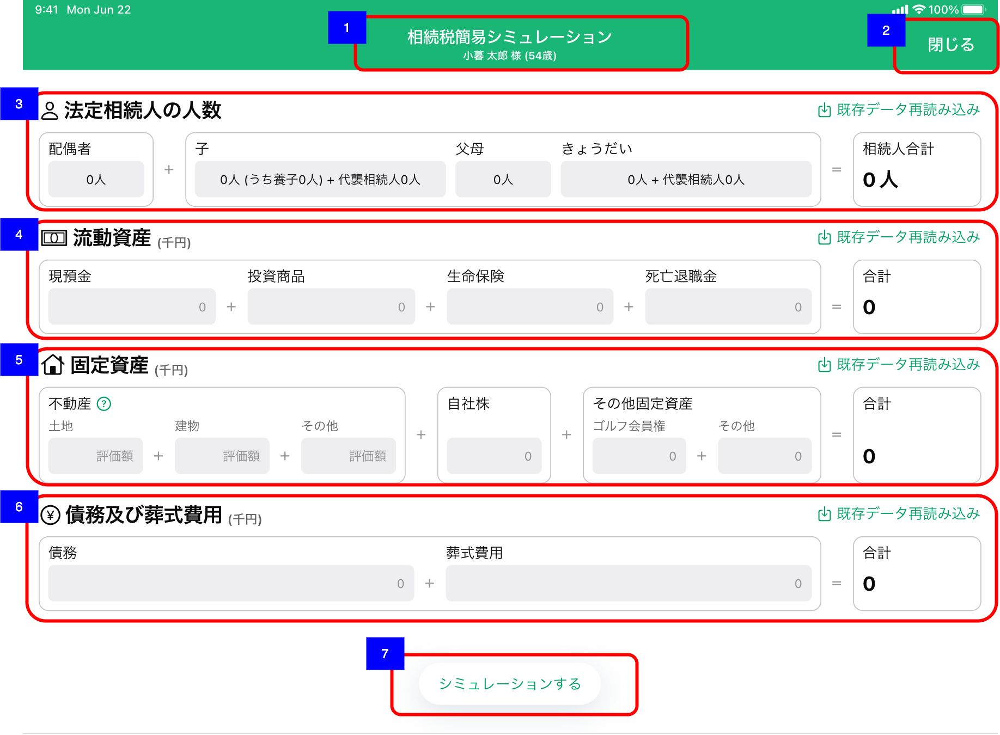
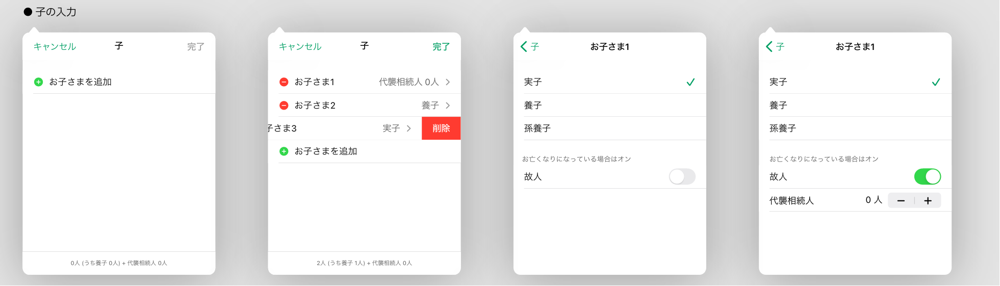
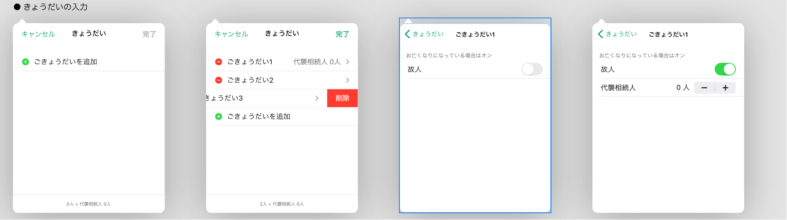

# 相続税簡易シミュレーション入力

## 概要

相続税簡易シミュレーションを実施するにあたり法定相続人や資産・負債等の項目を表示、入力する。

## 画面遷移

N/A

## 画面レイアウト図

- 相続税簡易シミュレーション入力



- 相続税簡易シミュレーション入力 - 配偶者の入力


- 相続税簡易シミュレーション入力 - 子の入力



- 相続税簡易シミュレーション入力 - 父母の入力


- 相続税簡易シミュレーション入力 - きょうだいの入力



## 画面項目

1. 画面名
2. 閉じるボタン
    - [x] タップすると、[閉じるボタンをタップ](#閉じるボタンをタップ)を実行する。
3. 法定相続人の人数
    - 配偶者
        - [x] 家族情報に登録した配偶者の情報がプリセットされる。
            - [x] 存命で登録されている場合`「1人」`
            - [x] 未登録もしくは故人で登録されている場合`「0人」`
        - [x] 人数の表示をタップすると入力用ポップオーバーが表示される。
        - 配偶者の入力用ポップオーバー
            - [x] タイトルが「配偶者」で表示される。
            - [x] 「配偶者さま」の項目が表示され、右側に「有」（配偶者が存命）または「無」（配偶者が存在しない、もしくは故人）で表示される。
            - [x] 「配偶者さま」の項目をタップすると「配偶者の詳細選択」に遷移する。
            - [x] 「完了」は初期表示時は非活性でタップ不可。初期表示時から編集があった場合、活性しタップ可能となる。
            - [x] 「完了」をタップすると変更内容が**人数に反映され**ポップオーバーを閉じる。
            - [x] 「キャンセル」をタップすると変更内容が**人数に反映されずに**ポップオーバーを閉じる。
            - [x] ポップオーバー外の領域をタップしてもポップオーバーは閉じない。
        - 配偶者の詳細選択
            - [x] タイトルが「配偶者さま」で表示される。
            - [x] 「< 配偶者」をタップすると前画面に遷移する。
            - [x] 「有」または「無」を選択できる。選択すると前画面に遷移する。
    - 子
        - [x] 家族情報に登録した法定相続人の対象である存命、かつ以下の続柄補足に該当する子の情報がプリセットされる。`「x人(うち養子 y人)+代襲相続人 z人」`の形式

            ```text
            実子扱い
            ・未選択
            ・前夫の子
            ・前妻の子
            ・非嫡出子
            
            養子扱い
            ・養子
            ・孫養子
            ```
            ※連れ子は法定相続人にならない

            - [x] x人：実子＋養子(y人)の人数。代襲相続人を含めない。
            - [x] y人：養子＋孫養子の人数
            - [x] z人：代襲相続人の人数

                ```text
                （例）
                ・子1（実子）
                ・子2（養子）
                ・子3（故人）ー代襲相続人1、2
                ・子4（養子）
                といた場合
                「3人（うち養子2人）＋代襲相続人2人」と表示する。
                ```
        - [x] 法定相続人となる養子の人数制限がかかった場合(養子の数が法定相続人として扱われる養子の上限人数より多い場合)、入力フィールドの下に`「基礎控除等の計算では、法定相続人の子をn人として扱います。」`(nは法定相続人となる子の人数)のメッセージが表示される。養子を含む法定相続人の人数の算出方法は以下のとおり。

            ```text
            ・ 実子が1人以上(実子には代襲相続人を含む。養子の代襲相続人も実子と同様の取り扱い。)いる場合、(養子の入力が2人以上あったとしても)1人までを養子として計上する
            ・ 実子が(実子には代襲相続人を含む。養子の代襲相続人も実子と同様の取り扱い。)いない場合、(養子の入力が3人以上あったとしても)2人までを養子として計上する
            ```

            ```
            （例）実子が1人、養子が3人いる場合
            ・ 法定相続人となる子の人数は、実子1人＋養子1人
            ・ 入力した養子の人数（3人）が条件（1人）よりも多いのでメッセージを表示
            ・ 表示するメッセージは「～法定相続人の子を2人として計算しています」（n人は実子1人＋養子1人の2人）
            ```

        - [x] （顧客の子にあたる）当人の親が登録されていない孫がいる場合、「！」アイコンと「代襲相続人の特定」ツールチップが表示される。
          - [x] 「！」アイコンをタップすると「代襲相続人の特定」ツールチップが表示される。
        - [x] 人数の表示をタップすると入力用ポップオーバーが表示される。
        - 子の入力用ポップオーバー
            - [x] タイトルが「子」で表示される。
            - [x] 家族情報で「子」で登録されている情報が故人含めて`「お子さまX」`(Xは1からの連番)の形式で表示され、右側に「実子」「養子」「孫養子」「代襲相続人 n人」のいずれかで表示される。
            - [x] 「お子さまX」をタップすると「子の詳細選択」に遷移する。
            - [x] 「お子さまX」の左に赤丸のマイナスボタンが常時表示され、タップすると画面右端から「削除」ボタンが表示される。
            - [x] 「削除」ボタンをタップすると該当の行が削除され、残りの項目は上から順に1からの連番でsuffixが更新される。
            - [x] 最終行に常に「+ お子さまを追加」が表示されており、タップすると「お子さまY」（Yは追加前最後の項目のsuffix+1した数値）が追加される。
            - [x] ポップオーバーの下部に法定相続人の人数が表示される。`「n人(うち養子 n人)+代襲相続人 n人」`の形式
            - [x] 「完了」は初期表示時は非活性でタップ不可。初期表示時から編集があった場合、活性しタップ可能となる。
            - [x] 「完了」をタップすると変更内容が**人数に反映され**ポップオーバーを閉じる。
            - [x] 「キャンセル」をタップすると変更内容が**人数に反映されずに**ポップオーバーを閉じる。
            - [x] ポップオーバー外の領域をタップしてもポップオーバーは閉じない。
        - 子の詳細選択
            - [x] タイトルが「お子さまX」で表示される。
            - [x] 「< 子」をタップすると前画面に遷移し、編集内容が前画面に反映される。
            - [x] 「実子」「養子」「孫養子」を選択できる。選択しても前の画面に自動遷移しない。
            - [x] 故人のトグルスイッチをオンにすると代襲相続人のステッパーが表示され、代襲相続人の人数を変更できる。
            - [x] 故人のトグルスイッチをオフにすると代襲相続人のステッパーが非表示となり、代襲相続人数の入力はリセットされ0人となる。
            - [x] トグルスイッチを変更しても前の画面に自動遷移しない。
    - 父母
        - [x] 子に法定相続人がいない場合、家族情報に登録した法定相続人の対象である存命の父母の情報がプリセットされる。`「n人」`の形式
        - [x] 子に法定相続人がいる場合は、グレーアウトされ人数は表示されない。
        - [x] 人数の表示をタップすると入力用ポップオーバーが表示される。
        - 父母の入力用ポップオーバー
            - [x] タイトルが「父母」で表示される。
            - [x] 「お父さま」「お母さま」の項目が表示され、右側に「有」（父母が存命）または「無」（父母が存在しない、もしくは故人）で表示される。
            - [x] 「お父さま」「お母さま」の項目をタップすると「父母の詳細選択」に遷移する。
            - [x] 「完了」は初期表示時は非活性でタップ不可。初期表示時から編集があった場合、活性しタップ可能となる。
            - [x] 「完了」をタップすると変更内容が**人数に反映され**ポップオーバーを閉じる。
            - [x] 「キャンセル」をタップすると変更内容が**人数に反映されずに**ポップオーバーを閉じる。
            - [x] ポップオーバー外の領域をタップしてもポップオーバーは閉じない。
        - 父母の詳細選択
            - [x] タイトルが「お父さま」もしくは「お母さま」で表示される。
            - [x] 「< 父母」をタップすると前画面に遷移する。
            - [x] 「有」または「無」を選択できる。選択すると前画面に遷移する。
    - きょうだい
        - [x] 子および父母に法定相続人がいない場合、家族情報に登録した法定相続人の対象であるきょうだいもしくは甥姪の情報がプリセットされる。`「x人+代襲相続人 y人」`の形式
            - [x] x人：代襲相続人を含めない法定相続人の人数
            - [x] y人：代襲相続人の人数
        - [x] 子もしくは父母に法定相続人がいる場合は、グレーアウトされ人数は表示されない。
        - [x] （顧客のきょうだいにあたる）当人の親が登録されていない甥姪がいる場合、「！」アイコンと「代襲相続人の特定」ツールチップが表示される。当人の親が登録されていない孫がいる場合は先にそちらのツールチップが表示される。
          - [x] 「！」アイコンをタップすると「代襲相続人の特定」ツールチップが表示される。
          - [x] 「！」アイコンはグレーアウトされている場合は表示されない。
        - [x] 人数の表示をタップすると入力用ポップオーバーが表示される。
        - きょうだいの入力用ポップオーバー
            - [x] タイトルが「きょうだい」で表示される。
            - [x] 家族情報で「きょうだい」で登録されている情報が故人含めて`「ごきょうだいX」`(Xは1からの連番)の形式で表示され、故人の場合は、右側に「代襲相続人 n人」の形式で表示される。存命の場合は右側に何も表示されない。
            - [x] 「ごきょうだいX」をタップすると「きょうだいの詳細選択」に遷移する。
            - [x] 「ごきょうだいX」の左に赤丸のマイナスボタンが常時表示され、タップすると画面右端から「削除」ボタンが表示される。
            - [x] 「削除」ボタンをタップすると該当の行が削除され、残りの項目は上から順に1からの連番でsuffixが更新される。
            - [x] 最終行に常に「+ ごきょうだいを追加」が表示されており、タップすると「ごきょうだいY」（Yは追加前最後の項目のsuffix+1した数値）が追加される。
            - [x] ポップオーバーの下部に法定相続人の人数が表示される。`「n人+代襲相続人 n人」`の形式
            - [x] 「完了」は初期表示時は非活性でタップ不可。初期表示時から編集があった場合、活性しタップ可能となる。
            - [x] 「完了」をタップすると変更内容が**人数に反映され**ポップオーバーを閉じる。
            - [x] 「キャンセル」をタップすると変更内容が**人数に反映されずに**ポップオーバーを閉じる。
            - [x] ポップオーバー外の領域をタップしてもポップオーバーは閉じない。
        - きょうだいの詳細選択
            - [x] タイトルが「ごきょうだいX」で表示される。
            - [x] 「< きょうだい」をタップすると前画面に遷移し、編集内容が前画面に反映される。
            - [x] 故人のトグルスイッチをオンにすると代襲相続人のステッパーが表示され、代襲相続人の人数を変更できる。
            - [x] 故人のトグルスイッチをオフにすると代襲相続人のステッパーが非表示となり、代襲相続人数の入力はリセットされ0人となる。
            - [x] トグルスイッチを変更しても前の画面に自動遷移しない。
        - [x] 「！」アイコンをタップすると「代襲相続人の特定」ツールチップが表示される。
    - 相続人合計
        - [x] 配偶者、子、父母、兄弟の法定相続人の合計人数が表示される。（代襲相続人含む）
    - 既存データ再読み込みボタン
        - [x] 既存データ再読み込みボタンをタップすると登録されている家族情報を取得しその内容から法定相続人の人数を更新する。
        - [x] （顧客の子にあたる）当人の親が登録されていない孫がいる場合、「！」アイコンと「代襲相続人の特定」ツールチップが表示される。
        - [x] （顧客のきょうだいにあたる）当人の親が登録されていない甥姪がいる場合、「！」アイコンと「代襲相続人の特定」ツールチップが表示される。当人の親が登録されていない孫がいる場合は先にそちらのツールチップが表示される。
4. 流動資産
    - 現預金
        - [x] 預金の合計が万円単位で表示され、資産負債トップ画面 > 預金・投資商品カードの「預金」の金額と一致する。
            - [x] りそな資産がマイナス値の場合でも正しく集計される(りそな資産の預金・投資商品のみマイナス値がありうる)
        - [x] タップするとキーボードが出現し、編集できる。
        - [x] 入力方法が数字の自由入力である。
        - [x] 1000億円未満の正の数値のみ入力可能である。3桁区切りのカンマが自動付与される。
        - [x] 小数第一位まで入力できる。小数第二位以降の入力は抑止され、入力が反映しない。
        - [x] 小数第一位の値が無い（0）場合は、整数表示される。
        - [x] 小数第一位の値がある（1-9）場合は、小数表示される。
    - 投資商品
        - [x] 投資商品の合計が万円単位で表示され、資産負債トップ画面 > 預金・投資商品カードの「投資商品」の金額と一致する。
            - [x] りそな資産がマイナス値の場合でも正しく集計される(りそな資産の預金・投資商品のみマイナス値がありうる)
        - [x] タップするとキーボードが出現し、編集できる。
        - [x] 入力方法が数字の自由入力である。
        - [x] 1000億円未満の正の数値のみ入力可能である。3桁区切りのカンマが自動付与される。
        - [x] 小数第一位まで入力できる。小数第二位以降の入力は抑止され、入力が反映しない。
        - [x] 小数第一位の値が無い（0）場合は、整数表示される。
        - [x] 小数第一位の値がある（1-9）場合は、小数表示される。
    - 生命保険
        - [x] りそな資産の保険と他社資産の保険の合計が万円単位で表示される。
            - [x] りそな資産の保険＝顧客詳細預り資産一覧画面の「保険」
            - [x] 他社資産の保険＝資産負債情報で登録された「保険」の明細のうち、「相続税対象外」の項目が有効になっている明細を除く合計値

            ```text
            資産負債トップ画面 > 預金・投資商品カードの「保険」の金額とは一致しない。差分は以下の通り。
            ・当画面には「掛け捨て保険」の金額も計上されるが、資産負債トップ画面には計上されない。
            ・当画面では「相続税対象外」の金額は計上さないが、資産負債トップ画面では計上される。
            ```

        - [x] タップするとキーボードが出現し、編集できる。
        - [x] 入力方法が数字の自由入力である。
        - [x] 1000億円未満の正の数値のみ入力可能である。3桁区切りのカンマが自動付与される。
        - [x] 小数第一位まで入力できる。小数第二位以降の入力は抑止され、入力が反映しない。
        - [x] 小数第一位の値が無い（0）場合は、整数表示される。
        - [x] 小数第一位の値がある（1-9）場合は、小数表示される。
    - 死亡退職金
        - [x] 死亡退職金は登録されているデータがないため、初期表示では必ず0で表示される。
        - [x] タップするとキーボードが出現し、編集できる。
        - [x] 入力方法が数字の自由入力である。
        - [x] 1000億円未満の正の数値のみ入力可能である。3桁区切りのカンマが自動付与される。
        - [x] 小数第一位まで入力できる。小数第二位以降の入力は抑止され、入力が反映しない。
        - [x] 小数第一位の値が無い（0）場合は、整数表示される。
        - [x] 小数第一位の値がある（1-9）場合は、小数表示される。
    - 合計
        - [x] 現預金、投資商品、生命保険、死亡退職金の合計金額が表示される。
    - 既存データ再読み込みボタン
        - [x] 既存データ再読み込みボタンをタップすると登録されている資産負債情報を取得しその内容から各項目が更新される。また、死亡退職金が初期化される(0がセットされる)。
5. 固定資産
    - 不動産
        - [x] 資産負債情報で登録した「不動産」の合計が万円単位で表示される。
            - [x] 土地＝不動産の「種類」が「土地」の明細の合計額
            - [x] 建物＝不動産の「種類」が「建物」「土地付き建物」「マンション」の明細の合計額
            - [x] その他＝不動産の「種類」が「その他」の明細の合計額
        - [x] 不動産のラベルの横に「？」アイコンが表示される。
        - [x] 「？」アイコンをタップするとヒントのツールチップが表示される。
        - [x] タップするとキーボードが出現し、編集できる。
        - [x] 入力方法が数字の自由入力である。
        - [x] 1000億円未満の正の数値のみ入力可能である。3桁区切りのカンマが自動付与される。
        - [x] 小数第一位まで入力できる。小数第二位以降の入力は抑止され、入力が反映しない。
        - [x] 小数第一位の値が無い（0）場合は、整数表示される。
        - [x] 小数第一位の値がある（1-9）場合は、小数表示される。
    - 自社株
        - [x] 資産負債情報で登録した「その他固定資産」のうち「自社株など」の合計が万円単位で表示され、資産負債トップ画面 > その他固定資産カードの「自社株など」の金額と一致する。
        - [x] タップするとキーボードが出現し、編集できる。
        - [x] 入力方法が数字の自由入力である。
        - [x] 1000億円未満の正の数値のみ入力可能である。3桁区切りのカンマが自動付与される。
        - [x] 小数第一位まで入力できる。小数第二位以降の入力は抑止され、入力が反映しない。
        - [x] 小数第一位の値が無い（0）場合は、整数表示される。
        - [x] 小数第一位の値がある（1-9）場合は、小数表示される。
    - その他固定資産
        - [x] 資産負債情報で登録した「その他固定資産」のうち「ゴルフ会員権」と「その他」の合計金額がそれぞれ万円単位で表示される。
            - [x] ゴルフ会員権＝資産負債トップ画面 > その他固定資産カードの「ゴルフ会員権」の金額と一致する。
            - [x] その他＝資産負債トップ画面 > その他固定資産カードの「その他」の金額と一致する。
        - [x] タップするとキーボードが出現し、編集できる。
        - [x] 入力方法が数字の自由入力である。
        - [x] 1000億円未満の正の数値のみ入力可能である。3桁区切りのカンマが自動付与される。
        - [x] 小数第一位まで入力できる。小数第二位以降の入力は抑止され、入力が反映しない。
        - [x] 小数第一位の値が無い（0）場合は、整数表示される。
        - [x] 小数第一位の値がある（1-9）場合は、小数表示される。
    - 合計
        - [x] 不動産（土地）、不動産（建物）、不動産（その他）、自社株、その他固定資産（ゴルフ会員権）、その他固定資産（その他）の合計金額が表示される。
    - 既存データ再読み込みボタン
        - [x] 既存データ再読み込みボタンをタップすると登録されている資産負債情報を取得しその内容から各項目を更新する。
6. 債務及び葬式費用
    - 債務
        - [x] 借入の合計が万円単位で表示され、資産負債トップ画面 > 借入の合計額の金額と一致する。
        - [x] タップするとキーボードが出現し、編集できる。
        - [x] 入力方法が数字の自由入力である。
        - [x] 1000億円未満の正の数値のみ入力可能である。3桁区切りのカンマが自動付与される。
        - [x] 小数第一位まで入力できる。小数第二位以降の入力は抑止され、入力が反映しない。
        - [x] 小数第一位の値が無い（0）場合は、整数表示される。
        - [x] 小数第一位の値がある（1-9）場合は、小数表示される。
    - 葬式費用
        - [x] 葬式費用は登録されているデータがないため、初期表示では必ず0で表示される。
        - [x] タップするとキーボードが出現し、編集できる。
        - [x] 入力方法が数字の自由入力である。
        - [x] 1000億円未満の正の数値のみ入力可能である。3桁区切りのカンマが自動付与される。
        - [x] 小数第一位まで入力できる。小数第二位以降の入力は抑止され、入力が反映しない。
        - [x] 小数第一位の値が無い（0）場合は、整数表示される。
        - [x] 小数第一位の値がある（1-9）場合は、小数表示される。
    - 合計
        - [x] 債務と葬式費用の合計金額が表示される。
    - 既存データ再読み込みボタン
        - [x] 既存データ再読み込みボタンをタップすると登録されている資産負債情報を取得しその内容から各項目が更新される。また、葬式費用が初期化される(0がセットされる)。
7. シミュレーションボタン
    - **TODO: 法定相続人が0人もしくは資産がマイナスの場合シミュレーションできない旨をユーザーに通知**
    - [x] タップすると、[シミュレーションボタンをタップ](#シミュレーションボタンをタップ)を実行する。

## イベント

この項では、当画面にて実行されるイベント一覧を記述する。

### 閉じるボタンをタップ

- [x] アラートダイアログが表示される。
  - [x] ダイアログのメッセージは`「○○画面に戻りますが、よろしいですか？」`の形式となっており、○○画面には遷移元画面名が表示される。遷移元画面名は以下のいずれか。

    ```text
    ・ 顧客詳細トップ画面
    ・ 家族情報画面
    ・ 資産負債情報画面
    ```

  - [x] 「続行」ボタンをタップすると当画面を閉じ、遷移元画面に戻る。
  - [x] 「キャンセル」ボタンをタップするとこのダイアログを閉じる。

### シミュレーションボタンをタップ

- [x] 該当顧客の顧客詳細画面を開いてから相続税簡易シミュレーション免責事項に同意していない場合は、[相続税簡易シミュレーション免責事項確認画面](./相続税簡易シミュレーション免責事項確認.md)を表示する。
- [x] 該当顧客の顧客詳細画面を開いてから相続税簡易シミュレーション免責事項に同意している場合は、相続税簡易シミュレーション算出APIを実行し[相続税簡易シミュレーション結果画面](./相続税簡易シミュレーション結果.md)を表示する。
