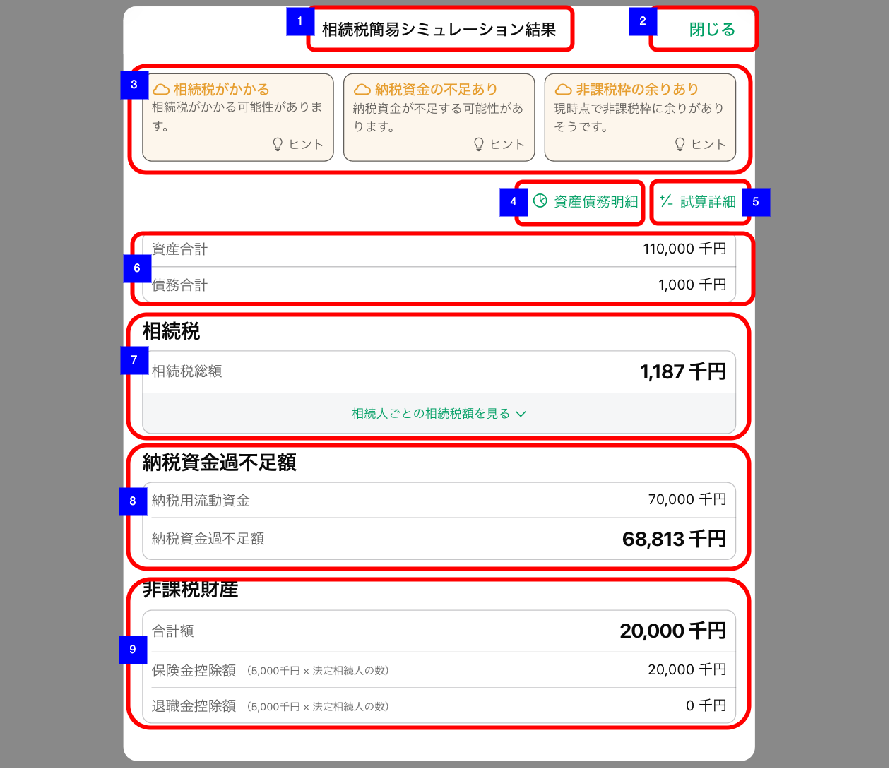
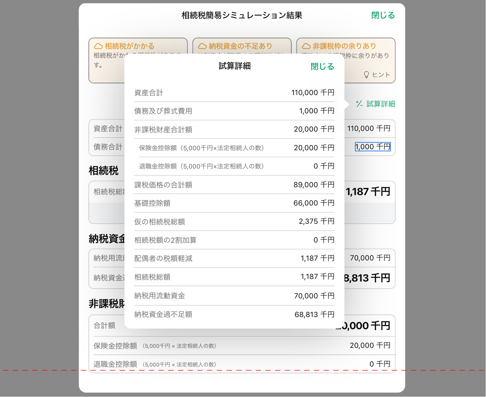

# 相続税簡易シミュレーション結果

## 概要

相続税簡易シミュレーションの実行結果を確認するための画面。

## 画面遷移

N/A

## 画面レイアウト図

- 相続税簡易シミュレーション結果

- 相続税簡易シミュレーション結果 - 試算詳細

- 相続税簡易シミュレーション結果 - アコーディオン

## 画面項目

1. 画面名
2. 閉じるボタン
    - [x] タップすると、[閉じるボタンをタップ](#閉じるボタンをタップ)を実行する。
3. ヒントカード
    - 3つのカードにタイトル、メッセージ、ヒントボタンが表示され、ヒントボタンをタップするとポップオーバーが表示され詳細メッセージを確認できる。
        - [x] 「閉じる」ボタンをタップするとポップオーバーを閉じる。
        - [x] ポップオーバー外のをタップするとポップオーバーを閉じる。
    - 相続税総額が1円以上の場合
        - [x] カードの背景色とタイトル、メッセージの文字色がオレンジ色
        - [x] タイトルが「相続税がかかる」
        - [x] メッセージが「相続税がかかる可能性があります」
        - [x] ポップオーバー内詳細メッセージ「不動産・生命保険等の活用や生前贈与など、資産構成の見直しを検討することも考えられます。」
    - 相続税総額が0円の場合
        - [x] カードの背景色とタイトル、メッセージの文字色がモノトーン
        - [x] タイトルが「相続税がからない」
        - [x] メッセージが「現時点では相続税はかからない可能性があります」
        - [x] ポップオーバー内詳細メッセージ「本件試算上ではこのような結果となりましたが、今後の財産額の変動や評価方法によっては相続税がかかる可能性もあります。」
    - 納税資金過不足額が0円未満の場合
        - [x] カードの背景色とタイトル、メッセージの文字色がオレンジ色
        - [x] タイトルが「納税資金の不足あり」
        - [x] メッセージが「納税資金が不足する可能性があります」
        - [x] ポップオーバー内詳細メッセージ「換金しにくい資産（不動産など）の売却等により流動性資産をあらかじめ確保する、万一の場合にすぐに現金が確保できるよう生命保険に加入する等の対策が考えられます。」
    - 納税資金過不足額が0円以上の場合
        - [x] カードの背景色とタイトル、メッセージの文字色がモノトーン
        - [x] タイトルが「納税資金の不足なし」
        - [x] メッセージが「現時点では納税資金を確保しており、納税資金不足はなさそうです。」
        - [x] ポップオーバー内詳細メッセージ「一次相続時に納税資金が不足していなくても、二次相続時には不足するケースも考えられます。」
    - 非課税枠の余りあり (※)
        - [x] カードの背景色とタイトル、メッセージの文字色がオレンジ色
        - [x] タイトルが「非課税枠の余りあり」
        - [x] メッセージが「現時点で非課税枠に余りがありそうです。」
        - [x] ポップオーバー内詳細メッセージ「生命保険と死亡退職金には「500万円×法定相続人数」の非課税枠があります。」
    - 非課税枠の余りなし (※)
        - [x] カードの背景色とタイトル、メッセージの文字色がモノトーン
        - [x] タイトルが「非課税枠の余りなし」
        - [x] メッセージが「現時点で非課税枠は満額使われているようです。」
        - [x] ポップオーバー内詳細メッセージ「生命保険の非課税枠をすでに活用済みの場合も、生命保険の活用が有効な対策となることもあります。」
    - **※ 非課税枠の余り有無条件**
        - 以下（A）（B）いずれかに余りがある場合は`非課税枠の余りあり`。（A）（B）共に余りがない場合は`非課税枠の余りなし`
        - （A）生命保険の確認
            - 非課税枠の金額「500万円×法定相続人の数」ー 入力画面の保険の金額>0の場合、非課税枠の余りあり
            - <=0の場合、非課税枠の余りなし
        - （B）死亡退職金の確認
            - 非課税枠の金額「500万円×法定相続人の数」ー 入力画面の死亡退職金の金額>0の場合、非課税枠の余りあり
            - <=0の場合、非課税枠の余りなし
4. 資産債務明細ボタン
    - [x] タップすると、[資産債務明細ボタンをタップ](#資産債務明細ボタンをタップ)を実行する。
5. 試算詳細ボタン
    - [x] タップすると、試算詳細ポップオーバーを表示する。
        - [x] 「閉じる」ボタンをタップするとポップオーバーを閉じる。
        - [x] ポップオーバー外の領域をタップするとポップオーバーを閉じる。
    - 試算詳細ポップオーバーには以下の情報がすべて整数もしくは小数第一位までの万円単位で表示される。（小数第二位で四捨五入）
        - [x] 資産合計
        - [x] 債務及び葬式費用
        - [x] 非課税財産合計額
        - [x] 保険金控除額
        - [x] 退職金控除額
        - [x] 課税価格の合計額
        - [x] 基礎控除額
        - [x] 仮の相続税総額
        - [x] 相続税額の2割加算
        - [x] 配偶者の税額軽減
        - [x] 相続税総額
        - [x] 納税用流動資金
        - [x] 納税資金不足額
6. 資産債務
    - [x] 資産合計額が整数もしくは小数第一位までの万円単位で表示される。（小数第二位で四捨五入）
    - [x] 債務合計額が整数もしくは小数第一位までの万円単位で表示される。（小数第二位で四捨五入）
7. 相続税
    - [x] 相続税総額が整数もしくは小数第一位までの万円単位で表示される。（小数第二位で四捨五入）
    - [x] 「相続人ごとの相続税額を見る」ボタンをタップするとアコーディオンが開閉する。
    - アコーディオン内
        - [x] 「相続人（続柄）」「法定相続分」「取得金額（万円）」「相続税額（万円）」が整数もしくは小数第一位までの万円単位で表示される。（小数第二位で四捨五入）
        - [x] 「相続人（続柄）」は入力画面と同じ名称（suffixを含めたお子さま1など）を引き継ぐ。代襲相続の場合は`「お子さまxの代襲相続人y」`の形式。
        - [x] 並び順は、相続順位の高い順に表示され、配偶者が相続人となっている場合は必ず先頭となる。代襲相続人は子・きょうだいと同列とみなして表示される（お子さま1→お子さま2の代襲相続人→お子さま3の順）。
        - [x] 相続人が孫養子の場合、「相続人（続柄）」の「お子さまx」の横に`（孫養子のため相続税額２割加算）`と表示される。
8. 納税資金過不足
    - [x] 納税用流動資金が整数もしくは小数第一位までの万円単位で表示される。（小数第二位で四捨五入）
    - [x] 納税資金過不足額が整数もしくは小数第一位までの万円単位で表示される。（小数第二位で四捨五入）
9. 非課税財産
    - [x] 非課税財産の合計額が整数もしくは小数第一位までの万円単位で表示される。（小数第二位で四捨五入）
    - [x] 保険金控除額が整数もしくは小数第一位までの万円単位で表示される。（小数第二位で四捨五入）
    - [x] 退職金控除額が整数もしくは小数第一位までの万円単位で表示される。（小数第二位で四捨五入）

## イベント

この項では、当画面にて実行されるイベント一覧を記述する。

### 閉じるボタンをタップ

- [x] 当画面を閉じて、[相続税簡易シミュレーション入力画面](./相続税簡易シミュレーション入力.md)を表示する。

### 資産債務明細ボタンをタップ

- [x] [資産債務明細画面](./相続税簡易シミュレーション結果_資産債務明細.md)に遷移する。
