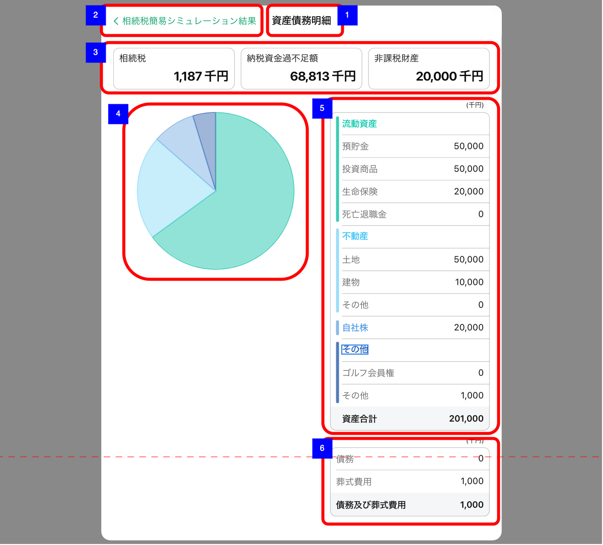
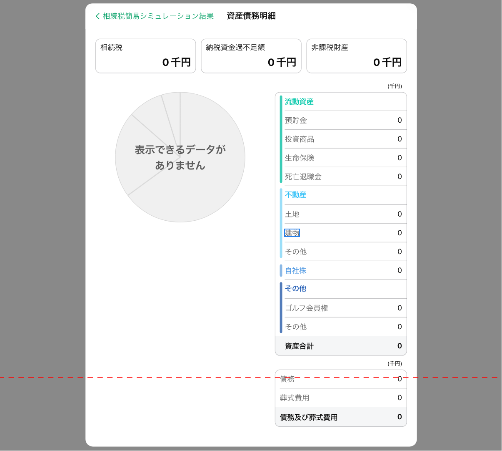

# 相続税簡易シミュレーション結果_資産債務明細

## 概要

相続税簡易シミュレーションの実行結果のインプットとなった資産債務明細を確認するための画面。

## 画面遷移

N/A

## 画面レイアウト図

- 相続税簡易シミュレーション結果 - 資産債務明細

- 相続税簡易シミュレーション結果 - 資産債務明細（データなし）

## 画面項目

1. 画面名
2. 相続税簡易シミュレーション結果
    - [x] タップすると[戻るボタンをタップ](#戻るボタンをタップ)を実行する。
3. 相続税サマリー
    - [x] 相続税合計額が整数もしくは小数第一位までの万円単位で表示される。（小数第二位で四捨五入）
    - [x] 納税資金過不足額が整数もしくは小数第一位までの万円単位で表示される。（小数第二位で四捨五入）
    - [x] 非課税財産が整数もしくは小数第一位までの万円単位で表示される。（小数第二位で四捨五入）
4. 資産債務グラフ
    - [x] 資産債務が円グラフで表示される。
    - [x] **N/A** 表示するデータがない場合はグレーアウトされた円グラフの画像の上に「表示できるデータがありません」と表示される。
    (**資産債務を入力しないとシミュレーションを実行できないので、このケースは確認できない**)
5. 資産明細
    - 流動資産
        - [x] [相続税簡易シミュレーション入力画面](相続税簡易シミュレーション入力.md)で入力した項目が整数もしくは小数第一位までの万円単位で表示される。（小数第二位で四捨五入）
        - [x] 預貯金が表示される。
        - [x] 投資商品が表示される。
        - [x] 生命保険が表示される。
        - [x] 死亡退職金が表示される。
    - 不動産
        - [x] [相続税簡易シミュレーション入力画面](相続税簡易シミュレーション入力.md)で入力した項目が整数もしくは小数第一位までの万円単位で表示される。（小数第二位で四捨五入）
        - [x] 土地（不動産）が表示される。
        - [x] 建物（不動産）が表示される。
        - [x] その他（不動産）が表示される。
    - 自社株
        - [x] [相続税簡易シミュレーション入力画面](相続税簡易シミュレーション入力.md)で入力した項目が整数もしくは小数第一位までの万円単位で表示される。（小数第二位で四捨五入）
        - [x] 自社株（その他固定資産）が表示される。
    - その他
        - [x] [相続税簡易シミュレーション入力画面](相続税簡易シミュレーション入力.md)で入力した項目が整数もしくは小数第一位までの万円単位で表示される。（小数第二位で四捨五入）
        - [x] ゴルフ会員権（その他固定資産）が表示される。
        - [x] その他（その他固定資産）が表示される。
    - 資産合計
        - [x] 資産合計が整数もしくは小数第一位までの万円単位で表示される。（小数第二位で四捨五入）
6. 債務明細
    - 債務
        - [x] [相続税簡易シミュレーション入力画面](相続税簡易シミュレーション入力.md)で入力した項目が整数もしくは小数第一位までの万円単位で表示される。（小数第二位で四捨五入）
        - [x] 債務が表示される。
        - [x] 葬式費用が表示される。
    - 債務及び葬式費用
        - [x] 債務と葬式費用の合計が整数もしくは小数第一位までの万円単位で表示される。（小数第二位で四捨五入）

## イベント

この項では、当画面にて実行されるイベント一覧を記述する。

### 戻るボタンをタップ

- [x] 前の画面に戻る。
